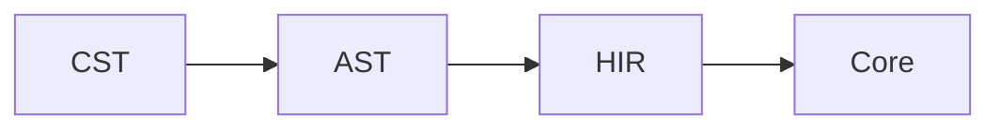

# Documentation Authoring Guide

How to write and place project documentation. `AGENTS.md` requires every change
to keep these documents consistent; this guide is the reference for the rules it
points to.

Write all documentation in English. Keep project documentation under `docs/`,
except `AGENTS.md` and the root `README.md`.

## Where a document goes

| Content | Location |
| --- | --- |
| User-facing, implementation-independent behavior | `docs/feature/F-XX-<slug>.md` |
| Implementation and IR architecture | `docs/design/` |
| A major, durable decision only | `docs/decision/DEC-XX-<slug>.md` |
| Per-topic acceptance checklists and evidence | `docs/implementation/` |
| Contributor process and repeatable workflows | `docs/workflow/` |

## Naming and identity

Use stable, zero-padded IDs such as `F-01`, `D-01`, and `DEC-01`. A filename's
number is the document's identity: never renumber an existing document to make
room for a new one, and never reuse a number that has been retired.

Every design document must identify the feature it implements, for example
`D-01` for `F-01`. The feature-to-design map in [`README.md`](README.md) lists
the pairs.

## Layout

Within `docs/design/`, root-level overview, tooling, roadmap, and cross-cutting
documents are `D-XX-<slug>.md`. Backend designs live under `docs/design/backend/`,
with the cross-cutting contract at `backend/00-<slug>.md`, functional topics
under `backend/fp/`, optimization topics under `backend/opt/`, and Wasm/WASI
topics under `backend/wasm/`. Frontend designs follow the same pattern under
`docs/design/frontend/`, with `00-<slug>.md` for the cross-cutting contract and
focused topics under `syntax/`, `semantics/`, and `type-system/` using unnumbered
slug filenames. Each topic file is self-contained.

## Further rules

- Add a decision record only for a major, durable decision, with context, the
  chosen option, and its consequences. Do not create one for a routine
  implementation choice. See [decision policy](decision/README.md).
- Keep feature documents free of crate names, libraries, and internal IR
  details. Put those in design documents.
- Keep documentation proportional to the change. A new user-facing feature
  maintains the relevant feature and design documents; a routine implementation
  choice updates a design document only where the design actually moved.

## Diagrams

Draw architecture, pipelines, control flow, state machines, and sequence
diagrams with Mermaid fenced blocks:

````markdown

````

A short, direct diagram — a simple linear order or a tiny dependency chain — may
stay in an ordinary fenced block. Keep formal model, grammar, and IR fragments
and pseudocode as ordinary fenced code blocks either way.

## Frontend and backend topic design document template

Topic documents under `docs/design/frontend/` and `docs/design/backend/` follow a
fixed chapter order so each one both specifies an implementation and teaches its
topic. Short documents may merge sections, but keep the order and the names.

Front matter:

- `# Title`
- `**Feature:** F-XX`
- `**Status:**` the design's maturity (`Draft` or `Stable`), not an
  implementation phase.
- `**Prerequisites:**` the background a reader needs (functional programming,
  WebAssembly, compilers) and the documents to read first.
- `**Summary:**` two to four sentences on what the topic decides.

Sections, in order:

1. **Scope** — what the document owns, what it does not, and where those live.
2. **Background** — the concepts and theory a reader needs, with references.
3. **Model** — precise definitions: types, grammars, IR shapes, notation, and
   invariants.
4. **Design** — the chosen representation or lowering, including the rejected
   alternatives and why.
5. **Algorithms** — step-by-step procedures, pseudocode, and edge cases.
6. **Code map** — the intended code organization for this topic: the module
   directory structure, each module's responsibility, and the key types and
   entry-point function signatures the implementation must provide. This is a
   design target that guides the code; the code is expected to conform to it,
   not the reverse. Do not describe the current file inventory here.
7. **Invariants and verification** — what must hold and what the verifier checks.
8. **Worked example** — a small program or IR fragment traced through the stage.
9. **Boundaries and interfaces** — the contracts with adjacent stages.
10. **Open questions and future work**.
11. **References**.

Describe the complete design, not a bootstrap. Do not frame sections around
"MVP", "bootstrap", or a first implementation slice. Implementation coverage
belongs in [`design/backend/wasm/capability-profile.md`](design/backend/wasm/capability-profile.md)
and [`decision/DEC-04-official-test-suite-roadmap.md`](decision/DEC-04-official-test-suite-roadmap.md);
a document may end with short implementation notes that only record deviations
from the design.

## Numbers in documents

A number stated in a document is a measurement, so state where it came from and
when it was taken. Re-measure before changing it rather than editing it by hand,
and record a decomposition when one total hides several causes: a single
"unresolved files" count cannot tell a phase that recovers nine apart from one
that recovers thirteen. When an acceptance criterion is not met as written, say
which part was met and which was not, instead of reporting the more flattering
number alone.

## Acceptance records

A document under `docs/implementation/` is an acceptance record for one topic. It
lists the requirements by ID, states for each whether it is Verified, and names
the test that provides the evidence. A requirement is Verified only when its
required runtime evidence actually executed; a skipped test leaves it
unverified, and a passing local test is not a substitute for the official suite.
