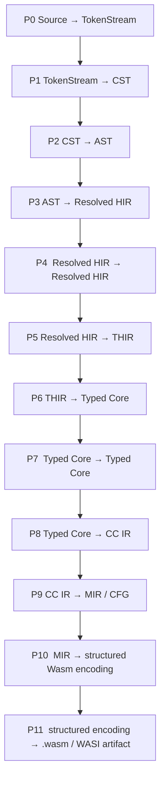

# D-01 — Frontend and IR Boundaries

**Implements:** [F-01 — Inspect PureScript Source](../feature/F-01-source-inspection.md)  
**Status:** In progress

## Purpose

Define the compiler pass order, representation boundaries, and invariants from
source text through typed functional Core. The architecture has twelve major
passes and six long-lived IR families. A pass may preserve its input
representation; a new representation is introduced only when its invariants
change. Wasm is a target encoding emitted from MIR through a thin structured
form; it is not one of the long-lived IR families.

## Pipeline



| Pass | Name | Responsibility |
| --- | --- | --- |
| P0 | Lex and Layout | Recognize raw tokens and insert logical layout markers. |
| P1 | Parse | Build source-oriented syntax and report parse errors. |
| P2 | Surface Lowering | Normalize parser-only distinctions into AST. |
| P3 | Resolve | Resolve modules, imports, values, types, and constructors to stable IDs. |
| P4 | Frontend Desugaring | Normalize operators, sections, do/ado, equations, and guards while preserving HIR. |
| P5 | Kind, Type, and Class Elaboration | Check kinds and types, resolve constraints, and attach explicit evidence. |
| P6 | Core Lowering | Remove source constructs and lower patterns and type-class dictionaries. |
| P7 | Core Simplify and Specialize | Optimize while preserving Typed Core. |
| P8 | ANF and Closure Conversion | Make evaluation order explicit and captures and calls explicit. |
| P9 | Representation Lowering | Choose runtime layouts and lower to a control-flow graph. |
| P10 | MIR Optimization and Wasm Structuring | Optimize CFG and structure MIR control flow into the thin Wasm encoding. |
| P11 | Validate and Link | Validate the encoded module, print WAT, and connect its runtime/WASI interface. |

`TokenStream` is a parser input, not a persistent IR family. ANF is the first
form within CC IR, not a separately maintained family. CC IR and MIR are
distinct representations with distinct contracts, grouped as one backend IR
family. Runtime representation belongs to MIR; it is not a separate IR. MIR is
the lowest long-lived IR. P10 structures its control flow into a thin Wasm
encoding: a module skeleton plus structured control-flow regions whose leaf
opcodes are delegated to the Wasm encoder. That form is produced and consumed
within the backend and is not a long-lived IR family.

## The six IR families

| Family | Main representation | Entry invariant |
| --- | --- | --- |
| CST | Concrete syntax tree | Parsed syntax and relevant token ranges remain available; no semantic resolution. |
| AST | Abstract syntax tree | Parser-only syntax is normalized; names remain unresolved and source-spanned. |
| HIR | Resolved HIR | References identify declarations and locals by stable IDs. |
| THIR | Typed high-level IR | Expressions and binders have types; overloads and constraints have explicit evidence. |
| Typed Core | Typed functional Core | A small expression language remains; source sugar and pattern syntax are gone. |
| CC IR / MIR | Closure-converted IR and CFG | Captures and calls are explicit; MIR has no nested expressions, fixes runtime representation, and is the lowest IR that feeds Wasm emission. |

These are long-lived architecture families, not a rule to create one crate per
row. A lowering pass may use temporary builders or analyses without making
them public IRs.

The structured Wasm encoding used between P10 and P11 is a target form rather
than a seventh family. It models the module skeleton and structured control
flow; leaf opcodes are delegated to `wasm_encoder::Instruction` instead of
being re-declared, so it grows with language features rather than with the Wasm
instruction set.

Each mature IR will expose a verifier for its invariants. The pass driver will
run the output verifier after transformations in debug and test builds. Keep
analyses such as free variables, liveness, and dominators in side data keyed by
stable IDs rather than turning them into optional fields on syntax nodes.

## Representation contracts

### CST

CST is source-oriented. It retains the concrete forms recognized by the
current grammar, source spans for names and binders, and spans for punctuation
and keywords that are part of those forms. Parentheses and syntax constructs
such as operator expressions remain explicit. Layout markers may have empty
spans because they are virtual. The original source remains the authority for
trivia and exact spelling.

CST must not contain resolved IDs, inferred types, type-class evidence, or
backend layout. The parser performs no name resolution or type checking.

### AST

AST is a separate representation with its own node types. It retains source
spans and unresolved names, while dropping syntax-only detail. Current surface
lowering removes parentheses and turns grouped function parameters into
nested, single-binder lambdas. It does not resolve names or desugar operators.

AST must not contain symbol IDs, checked types, dictionary evidence, or runtime
layout. It is not an alias for CST and is not already HIR.

### Resolved HIR

Resolution replaces textual identity with stable IDs such as `ModuleId`,
`SymbolId`, `ConstructorId`, and `LocalId`. It resolves module dependencies,
imports, exports, and both value and type namespaces. Unresolved references do
not cross this boundary. Source spans remain available for diagnostics.

### THIR

THIR is the fully typed, still high-level representation. Every expression and
binder has a type reference. Names are resolved, and overloaded operations
and type-class constraints have explicit evidence. Patterns and source-level
constructs may remain here. THIR has no runtime offsets, Wasm indices, or
calling-convention fields.

### Typed Core

Typed Core is the compiler's small functional language and the preferred
backend interchange boundary. It retains types, stable global and local IDs,
constructors, applications, lambdas, bindings, cases, records, and primitive
operations as required by the supported language. Type-class constraints
become explicit dictionary parameters and values. Do/ado notation, operator
syntax, source guards, source pattern syntax, and declaration syntax have been
lowered away. Core optimization transforms Typed Core into Typed Core.

### CC IR and MIR

CC IR starts with ANF, where non-trivial computations are named and evaluation
order is explicit. Closure conversion removes lambdas and records each
function's captures. Direct calls and closure calls are distinct.

MIR is a separate, low-level representation: typed basic blocks, virtual
values, instructions, and explicit terminators. It has no nested expression
trees, source patterns, or implicit closures. Representation lowering fixes
primitive and aggregate layouts, closure ABI, and call conventions before
Wasm structuring. MIR is the lowest long-lived IR: the Wasm target structures
its control flow into the thin structured Wasm encoding and then emits a
binary, without introducing another IR family. Below Typed Core, the
representations are language-agnostic. CC carries target-neutral
representation requirements; P9 maps them to the concrete WebAssembly value
and type system owned by MIR, as specified in
[IR boundaries](backend/00-ir-boundaries.md).

## Source information

Keep a source range on CST, AST, HIR, and THIR nodes. Core keeps a source-info
reference where it helps diagnostics and debugging. MIR and the Wasm encoder
preserve locations on important operations such as calls, branches, allocation, and
traps; they do not need to copy a full source span to every low-level value.

## Current crate ownership

| Crate | Owns | Runtime dependencies |
| --- | --- | --- |
| `psrs-span` | Source text, byte ranges, line/column mapping | Standard library |
| `psrs-cst` | Concrete syntax nodes and token spans | `psrs-span` |
| `psrs-syntax` | Lexer, layout processor, parser, parse diagnostics | `psrs-cst`, `psrs-span` |
| `psrs-ast` | AST nodes and CST-to-AST lowering | `psrs-cst`, `psrs-span` |
| `psrs-hir` | Resolved HIR nodes and IDs, including WIT-bound external declarations | `psrs-span` |
| `psrs-resolve` | Local and same-module value resolution, program module graph, import/export resolution | `psrs-ast`, `psrs-hir`, `psrs-span` |
| `psrs-desugar` | HIR-preserving operator lowering | `psrs-hir` |
| `psrs-thir` | Typed high-level IR nodes and verifier | `psrs-hir`, `psrs-span` |
| `psrs-typecheck` | Monomorphic inference, unification, and THIR construction | `psrs-hir`, `psrs-span`, `psrs-thir` |
| `psrs-kind` | Kind inference and unification over resolved HIR, and kind diagnostics | `psrs-hir`, `psrs-span` |
| `psrs-core` | Typed Core nodes, verifier, and THIR-to-Core lowering | `psrs-hir`, `psrs-span`, `psrs-thir` |
| `psrs-backend` | Direct-call CC/ANF, CFG MIR, string data segments, the WASI import registry, `wit-component` componentization, structured Wasm encoding, binary emission, validation, and WAT printing | `psrs-core`, `psrs-hir`, `psrs-span`, `wasm-encoder`, `wasmparser`, `wasmprinter`, `wit-parser`, `wit-component` |
| `psrs-driver` | End-to-end pass orchestration and source diagnostics | Frontend, type, Core, and backend pass crates |
| `psrs-cli` | Source inspection, Wasm build, WAT output, and diagnostic rendering | `psrs-driver` plus frontend inspection crates |

This workspace uses more crates than the compact bootstrap sketch in the
design notes because CST, AST, HIR, THIR, and Core already have real types and
APIs. The backend keeps CC IR and MIR as separate verified modules in one
`psrs-backend` crate, plus a thin structured Wasm encoding that P10 produces
and P11 emits. CC IR and MIR are the backend IR family; the Wasm encoder,
validator, and WAT printer are the Wasm target within that crate. Leaf Wasm
opcodes are delegated to `wasm_encoder::Instruction`, so the Wasm encoding does
not mirror the Wasm instruction set. Split those modules into crates only when
they need independent ownership or consumers. Do not create empty placeholder crates. Keep dependency edges
acyclic and directed toward lower-level representations and source utilities;
the driver is the orchestration layer above the pass crates.

Use arena-backed IDs for semantic graphs and representations that need stable
identity, side tables, or use-def analysis. The current recursive CST and AST
subset may use owned child nodes while the grammar is small; do not carry that
tree shape into HIR, THIR, Core, or MIR by default.

## Implemented compiler slice

The current implementation has an end-to-end, direct-style slice through P11:

```text
SourceFile -> TokenStream -> CST -> AST -> Resolved HIR
  -> desugared HIR -> THIR -> Typed Core -> direct-call CC IR / ANF
  -> MIR / CFG -> structured Wasm -> validated .wasm and WAT
```

The parser supports module headers, simple value declarations, names,
integer/string/character literals, application, infix operators, lambdas,
conditionals, and local `let` declarations. `psrs parse` prints CST and
`psrs ast` prints normalized AST. Both trees are intentionally smaller than
the eventual PureScript grammar. Unsupported syntax is not silently resolved
or assigned types.

`psrs hir` prints the supported resolved representation and supplies a small
bootstrap intrinsic table for booleans and integer operators. This table is
not a replacement for module imports or general operator resolution.

The caller supplies the module ID; the resolver assigns deterministic
declaration and local IDs. It resolves forward references, lambda locals, and
mutually recursive local `let` bindings within one parsed module. It rejects
duplicate or unknown value names and verifies its HIR output.

A program resolver builds the module graph: it assigns one stable `ModuleId`
per source in input order, detects duplicate modules, missing imports
(`ModuleNotFound`), and import cycles (`CycleInModules`), then resolves modules
in dependency order. Value names resolve across modules through imported
symbols, including qualified (`Module.value`) and aliased (`import M as X`)
references, explicit import lists, `hiding` lists, and explicit export lists
(`UnknownImport`, `UnknownExport`, `ScopeConflict`). The AST and HIR carry
module headers and resolved import/export metadata.

Type-level declarations (`data`, `newtype`, `type`, and `class`) lower into AST
and HIR with stable `TypeId`s. The resolver collects the shared uppercase
namespace of type names and data constructors, reports `DeclConflict`, resolves
user type names and type-level application in signatures and declaration
bodies, and treats data constructors and class members as values. Types,
constructors, and classes also cross module boundaries: imports carry resolved
type IDs and exported constructors, explicit import and export lists validate
them, export lists report the transitive requirements that `purs` enforces, and
`module X` re-exports resolve through the import's alias. An import with an
`as` alias is qualified-only, matching PureScript. A resolved multi-module
program is linked at Core before entering the backend.

The type checker supports monomorphic `Int`, `Boolean`, `String`, `Unit`, and
function types with unification and an occurs check, plus rank-1 polymorphism:
it generalizes local `let` groups and top-level strongly connected components
and instantiates schemes at use sites. THIR and Typed Core types carry generic
variables and quantified declaration and `let` bindings. Declarations may carry
a `name :: Type` signature, resolved in HIR to built-in type constructors and
type variables, then checked against the inferred type with rigid variables.
A `psrs-kind` pass (P5) infers and unifies kinds over resolved declarations and
reports the official kind codes. `InferType`, THIR, and Core now carry type
constructors and type-level application, so signatures over `Array` and user
types elaborate and unify, and type synonyms are expanded. Data and newtype
constructors are registered as polymorphic values, so constructor applications
type-check, and HIR, THIR, and Core carry single-scrutinee `case` expressions
with constructor, variable, and wildcard patterns. A first runtime slice
threads a constructor table through THIR and Core, lowers the nullary
constructors of a non-parameterized data type to immediate integer tags, and
lowers `case` over such a type to tag comparisons, so enum-style programs run
under WASI. Constructors with fields, parameterized types, heap allocation, and
tagged aggregate layouts are not implemented and are reported as named
limitations. Type-class constraints and rows are not implemented yet. The
backend uses the initial erased representation in
[erasure](backend/fp/polymorphism-and-erasure.md) for supported rank-1 generic calls
and rejects remaining generic aggregates, partial applications, and dictionary
passing. Type classes and pattern exhaustiveness are not implemented. P4
currently lowers resolved operators to applications. P6 turns saturated integer
intrinsics into Core primitive operations and keeps runtime functions, such as
`log`, as direct calls. P7 Core optimization has no implementation yet.

P8 flattens top-level lambdas, makes closure captures explicit, and emits ANF
assignments with direct or closure calls. Function values use a uniform GC
closure representation; scalar captures are boxed into `i31` values and
reference captures remain GC references. String literals become string
constants. P9 creates typed MIR values, including GC references for supported
data constructors, string
constants, and basic blocks, and lowers `log` to WASI: it reads
the string's length from its length-prefixed buffer and calls
`wasi:cli/stdout` and `wasi:io/streams`. P10 structures the generated `if`
diamonds into the thin Wasm encoding, whose leaf opcodes are
`wasm_encoder::Instruction` values, assigns string data segments, exports the
canonical `wasi:cli/run@0.2.12#run` entry that calls `main` and
`wasi:cli/exit.exit-with-code`, and declares the WASI imports. P11 uses
`wasm-encoder` to emit the core module, `wit-component` to lift it into a
component, `wasmparser` to validate it, and `wasmprinter` to print WAT from the
encoded component. The artifact is a WASI 0.2 component that exports
`wasi:cli/run@0.2.12` and imports only the WASI interfaces the program uses.

`psrs build <file.purs>... [-o output.wasm]` writes the validated WASI 0.2
component, linking all listed modules with the embedded `Prelude`. `psrs wat
<file.purs>... [-o output.wat]` prints WAT or writes it to a file. The
driver reports pass diagnostics with source ranges. `psrs dump
<core|cc|mir> <file.purs>` prints a readable debug dump for one
intermediate representation.

## Frontend development sequence

1. Preserve source ranges and physical newlines through lexing and layout.
2. Grow the CST grammar while retaining binder and concrete token spans.
3. Keep each CST-to-AST conversion explicit and test its normalization.
4. Add module loading, imports, exports, and type namespaces to resolution.
5. Add type generalization and explicit evidence before widening THIR.
6. Add Core optimization passes.
7. Add closure conversion, aggregate representation, and a WASI runtime ABI.

The architecture may combine work inside an early bootstrap milestone, but
each stable representation boundary remains a distinct input/output type.
