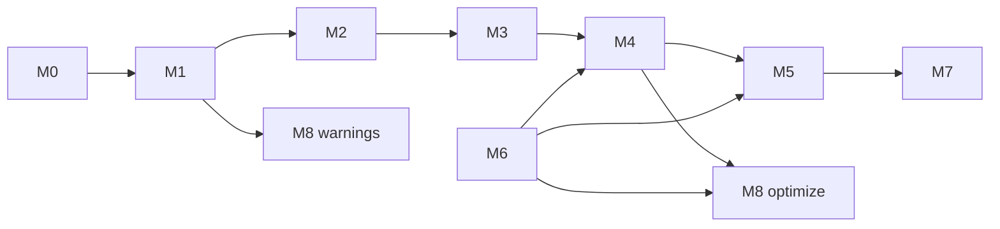

# D-04 — Suite-Driven Roadmap

**Implements:** [F-02 — Build Portable Program Artifacts](../feature/F-02-portable-programs.md)  
**Status:** In progress

## Purpose

Turn the official PureScript test suite into an operational scoreboard for the
frontend and backend feature matrices below. [DEC-04](../decision/DEC-04-official-test-suite-roadmap.md)
fixes the strategy: the feature matrices define the implementation
inventory, while the suite and the `purs` compiler provide the acceptance
oracle. This document defines the corpus classification, coverage milestones,
and acceptance criteria used to measure those matrices.

The milestones are ordered by dependency, not by suite size. Each milestone is
independently measurable as per-file agreement with `purs`, and each later
milestone reuses the earlier ones.

## Corpus

The vendored corpus is pinned to the PureScript `v0.15.16` release so that the
installed `purs` binary and the sources agree. Counts below are from that
revision and include files in subdirectories:

| Directory | Files | Role |
| --- | --- | --- |
| `tests/purs/layout` | 15 | Lexer/layout goldens with `.out` |
| `tests/purs/passing` | 439 | Must compile and run |
| `tests/purs/failing` | 444 | Must fail with a listed `errorCode` |
| `tests/purs/warning` | 68 | Must compile with listed warnings |
| `tests/purs/optimize` | 10 | Expected CoreFn output |

`purs --json-errors` reports a machine-readable `errorCode` per diagnostic.
Parsing occurs before module resolution, so `ErrorParsingModule` classifies
parse behavior even when the support libraries are not installed.

One caveat applies when using a single-file `purs compile` invocation without
the support libraries: for a module whose imports cannot be found, the compiler
reports `ModuleNotFound` from the partially-parsed header without parsing the
rest of the body. The harness therefore also supports classifying `failing`
files by their `@shouldFailWith` annotation (`PSRS_ORACLE=annotations`), which
is the corpus's own ground truth and does not depend on the installed
libraries or compiler revision.

## Exclusions

JavaScript and Node.js FFI are not a compatibility target, per [F-02](../feature/F-02-portable-programs.md).
A suite file is excluded from milestone acceptance when any of the following
holds:

- it contains a `foreign import` declaration;
- it is accompanied by a `.js` FFI implementation used by the same module;
- its expected `errorCode` is FFI-specific (`DeprecatedFFIPrime`,
  `MissingFFIImplementations`, `UnsupportedFFICommonJSImports`,
  `UnsupportedFFICommonJSExports`, `DeprecatedFFICommonJSModule`,
  `UnnecessaryFFIModule`, and similar).

In this corpus that is 26 `passing`, 32 `failing`, and 2 `warning` files, plus
25 `.js` files. Excluded files are reported separately by the harness and count
as neither agreement nor gaps. The parser may accept `foreign` syntax
opportunistically, but no milestone requires it.

Programs that use the project's PureScript-facing WASI libraries remain
targets; those libraries are implemented by the runtime, not by JavaScript
FFI.

## Milestones

| ID | Milestone | Primary suite subset | Layer |
| --- | --- | --- | --- |
| M0 | Layout and lexing | `layout` (15) | L0 |
| M1 | Surface grammar | parse behavior of all non-excluded files | L1 |
| M2 | Modules, imports, exports, names | resolution `errorCode`s | L2 |
| M3 | Kinds and higher-kinded types | kind `errorCode`s | L3 |
| M4 | Core type checking | type `errorCode`s | L4 |
| M5 | Type classes and instances | class `errorCode`s | L5 |
| M6 | Data, newtypes, records, rows | features required by `passing` | L4–L6 |
| M7 | Runtime and standard library | `passing` (414) run | L6 |
| M8 | Warnings and optimization | `warning` (68), `optimize` (10) | — |

### M0 — Layout and lexing

- **Suite:** `tests/purs/layout/*.purs` (15), for example `Shebang.purs`,
  `Delimiter.purs`, `Commas.purs`, `IntType.purs`, `AdoIn.purs`.
- **Goal:** Tokenization and the layout algorithm match PureScript's, including
  Unicode keywords (`∷`, `∀`, `→`), numeric and string literals, backtick
  operators, and `where`/`let`/`do`/`ado` layout.
- **Acceptance:** Our layout output is stable and reviewed against each golden;
  every layout file parses.
- **Prerequisite:** None.

### M1 — Surface grammar

- **Suite:** All non-excluded `passing` + `failing` + `warning` files.
- **Selection rule:** Files the oracle reports as `ErrorParsingModule` (34
  failing tests, for example `UnderscoreModuleName.purs`) must fail to parse;
  every other non-excluded file must parse successfully.
- **Goal:** The full surface grammar: module/import/export lists; value, type,
  `data`, `newtype`, `class`, `instance`, `derive`, `foreign`, fixity, and kind
  signature declarations; `where` blocks; types with `forall`, rows,
  constraints, kind annotations, application, and operators; expressions with
  `case`/`of` and guards, `do`/`ado`, records, sections, and type application;
  and pattern binders.
- **Acceptance:** L1 parse agreement reaches 100% over all four directories,
  enforced by the suite scoreboard.
- **Prerequisite:** M0.

**Progress (measured against the vendored `v0.15.16` corpus):** 905/907 parse
agreement (99.8%): `passing` 413/413, `failing` 413/413, `warning` 66/66, and
`layout` 13/15. The two remaining `layout` files are `CaseGuards.purs` and
`Commas.purs`. The numbers above use
`PSRS_ORACLE=annotations`; the default `purs` oracle additionally disagrees on
files whose imports prevent the installed compiler from parsing the body (see
the Corpus caveat).

### M2 — Modules, imports, exports, and names

- **Suite:** Failing tests by `errorCode`: `UnknownName` (22), `DeclConflict`
  (11), `TransitiveExportError` (10), `ExportConflict` (7), `ScopeConflict`
  (6), `TransitiveDctorExportError` (2), `OrphanTypeDeclaration` (2),
  `OrphanKindDeclaration` (2), `OverlappingNamesInLet` (4),
  `OverlappingArgNames` (2), `DuplicateValueDeclaration` (2), `DuplicateModule`
  (1), `CycleInModules` (1), `UnknownImport` (1),
  `UnknownImportDataConstructor` (1), `UnknownExport` (1),
  `UnknownExportDataConstructor` (1), `ModuleNotFound` (1).
- **Goal:** A module loader and namespace resolution: values, types,
  constructors, classes, imports with `hiding`/`as`, export lists, and
  dependency cycles.
- **Acceptance:** Agreement on the `errorCode`s above, and every `passing`
  module resolves.
- **Prerequisite:** M1.

**Progress (implemented slice):** the front end resolves a value-namespace
module graph: stable module IDs, duplicate (`DuplicateModule`), missing
(`ModuleNotFound`), and cyclic (`CycleInModules`) module diagnostics,
unqualified, qualified, and aliased imports, explicit and `hiding` import
lists (`UnknownImport`), explicit export lists (`UnknownExport`), and
cross-module value references. It also lowers `data`, `newtype`, `type`, and
`class` declarations into AST and HIR, resolves user type names and type-level
application in types, treats data constructors and class members as values, and
reports conflicts in the shared uppercase namespace (`DeclConflict`). Types,
constructors, and classes import and export across modules: `import M (T(..))`
brings the type and its constructors, `T(A, B)` selects constructors
(`UnknownImportDataConstructor`), and export lists validate constructors
(`UnknownExportDataConstructor`, `TransitiveDctorExportError`) and require
referenced types, superclasses, and class members to be exported too
(`TransitiveExportError`). An import with an `as` alias is qualified-only, so
`module A` re-exports validate through the alias: ambiguous aliases and
unaliased names report `ScopeConflict`, while the same name re-exported from
two modules reports `ExportConflict`. Surface lowering reports
`OrphanTypeDeclaration`, `OrphanKindDeclaration`, and `OverlappingArgNames`;
resolution reports `DuplicateValueDeclaration` and `OverlappingNamesInLet`.
Operator and fixity aliases, kind-annotation references, and value-type-based
transitive exports are still open.

**Measured baseline (annotations oracle):** the scoreboard also loads a case's
support modules from its sibling directory, matching the corpus layout. M2
failing agreement is 46/70 and 35/413 `passing` modules resolve, including all
11 `DeclConflict` cases, `ExportConflict` 5/7, `ScopeConflict` 5/6,
`UnknownImport`, `UnknownImportDataConstructor`, `UnknownExportDataConstructor`,
`TransitiveDctorExportError`, and the self-contained `TransitiveExportError`
subsets. The remaining failures need expression forms (records, `do`, guards,
`where`), instances, pattern binders, or fixity aliases rather than names.

### M3 — Kinds and higher-kinded types

- **Suite:** `KindsDoNotUnify` (29), `PartiallyAppliedSynonym` (12),
  `CycleInTypeSynonym` (4), `CycleInKindDeclaration` (4), `UndefinedTypeVariable`
  (4), `InfiniteKind` (2), `OrphanKindDeclaration` is M2 for resolution but kind
  errors are here, `UnsupportedTypeInKind` (1), `ScopedKindVariable` errors.
- **Goal:** Kinds, type synonyms, type constructors, type-level application,
  and kind checking.
- **Acceptance:** Agreement on the `errorCode`s above.
- **Prerequisite:** M2.

**Progress (implemented slice):** kinds are checked as a dedicated pass
(`psrs-kind`, P5) over resolved HIR. HIR and AST now carry kinded `forall`
binders, standalone kind signatures, kind annotations on type parameters,
records/rows, constraints, and type-level literals. The checker infers kinds for
`data`, `newtype`, `type`, and `class` declarations, unifies them with an occurs
check, and reports `KindsDoNotUnify`, `InfiniteKind`, `PartiallyAppliedSynonym`,
`CycleInTypeSynonym`, `CycleInKindDeclaration`, and `UndefinedTypeVariable`.
The driver exposes a lenient kind check and the `l3` scoreboard; the scoreboard
also runs against the vendored corpus without `purs`.

**Measured baseline (annotations oracle):** M3 failing agreement is 27/48.
Per code: `CycleInKindDeclaration` 2/2, `InfiniteKind` 2/2,
`CycleInTypeSynonym` 3/4, `UndefinedTypeVariable` 3/4,
`PartiallyAppliedSynonym` 8/12, `KindsDoNotUnify` 9/24. The remaining cases
need features outside the kind core: instances and `derive`, `foreign import
data`, rows in kinds, polymorphic expression annotations, and shared
cross-module kind environments.

### M4 — Core type checking

- **Suite:** `TypesDoNotUnify` (47), `HoleInferredType` (10), `EscapedSkolem`
  (3), `InfiniteType` (2), `ExpectedType` (2),
  `CannotApplyExpressionOfTypeOnType` (2), `AmbiguousTypeVariables` (1),
  `IntOutOfRange` (1), and related.
- **Goal:** The type checker over ADTs, records, rows, and functions, including
  holes and rigid variables.
- **Acceptance:** Agreement on the `errorCode`s above.
- **Prerequisite:** M3 and M6.

### M5 — Type classes and instances

- **Suite:** `NoInstanceFound` (55), `OverlappingInstances` (9),
  `OrphanInstance` (7), `InvalidInstanceHead` (7), `InvalidNewtypeInstance` (6),
  `ClassInstanceArityMismatch` (4), `MissingClassMember` (2),
  `PossiblyInfiniteInstance` (1), `DuplicateTypeClass` (1),
  `DuplicateInstance` (1), `CycleInTypeClassDeclaration` (2), `CannotDerive`
  (1), and related.
- **Goal:** Class and instance declarations, instance resolution, dictionary
  evidence, and `derive`.
- **Acceptance:** Agreement on the `errorCode`s above.
- **Prerequisite:** M4.

### M6 — Data, newtypes, records, and rows

- **Suite:** Feature subset of `passing` that uses `data` (324 files),
  `newtype` (80), type synonyms (143), records, and rows.
- **Goal:** Algebraic data types, constructors and pattern matching, newtype
  erasure, record and row types, and their runtime layouts.
- **Acceptance:** These `passing` files type-check and lower, and their
  `optimize` counterparts later match.
- **Prerequisite:** M1; supports M4, M5, and M7.

**Progress (implemented slice):** `data` and `newtype` constructors are
registered as polymorphic values and type-check, including application of
constructors with fields. A single-scrutinee `case` with constructor, variable,
and wildcard patterns type-checks, and constructor patterns in function
parameters lower to a temporary parameter plus `case`. The constructor table
flows through THIR and Core. The first runtime slice lowers the nullary
constructors of a non-parameterized data type to immediate integer tags and
`case` over it to tag comparisons, so enum-style programs compile to Wasm and
run under WASI. Nested constructor patterns in aggregate fields now test the
nested constructor before destructuring the corresponding GC object. A valid
single-field `newtype` is now erased in CC: construction
and matching pass through the field value, with no GC allocation; nested
constructor patterns are lowered against that erased field. A first
concrete parameterized ADT slice also uses the selected erased representation:
fields that depend on a type parameter are boxed and recovered through `eqref`,
as demonstrated by `Maybe Int` and `Maybe Number`, whose erased scalar fields
use typed GC boxes before being recovered through `eqref`. A `Wrap Int` case
with an `Array Int` payload also constructs and matches through an erased field.
Concrete scalar and aggregate array literals, length, indexing, and updates
now lower to Wasm GC arrays, including nested arrays, records, field-bearing
data values, and `Number`. Closed concrete record literals, field reads,
updates, and record patterns lower to Wasm GC structs.
Nested constructor and record field patterns use conditional matching. These
patterns are currently limited to concrete record types with no open row tail.
Generic direct calls and erased higher-order adapters now work for the tested
scalar and parameterized-value cases. Generic records and arrays remain open:
when an erased field projection or direct access would recover a type-dependent
nominal array or record layout, CC reports a source-spanned limitation instead
of emitting a cast that may trap at runtime. The design target for generic
array and closed-record reconstruction is
[generic aggregate erasure](backend/fp/generic-aggregate-erasure.md); that
conversion design is not current implementation coverage. Open rows and richer
heap or tagged aggregate layouts remain open. The parameterized ADT representation is
fixed by
[DEC-07](../decision/DEC-07-runtime-representation-for-parameterized-adts.md).
Supported non-parameterized fields use Wasm GC objects under the runtime baseline fixed by
[DEC-05](../decision/DEC-05-wasmtime-feature-set.md).

Array and record GC type indices are reserved before either family is laid out,
so concrete arrays and records can refer to each other without depending on
type-table declaration order.

The first M7 closure slice is now executable: top-level functions and local
lambdas, including scalar-capturing lambdas, can be passed as values, local
function parameters can be invoked with `call_ref`, and the Wasm artifact
validates and runs through the component path. A uniform closure struct stores
the code reference and an immutable capture array.

### M7 — Runtime and standard library

- **Suite:** `tests/purs/passing`, 414 files after excluding 26 FFI tests; these
  must compile and run with the expected observable result.
- **Goal:** Module loading, the PureScript-facing standard library (Prelude,
  `Effect`, console, assertions), closure conversion, and a runtime that
  executes the artifacts.
- **Acceptance:** Each passing test compiles and runs; failures are reported per
  file.
- **Prerequisite:** M2–M6.

### M8 — Warnings and optimization

- **Suite:** `warning` (68) with warning codes such as `UnusedName` (13),
  `WildcardInferredType` (8), `UserDefinedWarning` (8),
  `MissingTypeDeclaration` (8), `DuplicateExportRef` (7); and `optimize` (10)
  with expected CoreFn output.
- **Goal:** Warning diagnostics that match warning codes, and optimization
  output that matches the expected CoreFn shape.
- **Acceptance:** Warning-code agreement and optimize-output agreement.
- **Prerequisite:** M1 for warnings; M4 and M6 for optimize.

## Dependency graph



## Progress measurement

The suite harness classifies every file with `purs --json-errors` and reports
per-file agreement for the current milestone:

- `parse_source` measures M0–M1.
- `check_source` measures M2–M5.
- Runtime comparison measures M7.
- Warning and optimize comparison measure M8.

The harness is opt-in and skips without `purs` or a checkout, so
`cargo test --workspace` stays self-contained.

```sh
PURESCRIPT_REPO=/path/to/purescript \
  cargo test -p psrs-driver --test suite -- --ignored --nocapture
```

The resolution scoreboard reads the corpus's own `@shouldFailWith` annotations
and does not need `purs` or the support libraries, so it also runs against the
vendored corpus without `PURESCRIPT_REPO`.

Each milestone is complete only when its subset reaches 100% agreement. New
diagnostics must align to an official `errorCode`; message text and `.out`
formatting are not matched.

## Feature matrices and landing gates

These tables track implementation and official-suite acceptance for the
frontend and backend. [DEC-04](../decision/DEC-04-official-test-suite-roadmap.md)
records why the two matrices are maintained.

## Matrix status legend

| Status | Meaning |
| --- | --- |
| Implemented | Supported at the stated boundary and covered by tests. |
| Partial | A restricted slice or an earlier compiler stage is implemented. |
| Planned | No supported implementation yet; the feature remains on the roadmap. |
| Excluded | Deliberately outside the current compatibility target. |

## Official-suite progress and landing gates

The following snapshot is part of this decision and must be updated with the
feature matrices. Counts and harness rules are maintained by
[D-04](D-04-suite-roadmap.md); the rows below record what they mean
for matrix status.

| Gate | Official-suite scope | Current progress | `Implemented` threshold |
| --- | --- | --- | --- |
| L0 | Layout goldens | 13/15 agreement | 15/15, with all remaining layout cases covered by regression tests. |
| L1 | Non-excluded parse behavior | 905/907 agreement using the annotations oracle; `passing` 413/413, `failing` 413/413, `warning` 66/66, `layout` 13/15 | 100% agreement for the tracked corpus. |
| L2 | Module, import, export, and name resolution | 46/70 failing cases; 35/413 passing modules resolve | The mapped resolution cases and all required passing-module cases agree. |
| L3 | Kinds and higher-kinded types | 27/48 failing cases | 100% agreement for the mapped kind cases. |
| L4 | Core type checking | The type gate is not complete | 100% agreement for the mapped type cases. |
| L5 | Classes and instances | The class gate is not complete | 100% agreement for the mapped class cases. |
| L6/M7 | Runtime and standard library | 414 non-FFI passing files are in scope; full compile/run coverage is not complete | Every in-scope passing file for the feature compiles, validates, and runs with the expected result. |
| M8-W | Warnings | 68 warning files are in scope; full warning-code coverage is not complete | Warning-code agreement reaches 100% for the tracked warning corpus. |
| M8-O | Optimization | 10 optimize files are in scope; optimize agreement is not complete | Expected optimize/CoreFn output agrees for all tracked optimize files. |

### Feature-to-gate crosswalk

This crosswalk makes the suite state part of each matrix row without repeating
the corpus counts in every row. A row with an open gate remains `Partial`, even
when its local implementation tests pass.

| Matrix rows | Required suite gate | Additional evidence |
| --- | --- | --- |
| FE-01 | L0 and L1 | Layout goldens and parser regression tests. |
| FE-02 | L2 | Resolution scoreboard and cross-module tests. |
| FE-03–FE-07 | L1–L2, then the relevant L4/L5 cases | CST/AST/HIR tests plus typed diagnostics. |
| FE-08–FE-13 | L3–L4 and the corresponding L6/M7 passing cases | Type/kind scoreboards and typed Core tests. |
| FE-14–FE-18 | L5 and the corresponding L6/M7 cases | Constraint, instance, and advanced-polymorphism tests. |
| FE-19 | Non-FFI suite cases plus WIT-specific tests | JavaScript FFI remains excluded. |
| FE-20 | L0–L5 diagnostics and M8-W | Error-code and warning-code scoreboards. |
| FE-21 | M8-O and backend Core/MIR tests | Optimize output and semantics-preservation tests. |
| BE-01–BE-11 | L6/M7 for source-visible behavior | CC/MIR lowering, representation, and execution tests. |
| BE-12 | M8-O | Core/MIR optimization and output comparison. |
| BE-13–BE-16 | L6/M7 for generated artifacts | Wasm feature-profile, validation, WAT, and runtime tests. |
| BE-17–BE-23 | L6/M7 for programs using the capability | WIT registry, canonical ABI, component, and WASI execution tests. |
| BE-24–BE-25 | No current acceptance gate | These are outside or later than the current target. |
| BE-26–BE-27 | L6/M7 | Module-loading and full passing-suite execution scoreboards. |
| BE-28 | No gate | JavaScript/Node.js FFI is excluded. |
| BC-01–BC-12 | No direct source-suite gate | Core Wasm feature tests, profile validation, WIT/component tests, and runtime compatibility tests. |

## Frontend feature matrix

The frontend boundary is Typed Core. Rows are intentionally phrased as
PureScript language features rather than crate or pass names. A syntax feature
that is currently accepted only by CST/AST is therefore `Partial` until it is
resolved, type checked, and represented in Typed Core as required.

| ID | Feature | Current support | Status | Next landing |
| --- | --- | --- | --- | --- |
| FE-01 | Lexing, Unicode tokens, comments, literals, and layout | Lexer and layout processor work; the official layout goldens still have open cases. | Partial | Close the remaining layout goldens and lock token behavior. |
| FE-02 | Module headers, imports, exports, qualified names, aliases, and hiding | Module graph, stable module IDs, value/type/constructor/class imports and exports, aliases, and cycles work in a subset. | Partial | Complete operator/fixity aliases and all transitive export rules. |
| FE-03 | Value declarations, signatures, recursive groups, pattern bindings, and `where` | Named declarations, signatures, recursive local groups, and top-level SCC inference work; pattern declarations and `where` are not end-to-end. | Partial | Lower pattern declarations and local `where` blocks. |
| FE-04 | Declaration forms: `data`, `newtype`, `type`, `class`, `instance`, `derive`, `foreign`, roles, fixities, and kind signatures | Most forms parse and several enter AST/HIR; only data, newtype, type, and part of class/kind handling are connected to checking. | Partial | Add semantic checking and resolution for each declaration form. |
| FE-05 | Expressions: application, operators, lambdas, `if`, `let`, `case`, records, arrays, literals, sections, `do`, and `ado` | Application, operators in the bootstrap subset, lambdas, `if`, `let`, `case`, scalar arrays, records, and selected literals work; sections, `do`/`ado`, and several literal forms remain open. | Partial | Land desugaring and typing for `do`/`ado`, sections, and the remaining literals. |
| FE-06 | Patterns: variables, wildcards, constructors, records, literals, tuples, arrays, guards, and binders | Variable, wildcard, constructor, and restricted closed-record patterns work; guards, multiple scrutinees, literal/tuple/array patterns, exhaustiveness, and redundancy checks remain open. | Partial | Complete pattern typing, coverage checking, and lowering. |
| FE-07 | Operators, sections, fixity declarations, and type/value operators | Operator syntax and the current intrinsic operators work; complete fixity resolution, aliases, sections, and type operators are pending. | Partial | Implement one shared fixity and operator-resolution pass. |
| FE-08 | Primitive types and monomorphic inference | `Int`, `Number` (IEEE-754 binary64), `Boolean`, `Char` (Unicode scalar as `i32`), `String`, `Unit`, function types, unification, occurs check, and source-spanned primitive errors work in the compiler slice. | Partial | Reach the complete L4/L6 gate and add official-suite evidence for the expanded primitive set and remaining literal semantics. |
| FE-09 | Rank-1 polymorphism, generalization, instantiation, signatures, `forall`, and scoped variables | Local and top-level generalization, instantiation, rigid signature variables, outermost `forall`, and the first generic CC/Wasm representation work through THIR/Core. | Partial | Reach the corresponding type/runtime suite gate, then add dictionary passing and the remaining generic representations. |
| FE-10 | Type constructors, type application, type synonyms, and saturation | Constructor/application types, built-in and user constructors, and synonym substitution work in a restricted set. | Partial | Complete constructor environments, arity rules, recursive synonyms, and backend-independent acceptance. |
| FE-11 | Kinds, kind signatures, higher-kinded types, kind annotations, and kind variables | Dedicated kind inference/checking covers several declarations, annotations, records/rows, and official kind errors. | Partial | Complete cross-module environments, rows in kinds, and expression-level cases. |
| FE-12 | Algebraic data types, constructors, newtypes, and constructor typing | Data/newtype declarations, constructor schemes, constructor application, and basic case typing work. | Partial | Add full recursive/parameterized checking, exhaustiveness, and all pattern forms. |
| FE-13 | Records, row types, row polymorphism, and variants | Closed concrete records, field access/update, and restricted record patterns work; open rows and row-polymorphic inference do not. | Partial | Implement row unification, open records, and variants. |
| FE-14 | Constraints, type classes, superclasses, class members, and instances | Class and instance syntax is represented, but constraint solving and dictionary evidence are not implemented. | Planned | Add class environments, constraint schemes, and instance resolution. |
| FE-15 | Functional dependencies | Functional-dependency syntax is represented; improvement and consistency checking are not implemented. | Partial | Add dependency improvement and the associated diagnostics. |
| FE-16 | Deriving, roles, `Coercible`, and newtype-based derivation | Syntax is partially represented; deriving, role checking, coercions, and generated evidence are not supported. | Partial | Implement roles/coercions first, then deriving and generated instances. |
| FE-17 | Visible type application, typed binders, type wildcards, holes, and advanced annotations | Some type syntax and kinded binders parse; visible application, holes, and full annotation checking remain incomplete. | Partial | Add explicit type-application elaboration and hole/wildcard diagnostics. |
| FE-18 | Higher-rank types, subsumption, impredicativity, and higher-rank `forall` | Not implemented; the current checker is rank-1. | Planned | Add a separate higher-rank checking phase after classes and rows. |
| FE-19 | Foreign declarations and target-aware external names | Source-declared WIT bindings are resolved for the supported backend path; JavaScript FFI and foreign data are not general frontend targets. | Partial | Define the complete target-aware foreign declaration rules. |
| FE-20 | Warnings, holes, source spans, and official diagnostic codes | Source spans and several error-code mappings exist; warning coverage and complete diagnostic agreement do not. | Partial | Track warning-code agreement separately from acceptance errors. |
| FE-21 | Typed Core normalization and CoreFn/optimization compatibility | Typed Core lowering and verification work for the supported subset; official optimize output is not yet a target. | Partial | Add Core optimization passes and an explicit optimize compatibility track. |

The frontend landing order is:

```text
FE-01 -> FE-02..FE-07 -> FE-08..FE-13 -> FE-14..FE-17 -> FE-18..FE-21
```

This is a dependency guide, not a requirement to finish every row in a block
before starting the next one. Each row must move from syntax/representation to
typed, source-spanned behavior before it is considered landed.

## Backend feature matrix

The backend starts from Typed Core. CC and MIR are the backend IR family;
Wasm is the target encoding, and WIT/WASI are the platform integration layers.

| ID | Feature | Current support | Status | Next landing |
| --- | --- | --- | --- | --- |
| BE-01 | ANF and explicit evaluation order | Direct-style CC/ANF lowering is implemented and tested for the bootstrap expression set. | Partial | Extend the lowering to every frontend expression form and pass the L6/M7 gate. |
| BE-02 | Closure conversion, captures, direct calls, and closure calls | Top-level functions, local lambdas, scalar and concrete aggregate captures, direct rank-1 generic calls, and explicit adapters between concrete and erased higher-order closures work. | Partial | Cover generic captures, partial applications, and the official runtime gate. |
| BE-03 | MIR/CFG, block parameters, terminators, and verification | Typed basic blocks, explicit instructions/terminators, runtime layouts, and MIR verification work; a verified tag `Switch` is supported for nullary ADT dispatch. | Partial | Extend control flow beyond enum-tag switches and current merge diamonds, then grow the instruction set for remaining language/runtime constructs and pass the L6/M7 gate. |
| BE-04 | Primitive runtime representation and calling conventions | `Int`, `Number` as Wasm `f64`, `Boolean`, `Char` as an integer-valued scalar, `String`, `Unit`, direct calls, and the current closure ABI work in compiler/runtime tests. The currently exposed integer, number, boolean, and character primitive subset lowers from Typed Core through CC. | Partial | Add official-suite evidence, remaining primitive/literal semantics, richer values, and stable ABI coverage before changing the status. |
| BE-05 | Nullary ADT tags and case lowering | Nullary constructors use integer tags; enum-style case dispatch lowers through verified MIR `Switch` to Wasm `br_table` and is validated and executed under WASI. | Partial | Extend case lowering beyond nullary enums, integrate with the complete pattern model, and pass the L6/M7 gate. |
| BE-06 | Field-bearing ADTs and constructor-pattern lowering | Non-parameterized constructors use Wasm GC structs; nested constructor patterns lower in a restricted form. CC coverage analysis handles constructor and record matrices, including nested fields and recursive ADTs, reports non-exhaustive witnesses, and exposes source-spanned redundancy warnings. | Partial | Complete shared decision lowering and recursive, polymorphic, and mixed-field layouts. |
| BE-07 | Newtype erasure | Single-field newtype construction and matching erase without allocation. | Partial | Connect erasure to coercions, roles, derived instances, and the relevant L6/M7 cases. |
| BE-08 | Parameterized ADT representation and erasure | Parameter-dependent `Int`/`Boolean`/`Number` fields use typed GC boxes and recover through `eqref`; dependent array and record payloads use erased storage, while recovery to their type-dependent nominal layouts is rejected with a named diagnostic. | Partial | Implement canonical generic layouts and boundary conversions from [generic aggregate erasure](backend/fp/generic-aggregate-erasure.md), then verify all instantiations. |
| BE-09 | Records and row values | Closed concrete records, field reads, updates, and restricted patterns use GC structs; dependent generic fields can be stored erased, but generic nominal record/array recovery is diagnosed. | Partial | Implement closed generic product layouts and field conversions per [generic aggregate erasure](backend/fp/generic-aggregate-erasure.md); open rows and variants remain separate work. |
| BE-10 | Arrays and aggregate values | Concrete scalar and aggregate arrays support literals, length, indexing, and updates through Wasm GC arrays, including nested arrays, records, ADTs, and `Number`; polymorphic element layouts remain unsupported. | Partial | Implement canonical generic arrays and element conversion per [generic aggregate erasure](backend/fp/generic-aggregate-erasure.md), then collect runtime evidence. |
| BE-11 | Strings, linear memory, data segments, and allocation | String literals use length-prefixed UTF-8 data; the bump `cabi_realloc` supports returned byte lists/strings, passing returned strings to another WIT import, and repeated allocations. It checks alignment, the old range and stored length prefix, address overflow, and growth failure, and copies preserved bytes on reallocation. | Partial | Add static memory-access extent checks, broaden returned aggregate handling, and define allocator ownership and reclamation. |
| BE-12 | Core optimization and MIR optimization | P7 Typed Core performs local simplification, bounded lambda inlining, field projection from statically known records (including dictionary-shaped records), and inert dead-binding elimination. P10 MIR performs small direct inlining, unreachable-block pruning, constant propagation, terminator simplification, value forwarding, dead pure-instruction elimination, and reachable-import projection; both verify transformed IR. Focused optimizer and compiler/runtime tests exist, but official optimize/CoreFn compatibility and broader pass coverage remain incomplete. | Partial | Connect both optimization stages to M8-O, add broader semantics-preservation evidence, and extend named-global inlining and specialization only with explicit linkage rules. |
| BE-13 | Structured Wasm encoding and binary emission | Thin structured control-flow encoding delegates leaf instructions to `wasm-encoder`; the current branch subset includes `if` and enum-tag switches encoded with `br_table`. | Partial | Cover the remaining MIR instruction and control-flow forms and pass the L6/M7 gate. |
| BE-14 | Wasm validation and WAT output | Generated core modules are validated with `wasmparser` and printed with `wasmprinter`. | Partial | Make feature-profile validation part of every backend acceptance test and pass the L6/M7 gate. |
| BE-15 | Wasm GC, reference types, typed function references, and `call_ref` | GC/reference operations and `call_ref` are emitted for the current closure and aggregate slice; the profile gate now rejects disabled targets. | Partial | Add per-operation validation and execution coverage for the complete selected subset. |
| BE-16 | Wasm feature profile and pinned runtime | `TargetCapabilities` defines the stable profile and `wasmparser` validates from the same explicit flags; optional Wasmtime proposals are disabled by default. | Partial | Add fallback lowerings or keep each optional capability explicitly out of the target. |
| BE-17 | WIT vendoring, parsing, name resolution, and canonical signatures | Vendored WASI WIT is loaded into a registry and resolves interfaces, functions, resources, lists, and results. | Partial | Expand the accepted source and result type mapping and pass the L6/M7 capability gate. |
| BE-18 | Generic source-declared WIT imports | Compatible `Int`/`Boolean`/`Number` scalars, handles, and byte-list/string imports lower through the canonical ABI with signature validation. Closed, directly flattened WIT records can contain nested byte-list fields. | Partial | Add other aggregate WIT values, richer results, and user-library loading. |
| BE-19 | WIT aggregate values and resources | Resource handles and byte lists have a restricted path; closed WIT records with nested byte-list fields are classified and lowered in WIT field order. Lists of strings, tuples, and general aggregates remain unsupported. | Partial | Add general aggregate layouts and resource ownership/lifetime rules. |
| BE-20 | Component Model packaging and capability-based imports | `wit-component` lifts the core module to a WASI 0.2 component and prunes unused imports. | Partial | Add component import/export regression cases beyond the CLI path and pass the L6/M7 gate. |
| BE-21 | WASI CLI entry, exit, stdout, and stderr | `wasi:cli/run`, exit codes, console output, and error output work in the component path. Source `Effect` values remain inert until the selected entry calls `runEffect`; focused execution tests cover source order and repeated runs. | Partial | Expand source-level runtime cases and pass the L6/M7 gate. |
| BE-22 | WASI clocks and randomness | Monotonic time and random bytes are wired through WASI and tested. | Partial | Expose the remaining clock/random library surface and pass the L6/M7 gate. |
| BE-23 | WASI arguments, environment, and filesystem | WIT descriptions are vendored, but the source library and aggregate lowering are not complete. | Planned | Add module loading and aggregate/list support, then expose these services. |
| BE-24 | WASI sockets and HTTP | Not part of the current synchronous portable-program target. | Excluded | Revisit as a separate platform scope after the core target is stable. |
| BE-25 | WASI 0.3 async streams and futures | The current compiler targets synchronous WASI 0.2. | Planned | Revisit only with an explicit platform decision and async language/library plan. |
| BE-26 | Embedded standard library and user module loading | The PureScript-facing library is embedded and linked like source modules; a filesystem module loader is missing. | Partial | Replace embedding with discoverable library/module loading. |
| BE-27 | Wasm/WASI execution and official passing-suite runtime coverage | Vertical execution tests pass for the bootstrap slice; full official passing-suite execution is not complete. | Partial | Track per-feature runtime cases and then expand the passing-suite scoreboard. |
| BE-28 | JavaScript/Node.js FFI compatibility | Not emitted or executed by this backend. | Excluded | No work planned under this decision. |

### Topic implementation acceptance

Detailed topic checklists refine the feature rows without replacing their
broader landing gates. A stable design or existing implementation is not an
acceptance result.

| Topic | Related rows | Acceptance status | Execution checklist |
| --- | --- | --- | --- |
| Generic aggregate erasure | BE-08, BE-09, BE-10; supporting BE-02, BE-03, BE-13, BE-15 | Topic acceptance complete: all GA-01..GA-20 checks have implementation, verifier and required execution evidence. Broader feature rows retain their separate gates. | [Requirements, repair evidence, and validation](../implementation/backend/generic-aggregate-erasure.md) |

The backend landing order is:

```text
BE-01..BE-04 -> BE-05..BE-11 -> BE-13..BE-16 -> BE-17..BE-23 -> BE-12, BE-25..BE-27
```

The backend capability checklist is tracked at a smaller granularity than the
language-facing rows above. `BC` rows describe the target contract and must not
be read as claims that every opcode in an enabled proposal is already emitted.

## Backend target capability matrix

| ID | Capability slice | Current support | Status | Next landing |
| --- | --- | --- | --- | --- |
| BC-01 | Wasm MVP values, function types, locals, imports/exports, memory, tables, code, and data sections | The encoder covers the sections needed by the current component path, including the linear closure function table; globals, start, passive segments, and custom sections are not modeled. | Partial | Add explicit module-section records and section-level encode/validate tests for the remaining sections. |
| BC-02 | MVP calls, structured control, locals, numeric operations, and memory operations | Direct calls, `if`, integer/floating scalar locals, the current arithmetic/comparison subset, typed linear `i32`/`f64` loads and stores, `memory.size`, and `memory.grow` are emitted. Nullary-ADT `Switch` dispatch is emitted as `br_table`; general loops, branch forms, and numeric/memory families remain incomplete. | Partial | Split control-flow and opcode coverage into independently tested lowering slices. |
| BC-03 | Linear memory and data-segment ABI | Active data segments, length-prefixed strings and byte lists, the WASI `cabi_realloc` allocator, and the canonical return area use one wasm32 memory. Reallocation checks alignment, address arithmetic, the old range and stored length prefix, and growth failure, and copies preserved bytes; there is no reclamation or static MIR access-extent check. Linear memory is the canonical ABI boundary, not a language heap ([DEC-09](../decision/DEC-09-gc-only-language-heap.md)). | Partial | Add passive segments/bulk operations, static memory-access extent verification, a target-selected pointer width, and broader ABI coverage. |
| BC-04 | Tier-1 scalar proposals: mutable globals, sign extension, saturating float-to-int, and extended const | The target profile exposes these capabilities, but the MIR/emitter does not yet have dedicated nodes or end-to-end tests for all of them. | Partial | Add explicit MIR operations, constant folding, and validator tests. |
| BC-05 | Multi-value function/block signatures | The thin encoder can carry multiple function results, but MIR functions and structured regions currently have one result. | Partial | Extend MIR signatures, block parameters/results, stack typing, and tuple lowering. |
| BC-06 | Bulk memory and passive element/data segments | Not emitted by the current lowering. | Planned | Add passive segment ownership and `memory.init/copy/fill` lowering. |
| BC-07 | Reference types, typed function references, and Wasm GC | GC structs/arrays, nullable references, casts, `i31`, `ref.func`, and `call_ref` support the current closure/aggregate representation. | Partial | Complete subtype validation, recursive groups, and per-instruction Wasmtime tests. |
| BC-08 | SIMD, relaxed SIMD, tail calls, exceptions, multi-memory, memory64, and wide arithmetic | Runtime-supported proposal families are explicitly disabled in the stable profile and have no lowering. | Planned | Adopt each independently with a flag, fallback or rejection behavior, and execution evidence. |
| BC-09 | Threads, shared memory, and stack switching | Not part of the single-threaded runtime or language ABI. | Planned | Design a concurrency/effect model before enabling Core or WASI threading. |
| BC-10 | Component Model MVP, WIT, canonical lift/lower, resources, and realloc/post-return | WASI 0.2 command componentization, WIT registry lookup, scalar/handle/byte-list mappings, directly flattened closed records with nested byte-list fields, and `cabi_realloc` work in a restricted slice. General aggregates, resource lifetime, and post-return handling remain incomplete. | Partial | Add records beyond the byte-list subset, tuples, variants, option/result, resource lifetime, and component round trips. |
| BC-11 | WASI version targets | WASI 0.2 Component Model is the stable target; Preview 1 is excluded and WASI 0.3 async is deferred. | Partial | Keep version selection in target capabilities and add an explicit Preview 1 compatibility target only if needed. |
| BC-12 | WASI service capabilities | CLI exit/stdout/stderr, monotonic clocks, and random imports are wired; filesystem, sockets, HTTP, TLS, and async streams are not. | Partial | Add one capability/interface family at a time with source library, canonical ABI, sandbox, and runtime tests. |

### CC/MIR stage crosswalk

The BC rows above are capability families. This crosswalk is the smaller
implementation unit used when deciding whether a row can move from `Partial`
to `Implemented`.

| Stage | Owns today | Does not own yet | Gate for a capability claim |
| --- | --- | --- | --- |
| CC | Evaluation order, symbolic representation/signature handles, closure captures, direct versus indirect calls, current erased-value adapters, expression-level `if`, cycle-safe coverage/usefulness analysis for supported constructor and record matrices, and `TagSwitch` requests for nullary sums. Non-exhaustive witnesses and source-spanned redundant-row warnings are reported. | The complete shared decision DAG, general control flow, and multi-result values. | Every represented operation and pattern path has type/shape verification and focused tests, and CC stays independent of the selected P9 planner. |
| MIR | Typed CFG, P9 GC layout planning for aggregates, closures, and variants, block parameters for current merge diamonds, verified `Switch` for nullary-ADT tags, canonical import calls, GC/reference operations, and the canonical ABI boundary over linear memory. P10 runs representation-preserving MIR optimization before Wasm structuring and re-verifies after each pass. | Dynamic representation operations, loops and general switch structures beyond enum-tag dispatch, multi-value signatures, globals, bulk memory, and proposal-specific instructions. | The verifier checks dominance, exact call/reference signatures, switch selector/case/target validity, and aggregate compatibility; any static memory-extent claim has corresponding verification, and the GC path has binary plus execution evidence. |
| WIT/ABI lowering | WASI WIT lookup and the scalar/handle/byte-list canonical ABI subset, including direct flattening of closed records with nested byte-list fields. | General record layouts beyond the byte-list subset, variants, options, results, resources, ownership, and version-polymorphic ABI. | Source signature validation, canonical lift/lower, component metadata, and runtime tests agree for the selected service family. |

P7 optimizes verified Typed Core before CC lowering; it owns source-type-aware
local rewrites and does not change target layouts. P10 optimizes P9-lowered,
verified MIR before Wasm structuring without changing its concrete layouts or
signatures, and re-verifies its output after each pass. Both pipelines have
focused tests, but they do not establish M8-O CoreFn compatibility. Dictionary
evidence currently reaches Core through the THIR-to-Core conversion tests and
is erased to ordinary Core values, calls, and field projections; source class
solving is not part of this backend coverage.

The former CC type-table pass-through has been removed: P9 resolves reachable
abstract handles, with the GC planner constructing the concrete MIR `RecGroup`.
Under [DEC-09](../decision/DEC-09-gc-only-language-heap.md) there is a single
language-heap planner; linear memory carries only canonical ABI bytes. The
`BE-03`, `BE-12`, `BE-15`, and `BC-07` rows remain `Partial` while general
control-flow forms, M8-O compatibility, dynamic representation operations,
broader ABI operations, and the remaining proposal slices are still open.

The capability landing order is:

```text
BC-01..BC-03 -> BC-04..BC-07 -> BC-10..BC-12 -> BC-08..BC-09
```

This matrix is intentionally aligned with the external Wasmtime checklist:
Core Wasm proposals, Component Model gates, WASI version strategy, and WASI
service families are separate rows. A Wasmtime stability tier is evidence about
the host runtime, not a compiler implementation status.

The frontend and backend are developed in parallel, but a runtime feature is
not counted as an official passing case until the frontend can produce the
required Typed Core and the backend can validate and execute the resulting
artifact.

## Official suite and scoreboard

The suite is the acceptance oracle, not the feature inventory. The scoreboard
reports frontend and backend progress separately:

| Track | Measures | Primary evidence |
| --- | --- | --- |
| Frontend | Layout, parse, resolve, kinds, type, class, warning, and diagnostic agreement with `purs`. | `layout`, `passing`, `failing`, and `warning` cases classified by official `errorCode`. |
| Backend | CC/MIR verifier results, Wasm validation, WIT signature agreement, component construction, and observable execution. | Backend unit tests, WAT/validation tests, WIT ABI tests, WASI runtime tests, and the executable subset of `passing`. |
| End to end | A source feature plus its runtime representation behaves like the oracle. | Per-file compile/run agreement for supported non-FFI cases. |

The existing error-code layers remain useful as scoreboard dimensions:

```text
L0 layout -> L1 parse -> L2 resolve -> L3 kinds -> L4 types -> L5 classes -> L6 runtime
```

They no longer define the implementation roadmap by themselves. A feature row
in the matrices links to the relevant suite cases and may contribute to more
than one layer.

The pinned corpus currently contains layout goldens, passing programs, failing
programs with expected `errorCode`s, warning cases, and optimize cases. Exact
counts and harness behavior belong in [D-04](D-04-suite-roadmap.md),
which is the operational design for classification and scoreboards.

### Exclusions

JavaScript and Node.js FFI are outside the current target. Suite files that
declare JavaScript `foreign import`s, ship a JavaScript FFI implementation, or
expect an FFI-specific diagnostic are reported separately and count as neither
agreement nor gaps. A compatible source-declared WIT import and programs using
the project's PureScript-facing WASI libraries remain in scope.

The default workspace test suite must remain self-contained. Tests requiring
`purs`, a PureScript checkout, or a WASI runtime are opt-in or skip when the
external dependency is unavailable.


## Error-code appendix

Codes not listed above belong to the milestone whose layer matches their
semantics; the harness tracks unmapped codes so the mapping can grow. Notable
remaining groups:

- FFI and roles: `DeprecatedFFIPrime`, `MissingFFIImplementations`,
  `RoleMismatch`, `UnsupportedRoleDeclaration`, `InvalidCoercibleInstanceDeclaration`.
  FFI codes are excluded per the Exclusions section; role errors are deferred
  until the standard library requires them.
- Deriving: `CannotDeriveInvalidConstructorArg`, `CannotDeriveNewtypeForData`.
- Parse-adjacent: `MultipleValueOpFixities`, `MultipleTypeOpFixities`,
  `MixedAssociativityError`, `InvalidOperatorInBinder`.
- Module system: `CannotDefinePrimModules`, `DuplicateModule`, `CycleInModules`.

## Out of scope

- Matching diagnostic message text or `.out` byte content.
- IDE, docs, publish, sourcemaps, and graph test directories.
- Node.js and JavaScript FFI compatibility, per F-02.
