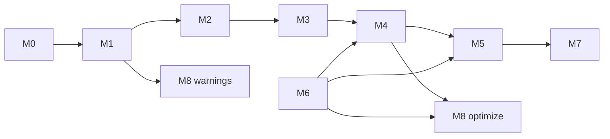

# D-04 — Suite-Driven Roadmap

**Implements:** [F-02 — Build Portable Program Artifacts](../feature/F-02-portable-programs.md)  
**Status:** In progress

## Purpose

Turn the official PureScript test suite into an operational scoreboard for the
frontend and backend feature matrices below. [DEC-04](../decision/DEC-04-official-test-suite-roadmap.md)
fixes the strategy: the feature matrices define the implementation
inventory, while the suite and the `purs` compiler provide the acceptance
oracle. This document defines the corpus classification, coverage milestones,
and acceptance criteria used to measure those matrices.

The milestones are ordered by dependency, not by suite size. Each milestone is
independently measurable as per-file agreement with `purs`, and each later
milestone reuses the earlier ones.

## Corpus

The vendored corpus is pinned to the PureScript `v0.15.16` release so that the
installed `purs` binary and the sources agree. Counts below are from that
revision and include files in subdirectories:

| Directory | Files | Role |
| --- | --- | --- |
| `tests/purs/layout` | 15 | Lexer/layout goldens with `.out` |
| `tests/purs/passing` | 439 | Must compile and run |
| `tests/purs/failing` | 444 | Must fail with a listed `errorCode` |
| `tests/purs/warning` | 68 | Must compile with listed warnings |
| `tests/purs/optimize` | 10 | Expected optimizer output |

The vendored copy under `tests/upstream` keeps the four `.purs` directories
only. `optimize` is not vendored, so M8-O reads it from a checkout, and its
goldens are `.out.js` files: M8-O therefore compares optimizer output shape
rather than CoreFn text.

`purs --json-errors` reports a machine-readable `errorCode` per diagnostic.
Parsing occurs before module resolution, so `ErrorParsingModule` classifies
parse behavior even when the support libraries are not installed.

One caveat applies when using a single-file `purs compile` invocation without
the support libraries: for a module whose imports cannot be found, the compiler
reports `ModuleNotFound` from the partially-parsed header without parsing the
rest of the body. The harness therefore also supports classifying `failing`
files by their `@shouldFailWith` annotation (`PSRS_ORACLE=annotations`), which
is the corpus's own ground truth and does not depend on the installed
libraries or compiler revision.

## Exclusions

JavaScript and Node.js FFI are not a compatibility target, per [F-02](../feature/F-02-portable-programs.md).
A suite file is excluded from milestone acceptance when any of the following
holds:

- it contains a `foreign import` declaration;
- it is accompanied by a `.js` FFI implementation used by the same module;
- its expected `errorCode` is FFI-specific (`DeprecatedFFIPrime`,
  `MissingFFIImplementations`, `UnsupportedFFICommonJSImports`,
  `UnsupportedFFICommonJSExports`, `DeprecatedFFICommonJSModule`,
  `UnnecessaryFFIModule`, and similar).

In this corpus that is 26 `passing`, 31 `failing`, and 1 `warning` file. No
tracked `.purs` file ships a sibling `.js` implementation — the corpus's 37
`.js` files are `optimize` goldens — and all 8 `failing` cases that expect an
FFI-specific `errorCode` also declare `foreign import`, so the harness's
`foreign import`-or-sibling-`.js` rule already excludes every file the three
rules above cover. Excluded files are reported separately by the harness and
count as neither agreement nor gaps. The parser may accept `foreign` syntax
opportunistically, but no milestone requires it.

Programs that use the project's PureScript-facing WASI libraries remain
targets; those libraries are implemented by the runtime, not by JavaScript
FFI.

## Milestones

| ID | Milestone | Primary suite subset | Layer |
| --- | --- | --- | --- |
| M0 | Layout and lexing | `layout` (15) | L0 |
| M1 | Surface grammar | parse behavior of all non-excluded files | L1 |
| M2 | Modules, imports, exports, names | resolution `errorCode`s | L2 |
| M3 | Kinds and higher-kinded types | kind `errorCode`s | L3 |
| M4 | Core type checking | type `errorCode`s | L4 |
| M5 | Type classes and instances | class `errorCode`s | L5 |
| M6 | Data, newtypes, records, rows | features required by `passing` | L4–L6 |
| M7 | Runtime and standard library | `passing` (413) run | L6 |
| M8 | Warnings and optimization | `warning` (68), `optimize` (10) | — |

### M0 — Layout and lexing

- **Suite:** `tests/purs/layout/*.purs` (15), for example `Shebang.purs`,
  `Delimiter.purs`, `Commas.purs`, `IntType.purs`, `AdoIn.purs`.
- **Goal:** Tokenization and the layout algorithm match PureScript's, including
  Unicode keywords (`∷`, `∀`, `→`), numeric and string literals, backtick
  operators, and `where`/`let`/`do`/`ado` layout.
- **Acceptance:** Our layout output is stable and reviewed against each golden;
  every layout file agrees with the official parse outcome.
- **Prerequisite:** None.

### M1 — Surface grammar

- **Suite:** All non-excluded `passing` + `failing` + `warning` files.
- **Selection rule:** Files the oracle reports as `ErrorParsingModule` (33
  tracked failing tests, for example `UnderscoreModuleName.purs`) must fail to
  parse; every other non-excluded file must parse successfully.
- **Goal:** The full surface grammar: module/import/export lists; value, type,
  `data`, `newtype`, `class`, `instance`, `derive`, `foreign`, fixity, and kind
  signature declarations; `where` blocks; types with `forall`, rows,
  constraints, kind annotations, application, and operators; expressions with
  `case`/`of` and guards, `do`/`ado`, records, sections, and type application;
  and pattern binders.
- **Acceptance:** L1 parse agreement reaches 100% over all four directories,
  enforced by the suite scoreboard.
- **Prerequisite:** M0.

**Progress (measured against the vendored `v0.15.16` corpus):** 908/908 parse
agreement (100%) with `PSRS_ORACLE=annotations`: `passing` 413/413,
`failing` 413/413, `warning` 67/67, and `layout` 15/15. The lexer rejects astral
character literals (`failing/2434.purs`). Layout now masks case and lambda
binders, guards, declaration heads, and record labels, closes exposed blocks
at commas and closing backticks, and emits layout ends before guard terminators.

The default syntax tests enforce all 15 official layout parse outcomes:
12 parse successfully; `DoLet`, `LetGuards`, and `InstanceChainElse` are rejected
by both parsers. Agreement includes those intentional rejections. Regression
coverage also exercises keyword record labels and lambdas inside guards.

The annotations oracle avoids the Corpus caveat: missing imports can prevent
the installed compiler from parsing a failing file's body.

Phase 0 (#80) remains in progress. A separate string-value divergence is
invisible to this scoreboard: Rust `String` cannot preserve lone UTF-16
surrogates, and `\xD834\xDF06` currently decodes to replacement characters.
`passing/StringEscapes.purs` must verify paired escapes, concatenation of lone
surrogates, out-of-order code units, and distinction from U+FFFD. Completing
this requires one shared code-unit-preserving string representation through
all compiler stages and actual runtime evidence; parse agreement alone does
not close that requirement.

### M2 — Modules, imports, exports, and names

- **Suite:** Failing tests by `errorCode`: `UnknownName` (22), `DeclConflict`
  (11), `TransitiveExportError` (10), `ExportConflict` (7), `ScopeConflict`
  (6), `TransitiveDctorExportError` (2), `OrphanTypeDeclaration` (2),
  `OrphanKindDeclaration` (2), `OverlappingNamesInLet` (4),
  `OverlappingArgNames` (2), `DuplicateValueDeclaration` (2), `DuplicateModule`
  (1), `CycleInModules` (1), `UnknownImport` (1),
  `UnknownImportDataConstructor` (1), `UnknownExport` (1),
  `UnknownExportDataConstructor` (1), `ModuleNotFound` (1).
- **Goal:** A module loader and namespace resolution: values, types,
  constructors, classes, imports with `hiding`/`as`, export lists, and
  dependency cycles.
- **Acceptance:** Agreement on the `errorCode`s above, and every `passing`
  module resolves.
- **Prerequisite:** M1.

**Progress (implemented slice):** the front end resolves a value-namespace
module graph: stable module IDs, duplicate (`DuplicateModule`), missing
(`ModuleNotFound`), and cyclic (`CycleInModules`) module diagnostics,
unqualified, qualified, and aliased imports, explicit and `hiding` import
lists (`UnknownImport`), explicit export lists (`UnknownExport`), and
cross-module value references. It also lowers `data`, `newtype`, `type`, and
`class` declarations into AST and HIR, resolves user type names and type-level
application in types, treats data constructors and class members as values, and
reports conflicts in the shared uppercase namespace (`DeclConflict`). Types,
constructors, and classes import and export across modules: `import M (T(..))`
brings the type and its constructors, `T(A, B)` selects constructors
(`UnknownImportDataConstructor`), and export lists validate constructors
(`UnknownExportDataConstructor`, `TransitiveDctorExportError`) and require
referenced types, superclasses, and class members to be exported too
(`TransitiveExportError`). An import with an `as` alias is qualified-only, so
`module A` re-exports validate through the alias: ambiguous aliases and
unaliased names report `ScopeConflict`, while the same name re-exported from
two modules reports `ExportConflict`. Surface lowering reports
`OrphanTypeDeclaration`, `OrphanKindDeclaration`, and `OverlappingArgNames`;
resolution reports `DuplicateValueDeclaration` and `OverlappingNamesInLet`.
Operator, constructor-operator, and type-operator aliases are not lowered yet,
instance declarations are not resolved, and the transitive export rules for a
type hidden by the export list, for kind signatures, and for value types are
still open.

**Measured baseline (annotations oracle):** the scoreboard also loads a case's
support modules from its sibling directory, matching the corpus layout. M2
failing agreement is 54/70, per code: `CycleInModules` 1/1, `DeclConflict`
11/11, `DuplicateModule` 1/1, `ModuleNotFound` 1/1, `OrphanKindDeclaration`
2/2, `UnknownExport` 1/1, `UnknownExportDataConstructor` 1/1, `UnknownImport`
1/1, `UnknownImportDataConstructor` 1/1, `UnknownName` 19/22,
`TransitiveExportError` 6/10, `ExportConflict` 5/7, `ScopeConflict` 5/6,
`OverlappingNamesInLet` 1/4, `DuplicateValueDeclaration` 1/2,
`OrphanTypeDeclaration` 1/2, `OverlappingArgNames` 1/2, and
`TransitiveDctorExportError` 1/2. The 16 remaining files need one of:

- operator, constructor-operator, and type-operator aliases, which surface
  lowering rejects and export checking ignores
  (`DctorOperatorAliasExport`, `OperatorAliasNoExport`,
  `TypeOperatorAliasNoExport`, `ExportConflictValueOp`, and
  `ExportConflictTypeOp`);
- transitive export rules that are still missing: a type hidden by the export
  list (`RequiredHiddenType`) and a kind signature (`TransitiveKindExport`);
- instance declarations, which are not part of resolution yet: duplicate
  members in one instance (`881.purs`) and a type declared in an instance
  signature (`InstanceSigsOrphanTypeDeclaration`);
- pattern bindings and pattern binders (`DuplicateDeclarationsInLet2/3`,
  `OverlappingBinders`, `LetPatterns2`);
- the built-in `Prim` module hierarchy, which we do not provide as source, so
  `2197-shouldFail.purs` and `2197-shouldFail2.purs` report `ModuleNotFound`
  instead of `ScopeConflict` and `UnknownName`;
- unary-minus desugaring to `negate`, without which `2109-negate.purs` reports
  no diagnostic at all.

`passing` resolution is 36/413. Of the 377 unresolved files, 230 fail on a
support library the scoreboard does not provide (`Prelude` in 163 files,
`Effect.Console` in 64, and `Data.Symbol`, `Data.Unit`, and `Effect` in one
each), 13 fail because the harness loads only a same-stem support directory and
not the case's other siblings in the same directory (`passing/Import/M2.purs`,
`passing/Coercible/Lib.purs`), and 134 stop in surface lowering on unsupported
syntax: expressions in 43 files, almost all of them the ascription `e :: T`
(`passing/1110.purs`, `passing/1335.purs`, `passing/2941.purs`,
`passing/Do.purs`, `passing/FunctionalDependencies.purs`); patterns in 41;
declarations in 26; types in 12; guards in 10; and multi-scrutinee `case` in 2.
Representative non-expression gaps are multi-field constructor patterns
(`passing/1185.purs`), record patterns nested in a constructor pattern
(`passing/2049.purs`), type wildcards (`passing/TypeWildcards.purs`), and row
constructor constraints (`passing/RowConstructors.purs`).

### M3 — Kinds and higher-kinded types

- **Suite:** `KindsDoNotUnify` (24), `PartiallyAppliedSynonym` (12),
  `CycleInTypeSynonym` (4), `CycleInKindDeclaration` (2), `UndefinedTypeVariable`
  (4), `InfiniteKind` (2), `OrphanKindDeclaration` is M2 for resolution but kind
  errors are here, `QuantificationCheckFailureInKind` (1). The corpus has no
  `UnsupportedTypeInKind` or `ScopedKindVariable` case.
- **Goal:** Kinds, type synonyms, type constructors, type-level application,
  and kind checking.
- **Acceptance:** Agreement on the `errorCode`s above.
- **Prerequisite:** M2.

**Progress (implemented slice):** kinds are checked as a dedicated pass
(`psrs-kind`, P5) over resolved HIR. HIR and AST now carry kinded `forall`
binders, standalone kind signatures, kind annotations on type parameters,
records/rows, constraints, and type-level literals. The checker infers kinds for
`data`, `newtype`, `type`, and `class` declarations, unifies them with an occurs
check, and reports `KindsDoNotUnify`, `InfiniteKind`, `PartiallyAppliedSynonym`,
`CycleInTypeSynonym`, `CycleInKindDeclaration`, and `UndefinedTypeVariable`.
The driver exposes a lenient kind check and the `l3` scoreboard; the scoreboard
also runs against the vendored corpus without `purs`.

**Measured baseline (annotations oracle):** M3 failing agreement is 27/48.
Per code: `CycleInKindDeclaration` 2/2, `InfiniteKind` 2/2,
`CycleInTypeSynonym` 3/4, `UndefinedTypeVariable` 3/4,
`PartiallyAppliedSynonym` 8/12, `KindsDoNotUnify` 9/24. Of the 21 remaining
files, 13 import `Prelude`, `Data.Foldable`, `Data.Newtype`, `Effect.Console`,
or `Safe.Coerce`, which the scoreboard does not provide, so they stop at
resolution. The other 8 need features outside the kind core: kind checking in
an expression (`3077.purs`, `StandaloneKindSignatures1/4.purs`), polykinded data
types whose parameter kind is inferred at instantiation
(`PolykindInstantiation.purs`, `PolykindInstantiatedInstance.purs`), a kind
that is a function over a row (`3765-kinds.purs`), a free type variable in a
local signature (`2542.purs`), and a shared cross-module kind environment
(`DiffKindsSameName.purs`).

### M4 — Core type checking

- **Suite:** `TypesDoNotUnify` (41), `HoleInferredType` (10), `EscapedSkolem`
  (2), `InfiniteType` (2), `ExpectedType` (2),
  `CannotApplyExpressionOfTypeOnType` (2), `AmbiguousTypeVariables` (1),
  `IntOutOfRange` (1), and related.
- **Goal:** The type checker over ADTs, records, rows, and functions, including
  holes and rigid variables.
- **Acceptance:** Agreement on the `errorCode`s above.
- **Prerequisite:** M3 and M6.

**Progress:** no scoreboard measures M4 yet, and the type checker cannot agree
on most of this suite: `TypeCheckError::error_code` maps only
`EscapedSkolem` and `InvalidCoercibleInstanceDeclaration` to an official code,
so a type mismatch is reported with a message and no code at all. Mapping the
existing kinds is the first step and makes 61 corpus cases measurable;
`TypeMismatch` to `TypesDoNotUnify` (41 cases), `OccursCheck` to `InfiniteType`,
and `IntegerOutOfRange` to `IntOutOfRange` follow directly, while
`UnconstrainedType`, `AmbiguousConstraint`, and `FundepConflict` need their
`purs` counterparts chosen before they can be mapped. `HoleInferredType` and
`CannotApplyExpressionOfTypeOnType` need rules we do not have yet. There is
also no lenient type-check entry point: the driver offers
`check_program_lenient` (resolution) and `check_program_kinds_lenient`
(resolution and kinds) only.

### M5 — Type classes and instances

- **Suite:** `NoInstanceFound` (53), `OverlappingInstances` (8),
  `OrphanInstance` (7), `InvalidInstanceHead` (7), `InvalidNewtypeInstance` (6),
  `ClassInstanceArityMismatch` (4), `MissingClassMember` (2),
  `PossiblyInfiniteInstance` (1), `DuplicateTypeClass` (1),
  `DuplicateInstance` (1), `CycleInTypeClassDeclaration` (2), and
  `CannotDeriveInvalidConstructorArg` (7) in the deriving group. The corpus has
  no `CannotDerive` case.
- **Goal:** Class and instance declarations, instance resolution, dictionary
  evidence, and `derive`.
- **Acceptance:** Agreement on the `errorCode`s above.
- **Prerequisite:** M4.

**Progress:** the instance solver, fundeps, and `Coercible` evidence exist and
execute (see FE-14, FE-15, and FE-16), but none of the codes above is emitted,
so M5 agreement is not measurable yet: `NoInstance`,
`OverlappingInstances`, `MissingInstanceMethod`, and `AmbiguousConstraint`
already exist as checker kinds and only need their official code, while
`OrphanInstance`, `InvalidInstanceHead`, `InvalidNewtypeInstance`,
`ClassInstanceArityMismatch`, `PossiblyInfiniteInstance`, `DuplicateTypeClass`,
`DuplicateInstance`, and `CycleInTypeClassDeclaration` need new checks.
`DerivingFunctor.purs`, `DerivingFoldable.purs`, and `DerivingTraversable.purs`
show that `passing` cases also reach the solver.

### M6 — Data, newtypes, records, and rows

- **Suite:** Feature subset of the 413 non-FFI `passing` files that uses `data`
  (138 files), `newtype` (34), type synonyms (60), record syntax (62), or row
  syntax (4).
- **Goal:** Algebraic data types, constructors and pattern matching, newtype
  erasure, record and row types, and their runtime layouts.
- **Acceptance:** These `passing` files type-check and lower, and their
  `optimize` counterparts later match.
- **Prerequisite:** M1; supports M4, M5, and M7.

**Progress (implemented slice):** `data` and `newtype` constructors are
registered as polymorphic values and type-check, including application of
constructors with fields. A single-scrutinee `case` with constructor, variable,
and wildcard patterns type-checks, and constructor patterns in function
parameters lower to a temporary parameter plus `case`. The constructor table
flows through THIR and Core. The first runtime slice lowers the nullary
constructors of a non-parameterized data type to immediate integer tags and
`case` over it to tag comparisons, so enum-style programs compile to Wasm and
run under WASI. Nested constructor patterns in aggregate fields now test the
nested constructor before destructuring the corresponding GC object. A valid
single-field `newtype` is now erased in CC: construction
and matching pass through the field value, with no GC allocation; nested
constructor patterns are lowered against that erased field. A first
concrete parameterized ADT slice also uses the selected erased representation:
fields that depend on a type parameter are boxed and recovered through `eqref`,
as demonstrated by `Maybe Int` and `Maybe Number`, whose erased scalar fields
use typed GC boxes before being recovered through `eqref`. A `Wrap Int` case
with an `Array Int` payload also constructs and matches through an erased field.
Concrete scalar and aggregate array literals, length, indexing, and updates
now lower to Wasm GC arrays, including nested arrays, records, field-bearing
data values, and `Number`. Closed concrete record literals, field reads,
updates, and record patterns lower to Wasm GC structs.
Nested constructor and record field patterns use conditional matching. These
patterns are currently limited to concrete record types with no open row tail.
Generic direct calls and erased higher-order adapters work for the tested
scalar and parameterized-value cases. Canonical generic arrays and closed
records now reconstruct their elements and fields across concrete/generic
boundaries, including dependent ADT fields, calls, adapters, and captures.
The [generic aggregate erasure acceptance record](../implementation/backend/generic-aggregate-erasure.md)
separates source tests from verified Typed Core backend fixtures. Open rows,
unknown foreign aggregate layouts, and richer heap or tagged aggregate layouts
remain open. The parameterized ADT representation is
fixed by
[DEC-07](../decision/DEC-07-runtime-representation-for-parameterized-adts.md).
Supported non-parameterized fields use Wasm GC objects under the runtime baseline fixed by
[DEC-05](../decision/DEC-05-wasmtime-feature-set.md).

Array and record GC type indices are reserved before either family is laid out,
so concrete arrays and records can refer to each other without depending on
type-table declaration order.

The first M7 closure slice is now executable: top-level functions and local
lambdas, including scalar-capturing lambdas, can be passed as values, local
function parameters can be invoked with `call_ref`, and the Wasm artifact
validates and runs through the component path. A uniform closure struct stores
the code reference and an immutable capture array.

### M7 — Runtime and standard library

- **Suite:** `tests/purs/passing`, 413 files after excluding 26 FFI tests; these
  must compile and run with the expected observable result.
- **Goal:** Module loading, the PureScript-facing standard library (Prelude,
  `Effect`, console, assertions), closure conversion, and a runtime that
  executes the artifacts.
- **Acceptance:** Each passing test compiles and runs; failures are reported per
  file.
- **Prerequisite:** M2–M6.

**Progress:** runtime evidence exists as vertical execution tests for the
implemented slice (GC strings, arrays, closed records, erased newtypes,
parameterized ADTs, closures, dictionaries, effects, and the component path),
not as a suite scoreboard: no harness compiles and runs a `passing` file yet.
The standard library is the first blocker. `stdlib/lib` holds 12 modules
(`Prelude`, `Data.Maybe`, `Data.Either`, and the `WASI` services) and exposes
`WASI.Console`, while the corpus imports `Effect.Console` 339 times and `Effect`
57 times, then `Test.Assert` (29), `Type.Proxy` (17), `Partial.Unsafe` (12),
`Data.Tuple` (8), `Prim.Row` (7), and the `Prim.*` and `Data.*` hierarchies, so
no corpus file is end-to-end comparable today. An `Effect`/`Effect.Console`
surface over the existing WASI console and an `Effect`/`Test.Assert` pair are the
first library work. Two harness changes unblock the measurement: put
`stdlib/lib` on the scoreboard's module path, and load a case's sibling modules
from the containing directory rather than only the same-stem support directory
(the latter already costs 13 `passing` files at L2).

### M8 — Warnings and optimization

- **Suite:** `warning` (68, 67 after FFI exclusion) with warning codes
  `UnusedName` (13), `MissingTypeDeclaration` (8),
  `WildcardInferredType` (8), `UserDefinedWarning` (8),
  `DuplicateExportRef` (7), `MissingKindDeclaration` (5),
  `UnusedExplicitImport` (5), and others; and `optimize` (10) with expected
  optimizer output.
- **Goal:** Warning diagnostics that match warning codes, and optimization
  output that matches the expected optimizer shape.
- **Acceptance:** Warning-code agreement and optimize-output agreement.
- **Prerequisite:** M1 for warnings; M4 and M6 for optimize.

**Progress:** neither half is measured. The corpus's warning annotations are
`@shouldWarnWith` headers, which no harness reads yet, and `optimize` is not
vendored and its goldens are JavaScript output, so M8-O needs a stated
CoreFn-equivalent comparison before it can be scored.

## Dependency graph


```mermaid
flowchart LR
    M0 --> M1 --> M2 --> M3 --> M4 --> M5 --> M7
    M6 --> M4
    M6 --> M5
    M1 --> M8W["M8 warnings"]
    M4 --> M8O["M8 optimize"]
    M6 --> M8O
```

## Progress measurement

The suite harness classifies every file with `purs --json-errors` and reports
per-file agreement for the current milestone:

- `parse_source` measures M0–M1.
- `check_source` measures M2–M5.
- Runtime comparison measures M7.
- Warning and optimize comparison measure M8.

The harness is opt-in and skips without `purs` or a checkout, so
`cargo test --workspace` stays self-contained.

```sh
PURESCRIPT_REPO=/path/to/purescript \
  cargo test -p psrs-driver --test suite -- --ignored --nocapture
```

The resolution scoreboard reads the corpus's own `@shouldFailWith` annotations
and does not need `purs` or the support libraries, so it also runs against the
vendored corpus without `PURESCRIPT_REPO`.

Only L1, L2, and L3 are implemented today: `l1_parse_scoreboard_against_purs`,
`l2_resolution_scoreboard_with_annotations`, and
`l3_kind_scoreboard_with_annotations`. L4–L6/M7 and M8 have no scoreboard yet,
so their rows below are recorded from code inspection rather than from a
measurement, and the gate stays open until a harness exists.

Each milestone is complete only when its subset reaches 100% agreement. New
diagnostics must align to an official `errorCode`; message text and `.out`
formatting are not matched.

## Delivery phases

The milestone table and the dependency graph describe *what* the corpus
requires. The phases below describe the order the work lands in, chosen so that
each phase makes the next one measurable. Every phase is a GitHub epic with
concrete slice issues as sub-issues; this table is the index.

| Phase | Epic | Slices | Why it is placed here |
| --- | --- | --- | --- |
| 0 | [#80](https://github.com/biuld/purescript-rs/issues/80) Lexer and layout agreement | `failing/2434.purs`, surrogate-pair escapes, `layout/Commas.purs`, `layout/CaseGuards.purs` | Self-contained and independent. It closes L1 and removes a divergence we currently claim as a feature. |
| 1 | [#74](https://github.com/biuld/purescript-rs/issues/74) Make every gate measurable | [#81](https://github.com/biuld/purescript-rs/issues/81) official `errorCode` mapping, [#82](https://github.com/biuld/purescript-rs/issues/82) lenient type check and L4/L5 scoreboards, [#83](https://github.com/biuld/purescript-rs/issues/83) harness module path, [#93](https://github.com/biuld/purescript-rs/issues/93) runtime scoreboard | Nothing else can be verified until L4, L5, L6/M7, and M8-W report numbers. Changes no user-visible behavior. |
| 2 | [#75](https://github.com/biuld/purescript-rs/issues/75) Frontend surface lowering | [#84](https://github.com/biuld/purescript-rs/issues/84) ascription, [#85](https://github.com/biuld/purescript-rs/issues/85) patterns, [#86](https://github.com/biuld/purescript-rs/issues/86) operator aliases, [#87](https://github.com/biuld/purescript-rs/issues/87) type wildcards and rows, [#88](https://github.com/biuld/purescript-rs/issues/88) guards and multi-scrutinee `case`, [#89](https://github.com/biuld/purescript-rs/issues/89) `Prim` and unary minus, [#90](https://github.com/biuld/purescript-rs/issues/90) instance resolution | The largest blocker in the corpus: 134 `passing` files stop in surface lowering, before resolution, kinds, or types run. A file that cannot lower cannot be measured by any later gate. |
| 3 | [#76](https://github.com/biuld/purescript-rs/issues/76) Standard library | [#94](https://github.com/biuld/purescript-rs/issues/94) `Prelude`, [#95](https://github.com/biuld/purescript-rs/issues/95) `Effect`/`Test.Assert`, [#96](https://github.com/biuld/purescript-rs/issues/96) tuples, `Proxy`, `Prim` | 230 of the 377 unresolved `passing` files are blocked on nothing but a missing library module. Depends on Phase 2: the library itself uses ascriptions, guards, sections, and instances. |
| 4 | [#77](https://github.com/biuld/purescript-rs/issues/77) L4 and L5 to 100% | [#97](https://github.com/biuld/purescript-rs/issues/97) missing class checks, [#98](https://github.com/biuld/purescript-rs/issues/98) deriving and fundeps, [#99](https://github.com/biuld/purescript-rs/issues/99) hole inference, [#100](https://github.com/biuld/purescript-rs/issues/100) M3 kind gate | Turns "measurable" into "passing". #81 makes 153 cases trackable; the rest need rules. |
| 5 | [#78](https://github.com/biuld/purescript-rs/issues/78) Backend on real programs | [#73](https://github.com/biuld/purescript-rs/issues/73) aggregate fixture execution, [#101](https://github.com/biuld/purescript-rs/issues/101) CC/MIR coverage | Consumes the output of Phases 2–4. The backend rows are `Partial` on source coverage, not on design. |
| 6 | [#79](https://github.com/biuld/purescript-rs/issues/79) M8 warnings and optimization | [#91](https://github.com/biuld/purescript-rs/issues/91) warning scoreboard, [#92](https://github.com/biuld/purescript-rs/issues/92) optimize comparison | Last, because both need a harness first and neither blocks another phase. |

Two dependencies are worth stating because they are not visible in the table:
Phase 3 cannot start before Phase 2, because the standard library is itself a
large client of the forms Phase 2 lands; and Phase 5 cannot start before Phase
3, because no corpus program is end-to-end comparable until the library
exists.

Wasm proposal families outside the current target — BC-04 through BC-09,
multi-value signatures, bulk memory, SIMD, exceptions, threads, memory64, and
multi-memory — are deliberately **not** phases. They have no corpus case and no
language feature requiring them, and adopting one is a target-profile revision
under [DEC-05](../decision/DEC-05-wasmtime-feature-set.md) rather than roadmap
work. They stay `Planned` in the capability matrix.

### Tracking conventions

GitHub is the index for the phases above; this document stays the normative
record. Four mechanisms carry what the document cannot, and each owns exactly
one thing so there is no second source of truth:

- **Milestone per phase**, named `Phase N — <title>`. Closed issues over total
  issues is the phase's completion percentage. No due dates: the phases are
  ordered by dependency, not by a schedule, and inventing dates would make the
  ordering look like a commitment it is not.
- **One `gate:` label per gate the issue unblocks.** This is the cross-cutting
  view the phase order cannot give — "everything blocking L4" is one query. An
  issue may carry several: #81 maps `TypeCheckErrorKind` to official codes and
  unblocks both L4 and L5, so it is labelled both. `gate:L0/L1` is combined
  because layout and parse share a phase.
- **One `area:` label** for `frontend`, `backend`, `harness`, or `stdlib`,
  naming which layer owns the work.
- **The `PureScript→Wasm roadmap` project** (<https://github.com/users/biuld/projects/1>),
  which adds the one thing the three above cannot express. GitHub issues are
  open or closed and nothing else, so a milestone cannot distinguish
  not-started from in-progress; the board's `Status` field can. The board
  carries one custom field, `Corpus cases`, holding the number of official-suite
  files or cases an issue recovers — sortable, so "which single issue unblocks
  the most corpus" has an answer. It deliberately does **not** re-create `Gate`,
  `Area`, or `Phase` as project fields; those are the labels and the milestone,
  and duplicating them would be a second source of truth.

Dependencies carry the blocking order that is not visible from the phase
number. The phase epics are chained (#74 blocks #75 blocks #76 …) except that
Phase 0 is independent. Below the epics, the edges that matter are
#82 → #97 and #82 → #99 (a scoreboard is what makes a case measurable),
#86 → #85 (operator patterns need operator aliases), #84, #86, #88, and #90 →
#94 (the standard library is a client of the forms Phase 2 lands), #89 → #96,
and #93 → #101 (backend coverage needs the runtime scoreboard to measure).

The `Corpus cases` values are the measured counts from this document's progress
sections, so the two cannot drift silently: `passing` blockers are counted by
first blocking stage, and the failing-suite counts are per `errorCode`.

## Feature matrices and landing gates

These tables track implementation and official-suite acceptance for the
frontend and backend. [DEC-04](../decision/DEC-04-official-test-suite-roadmap.md)
records why the two matrices are maintained.

## Matrix status legend

| Status | Meaning |
| --- | --- |
| Implemented | Supported at the stated boundary and covered by tests. |
| Partial | A restricted slice or an earlier compiler stage is implemented. |
| Planned | No supported implementation yet; the feature remains on the roadmap. |
| Excluded | Deliberately outside the current compatibility target. |

## Official-suite progress and landing gates

The following snapshot is part of this decision and must be updated with the
feature matrices. Counts and harness rules are maintained by
[D-04](D-04-suite-roadmap.md); the rows below record what they mean
for matrix status.

| Gate | Official-suite scope | Current progress | `Implemented` threshold |
| --- | --- | --- | --- |
| L0 | Layout goldens | 15/15 official parse outcomes agree (12 accepted, 3 rejected), enforced by regression tests. | 15/15 agreement, with all layout cases covered by regression tests. |
| L1 | Non-excluded parse behavior | 908/908 agreement using the annotations oracle; `passing` 413/413, `failing` 413/413, `warning` 67/67, `layout` 15/15 | 100% agreement for the tracked corpus. |
| L2 | Module, import, export, and name resolution | 54/70 failing cases; 36/413 passing modules resolve | The mapped resolution cases and all required passing-module cases agree. |
| L3 | Kinds and higher-kinded types | 27/48 failing cases | 100% agreement for the mapped kind cases. |
| L4 | Core type checking | Not measured: no scoreboard, and only `EscapedSkolem` carries an official code | 100% agreement for the mapped type cases. |
| L5 | Classes and instances | Not measured: no scoreboard, and no mapped class code is emitted | 100% agreement for the mapped class cases. |
| L6/M7 | Runtime and standard library | 413 non-FFI passing files are in scope; no compile/run scoreboard exists and the standard library is 12 modules | Every in-scope passing file for the feature compiles, validates, and runs with the expected result. |
| M8-W | Warnings | 67 non-FFI warning files are in scope; no warning-code scoreboard exists | Warning-code agreement reaches 100% for the tracked warning corpus. |
| M8-O | Optimization | 10 optimize files are in scope; they are not vendored and their goldens are JavaScript output | Expected optimize/CoreFn output agrees for all tracked optimize files. |

### Feature-to-gate crosswalk

This crosswalk makes the suite state part of each matrix row without repeating
the corpus counts in every row. A row with an open gate remains `Partial`, even
when its local implementation tests pass.

| Matrix rows | Required suite gate | Additional evidence |
| --- | --- | --- |
| FE-01 | L0 and L1 | Layout goldens and parser regression tests. |
| FE-02 | L2 | Resolution scoreboard and cross-module tests. |
| FE-03–FE-07 | L1–L2, then the relevant L4/L5 cases | CST/AST/HIR tests plus typed diagnostics. |
| FE-08–FE-13 | L3–L4 and the corresponding L6/M7 passing cases | Type/kind scoreboards and typed Core tests. |
| FE-14–FE-18 | L5 and the corresponding L6/M7 cases | Constraint, instance, and advanced-polymorphism tests. |
| FE-19 | Non-FFI suite cases plus WIT-specific tests | JavaScript FFI remains excluded. |
| FE-20 | L0–L5 diagnostics and M8-W | Error-code and warning-code scoreboards. |
| FE-21 | M8-O and backend Core/MIR tests | Optimize output and semantics-preservation tests. |
| BE-01–BE-11 | L6/M7 for source-visible behavior | CC/MIR lowering, representation, and execution tests. |
| BE-12 | M8-O | Core/MIR optimization and output comparison. |
| BE-13–BE-16 | L6/M7 for generated artifacts | Wasm feature-profile, validation, WAT, and runtime tests. |
| BE-17–BE-23 | L6/M7 for programs using the capability | WIT registry, canonical ABI, component, and WASI execution tests. |
| BE-24–BE-25 | No current acceptance gate | These are outside or later than the current target. |
| BE-26–BE-27 | L6/M7 | Module-loading and full passing-suite execution scoreboards. |
| BE-28 | No gate | JavaScript/Node.js FFI is excluded. |
| BC-01–BC-12 | No direct source-suite gate | Core Wasm feature tests, profile validation, WIT/component tests, and runtime compatibility tests. |

## Frontend feature matrix

The frontend boundary is Typed Core. Rows are intentionally phrased as
PureScript language features rather than crate or pass names. A syntax feature
that is currently accepted only by CST/AST is therefore `Partial` until it is
resolved, type checked, and represented in Typed Core as required.

| ID | Feature | Current support | Status | Next landing |
| --- | --- | --- | --- | --- |
| FE-01 | Lexing, Unicode tokens, comments, literals, and layout | Lexer and layout processor work, including string and character escapes (`decodes_common_string_and_character_escapes`). Two lexer behaviors diverge from `purs`: an astral code point in a `Char` literal is accepted where `purs` reports `ErrAstralCodePointInChar`, and a `\x` escape for a surrogate code unit becomes U+FFFD instead of joining its pair. The official layout goldens still have open cases. | Partial | Close the remaining layout goldens and lock token behavior, including the astral `Char` and surrogate-pair rules. |
| FE-02 | Module headers, imports, exports, qualified names, aliases, and hiding | Module graph, stable module IDs, value/type/constructor/class imports and exports, aliases, and cycles work in a subset; 54/70 mapped failing cases agree. Operator, constructor-operator, and type-operator aliases are not lowered, instance declarations are not resolved, and the transitive export rules for a hidden type, a kind signature, and a value type are missing. | Partial | Complete operator/fixity aliases, instance resolution, and all transitive export rules. |
| FE-03 | Value declarations, signatures, recursive groups, pattern bindings, and `where` | Named declarations, signatures, recursive local groups, and top-level SCC inference work; pattern declarations and `where` are not end-to-end. | Partial | Lower pattern declarations and local `where` blocks. |
| FE-04 | Declaration forms: `data`, `newtype`, `type`, `class`, `instance`, `derive`, `foreign`, roles, fixities, and kind signatures | Data/newtype roles are inferred and checked, foreign role signatures enter the checked kind environment, and source role errors retain spans. Deriving and several declaration forms remain incomplete. | Partial | Complete deriving and the remaining declaration-form semantics. |
| FE-05 | Expressions: application, operators, lambdas, `if`, `let`, `case`, records, arrays, literals, sections, `do`, and `ado` | Application, operators in the bootstrap subset, lambdas, `if`, `let`, `case`, scalar arrays, empty array literals whose element type is determined, records, and selected literals work, and `do`/`ado` lower to bind, discard, and `let`. 43 `passing` files still stop in expression lowering, almost all of them on the ascription `e :: T`; sections are rejected at parse time. | Partial | Land the ascription, sections, and the remaining literal forms. |
| FE-06 | Patterns: variables, wildcards, constructors, records, literals, tuples, arrays, guards, and binders | Variable, wildcard, single-field constructor, restricted closed-record, and tuple patterns work. A tuple is the closed record `{ _1, _2, ... }` in typing and Core. A multi-field constructor pattern in a `case` alternative (`passing/1185.purs`) and a record pattern nested in a constructor pattern (`passing/2049.purs`) are the two largest gaps: 41 `passing` files stop in pattern lowering. Guards, multiple scrutinees, literal/array patterns, exhaustiveness, and redundancy checks remain open. | Partial | Complete the remaining pattern forms, coverage checking, and lowering. |
| FE-07 | Operators, sections, fixity declarations, and type/value operators | Operator syntax and the current intrinsic operators work; complete fixity resolution, aliases, sections, and type operators are pending. | Partial | Implement one shared fixity and operator-resolution pass. |
| FE-08 | Primitive types and monomorphic inference | `Int`, `Number` (IEEE-754 binary64), `Boolean`, `Char` (Unicode scalar as `i32`, including astral literals), `String`, `Unit`, function types, unification, occurs check, and source-spanned primitive errors work in the compiler slice. | Partial | Reach the complete L4/L6 gate and add official-suite evidence for the expanded primitive set and remaining literal semantics. |
| FE-09 | Rank-1 polymorphism, generalization, instantiation, signatures, `forall`, and scoped variables | Local and top-level generalization, instantiation, rigid signature variables, outermost `forall`, and the first generic CC/Wasm representation work through THIR/Core. | Partial | Reach the corresponding type/runtime suite gate, then add dictionary passing and the remaining generic representations. |
| FE-10 | Type constructors, type application, type synonyms, and saturation | Constructor/application types, built-in and user constructors, and synonym substitution work in a restricted set. | Partial | Complete constructor environments, arity rules, recursive synonyms, and backend-independent acceptance. |
| FE-11 | Kinds, kind signatures, higher-kinded types, kind annotations, and kind variables | Dedicated kind inference/checking covers several declarations, annotations, records/rows, and official kind errors. | Partial | Complete cross-module environments, rows in kinds, and expression-level cases. |
| FE-12 | Algebraic data types, constructors, newtypes, and constructor typing | Data/newtype declarations, constructor schemes, constructor application, and basic case typing work. | Partial | Add full recursive/parameterized checking, exhaustiveness, and all pattern forms. |
| FE-13 | Records, row types, row polymorphism, and variants | Closed concrete records, field access/update, restricted record patterns, and row unification work. Open and closed rows match by label; field types unify; duplicate labels and extension of a closed or rigid tail are rejected. A label that exists only in an unknown tail is not accessed or updated: that needs `Prim.Row.Cons`, which is a type-class constraint and stays with issue #63, along with `Lacks`, `Union`, and `Nub`. Variants are not implemented. An open row has no runtime layout, so closure conversion rejects a function whose type still contains a row variable. | Partial | Add `Prim.Row` constraints with type classes (#63) and variants, without choosing a runtime field layout. |
| FE-14 | Constraints, type classes, superclasses, class members, and instances | Source constraint elaboration, contextual and multi-parameter instances, superclass evidence, imported generic dictionaries, ordered source instance chains, and rank-1 polymorphic method signatures execute. Class method forall variables instantiate independently; instance methods are checked against rigid method signatures. Wanted class constraints unify flexibly against given and projected superclass evidence without assigning rigid given variables. Chain identity and branch order survive imports; apartness, chain-local unknown blocking, context commitment, ordinary overlap, independent-argument checks, repeated-head occurs checks, recursive application heads, and fundep interaction have source tests and selected `purs` comparisons, including Wasmtime execution. Scoped method-local constraints and quantified method parameters have evidence in the [rank-N acceptance record](../implementation/frontend/rank-n.md). | Partial | Reconcile remaining constraint rules and official-suite coverage; deriving is tracked under FE-16. |
| FE-15 | Functional dependencies | Source fundep improvement uses transitive determining closure and selected branches; independent class arguments still prove apartness. Ambiguity and consistency diagnostics are covered. | Partial | Reconcile official-suite fundep coverage and remaining advanced class forms. |
| FE-16 | Deriving, roles, `Coercible`, and newtype-based derivation | Role inference/checking (including imported aliases), compiler-owned `Coercible` solving, checked kind compatibility, higher-kinded given rewriting, canonical open-row alignment, constructor-visibility checks, explicit Typed Core evidence boundaries, and backend-planned conversions work for the covered subset. Source and Wasmtime tests cover phantom/nominal/representational roles, parameterized newtype scalar/function/array payloads, structural `Eq`/`Ord`, nested alias-aware `Functor.map`, direct `Bifunctor.bimap`, recursive `Eq`, checked `derive newtype` adapters, empty-class underlying-instance validation, and cross-module dictionaries. Differential tests also cover function-result traversal, `Contravariant` via `Profunctor.lcmap`, and resolved re-exported class identity. Runtime closure capture still blocks the function-based `Contravariant` case; other upstream deriving classes, method-local class constraints, and open-row runtime conversion remain incomplete. | Partial | Implement the remaining upstream deriving classes and method-local constraints; expand closure-capture runtime support and remaining coercion cases. See [roles and coercions acceptance](../implementation/frontend/roles-and-coercions.md). |
| FE-17 | Visible type application, typed binders, type wildcards, holes, and advanced annotations | Some type syntax and kinded binders parse; visible application, holes, and full annotation checking remain incomplete. 12 `passing` files stop in type lowering, dominated by type wildcards (`passing/TypeWildcards.purs`, `passing/WildcardType.purs`, `passing/TypeWildcardsRecordExtension.purs`) and row constructor constraints (`passing/RowConstructors.purs`). | Partial | Add explicit type-application elaboration and hole/wildcard diagnostics. |
| FE-18 | Higher-rank types, subsumption, impredicativity, and higher-rank `forall` | Bidirectional checking preserves nested quantifiers, checks directional function/record subsumption, and rejects escaping skolems and specialized universal arguments. Source and GC execution cases cover rank-2 through rank-4, fields, returned and captured values, recursive annotations, higher-kinded parameters, and nested constraints. See the [rank-N acceptance record](../implementation/frontend/rank-n.md) for verification evidence and the official differential battery. | Partial | Reconcile the complete official higher-rank/skolem corpus, including its library dependencies and separate higher-rank kind requirements; track visible type application and diagnostic agreement. |
| FE-19 | Foreign declarations and target-aware external names | Source-declared WIT bindings are resolved for the supported backend path. `foreign import data` is a nominal opaque type with no constructors; a nullary one maps to a WIT resource. THIR and Core keep it as `Constructor(User(id))` plus `opaque_ids`, distinct from `Int` (`lowers_an_opaque_foreign_type_to_core_without_collapsing_it_to_int`). JavaScript FFI is not a frontend target. CC/MIR handle layout is not done. | Partial | Finish target-aware foreign value rules beyond the supported WIT subset. Resource lifetime and handle layout stay in the backend. |
| FE-20 | Warnings, holes, source spans, and official diagnostic codes | Source spans and several error-code mappings exist; warning coverage and complete diagnostic agreement do not. | Partial | Track warning-code agreement separately from acceptance errors. |
| FE-21 | Typed Core normalization and CoreFn/optimization compatibility | Typed Core lowering and verification work for the supported subset; official optimize output is not yet a target. | Partial | Add Core optimization passes and an explicit optimize compatibility track. |

The frontend landing order is:

```text
FE-01 -> FE-02..FE-07 -> FE-08..FE-13 -> FE-14..FE-17 -> FE-18..FE-21
```

This is a dependency guide, not a requirement to finish every row in a block
before starting the next one. Each row must move from syntax/representation to
typed, source-spanned behavior before it is considered landed.

## Backend feature matrix

The backend starts from Typed Core. CC and MIR are the backend IR family;
Wasm is the target encoding, and WIT/WASI are the platform integration layers.

| ID | Feature | Current support | Status | Next landing |
| --- | --- | --- | --- | --- |
| BE-01 | ANF and explicit evaluation order | Direct-style CC/ANF lowering is implemented and tested for the bootstrap expression set. | Partial | Extend the lowering to every frontend expression form and pass the L6/M7 gate. |
| BE-02 | Closure conversion, captures, direct calls, and closure calls | Top-level functions, local lambdas, scalar and concrete aggregate captures, generic calls, annotated rank-N parameters and fields, captured polymorphic values, returned closure boundaries, and explicit adapters between concrete and erased higher-order closures work. | Partial | Reconcile remaining partial applications and the complete official runtime gate. |
| BE-03 | MIR/CFG, block parameters, terminators, and verification | Typed basic blocks, explicit instructions/terminators, runtime layouts, and MIR verification work; a verified tag `Switch` is supported for nullary ADT dispatch. | Partial | Extend control flow beyond enum-tag switches and current merge diamonds, then grow the instruction set for remaining language/runtime constructs and pass the L6/M7 gate. |
| BE-04 | Primitive runtime representation and calling conventions | `Int`, `Number` as Wasm `f64`, `Boolean`, `Char` as an integer-valued scalar, `String`, `Unit`, direct calls, and the current closure ABI work in compiler/runtime tests. The currently exposed integer, number, boolean, and character primitive subset lowers from Typed Core through CC. | Partial | Add official-suite evidence, remaining primitive/literal semantics, richer values, and stable ABI coverage before changing the status. |
| BE-05 | Nullary ADT tags and case lowering | Nullary constructors use integer tags; enum-style case dispatch lowers through verified MIR `Switch` to Wasm `br_table` and is validated and executed under WASI. | Partial | Extend case lowering beyond nullary enums, integrate with the complete pattern model, and pass the L6/M7 gate. |
| BE-06 | Field-bearing ADTs and constructor-pattern lowering | Non-parameterized constructors use Wasm GC structs; nested constructor patterns lower in a restricted form. CC coverage analysis handles constructor and record matrices, including nested fields and recursive ADTs, reports non-exhaustive witnesses, and exposes source-spanned redundancy warnings. | Partial | Complete shared decision lowering and recursive, polymorphic, and mixed-field layouts. |
| BE-07 | Newtype erasure | Single-field newtypes have no wrapper allocation. Construction, matching, and checked coercions adapt declared storage templates through the existing value-conversion protocol; scalar, function, and array payloads execute. | Partial | Complete derived instances and the remaining relevant L6/M7 cases. |
| BE-08 | Parameterized ADT representation and erasure | Parameter-dependent scalar fields use typed GC boxes; dependent array and closed-record payloads reconstruct across generic/concrete boundaries. [GA-01..GA-20](../implementation/backend/generic-aggregate-erasure.md) have focused verifier and runtime evidence. | Partial | Extend parameterized ADT coverage beyond the accepted generic aggregate slice and pass the relevant official-suite gate. |
| BE-09 | Records and row values | Closed concrete and canonical generic records support field conversion, access, patterns, and pure updates in the accepted backend slice. | Partial | Add open rows and variants, expand source-path coverage, and pass the relevant official-suite gate. |
| BE-10 | Arrays and aggregate values | Concrete and canonical generic arrays support recursive element conversion, literals, length, indexing, and pure updates through Wasm GC arrays; required aggregate cases have runtime evidence. A monomorphic empty array literal type-checks and executes (`runs_an_empty_integer_array_literal`). | Partial | Expand source-path coverage and the official-suite gate. |
| BE-11 | Strings, linear memory, data segments, and allocation | Target ([DEC-10](../decision/DEC-10-canonical-abi-buffer-lifetime.md)): strings are GC values, linear memory is transient canonical scratch, `cabi_realloc` is a reclaiming allocator, and exports get `post-return`. Strings are GC `(array (mut i16))` values: literals use passive segments and `array.new_data`, and the ABI adapter transcodes UTF-16 to the component's UTF-8. `cabi_realloc` is now a reclaiming aligned allocator with free-list reuse and coalescing; call-local and import-result buffers are freed at the boundary, the heap-state region and allocator provenance are verified, and `post-return` synthesis is implemented and fixture-verified: a buffer result frees its data buffer and return area, and an `own<T>` result drops its handle. No source export names a non-scalar result, so the production lists stay empty. Resource handles lower as table indexes: `resource.drop` for an owned value the function consumes, borrow release when the creating call returns, and verifier rejection of a second drop or a use after the borrow scope. [LM-01..LM-05](../implementation/backend/linear-memory-and-canonical-abi.md) and [ALC-01..ALC-07](../implementation/backend/canonical-buffer-allocation.md) are updated. | Partial | Wire a non-scalar component export, and broaden returned aggregate handling. |
| BE-12 | Core optimization and MIR optimization | P7 Typed Core performs local simplification, bounded lambda and named-global inlining, field projection from statically known records (including dictionary-shaped records), bounded same-module specialization, and inert dead-binding elimination. P10 MIR performs small direct inlining, unreachable-block pruning, constant propagation, terminator simplification, value forwarding, dead pure-instruction elimination, and reachable-import projection; both verify transformed IR. [OPT-01..OPT-14](../implementation/backend/optimization.md) are Verified. | Partial | Connect both optimization stages to M8-O, add broader semantics-preservation evidence, and extend cross-module specialization only with explicit linkage rules. |
| BE-13 | Structured Wasm encoding and binary emission | Thin structured control-flow encoding delegates leaf instructions to `wasm-encoder`. One region emitter structures every reducible CFG (diamonds, loops, multiple exits, sparse `Switch`), irreducible input uses the dispatcher, and tail calls encode `return_call`/`return_call_ref` under an enabled profile. [ENC-01..ENC-11](../implementation/backend/wasm-encoding.md) are Verified. | Partial | Cover the remaining MIR instruction forms and pass the L6/M7 gate. |
| BE-14 | Wasm validation and WAT output | Generated core modules are validated with `wasmparser` from the target's own feature flags and printed with `wasmprinter`; the backend execution harness validates before running. [ENC-07](../implementation/backend/wasm-encoding.md) is Verified. | Partial | Pass the L6/M7 gate. |
| BE-15 | Wasm GC, reference types, typed function references, and `call_ref` | GC/reference operations and `call_ref` are emitted for the current closure and aggregate slice; the profile gate rejects disabled targets, and MIR subtyping verification enforces finality, mutability, width/depth, variance, and nullability. | Partial | Add per-operation validation and execution coverage for the complete selected subset. |
| BE-16 | Wasm feature profile and pinned runtime | `TargetCapabilities` defines the stable profile and `wasmparser` validates from the same explicit flags; optional Wasmtime proposals are disabled by default. Tail calls have a lowering gated on `tail_call` with enabled/disabled execution evidence ([ENC-08/09/11](../implementation/backend/wasm-encoding.md)). | Partial | Add fallback lowerings or keep each remaining optional capability explicitly out of the target. |
| BE-17 | WIT vendoring, parsing, name resolution, and canonical signatures | Vendored WASI WIT is loaded into a registry and resolves interfaces, functions, resources, lists, and results. | Partial | Expand the accepted source and result type mapping and pass the L6/M7 capability gate. |
| BE-18 | Generic source-declared WIT imports | Compatible `Int`/`Boolean`/`Number` scalars, handles, and byte-list/string imports lower through the canonical ABI with signature validation. Closed, directly flattened WIT records can contain nested byte-list fields. | Partial | Add other aggregate WIT values, richer results, and user-library loading. |
| BE-19 | WIT aggregate values and resources | Resource handles lower under [DEC-14](../decision/DEC-14-resource-handle-ownership.md): the compiler drops no handle on its own and exposes `resource.drop` to source, so the standard library owns the lifetime discipline; byte lists and closed WIT records with nested byte-list fields are classified and lowered in WIT field order. Indirect parameter tuples are allocated through `cabi_realloc`. Non-byte `list<T>` of scalars, `bool`, `char`, strings, nullary enums, flags, resource handles, and directly flattened records of scalar or string fields is copied between a source GC array and the canonical buffer, with a driver execution test for `list<string>` and synthesized Wasm fixtures for `list<record>`, `list<flags>`, and `list<handle>` ([ABI-08](../implementation/backend/linear-memory-and-canonical-abi.md) In progress). `option`, `result`, and non-unit `variant` are classified and validated against `Data.Maybe.Maybe`, `Data.Either.Either`, and a source data type, CC derives their variant representation and a concrete payload tree, and MIR branches on each tag and rebuilds the source value recursively for a scalar payload of any width (`s8`..`u64`, `f32`/`f64`), a byte or non-byte list, `flags`, a closed record, and a nested `option`/`result`/`variant`, recursing through record fields and a `list<record>`/`list<flags>` element, with synthesized Wasm fixtures ([DEC-13](../decision/DEC-13-wit-to-source-type-mapping.md)); a large aggregate return area is allocated through `cabi_realloc`, a handle in a result is an ordinary value the standard library drops explicitly, and an indirect parameter record carries a mapped aggregate. The aggregate ABI is generated from one normalized canonical type ([compositional canonical ABI lowering](backend/wasm/canonical-abi-compositional.md)); the descriptor types and per-shape plans are removed. `list<option<T>>`/`list<result>`/`list<variant>` elements, nested `list<list<T>>`, multi-word flags as list elements and in aggregates, non-byte `list<T, N>`, and `list<own<T>>` results are classified and lowered, and a unit-success `result<_, E>` maps to `Either E Unit` (the error on `Left`) and sizes its return area from the error payload. | Partial | Add general aggregate layouts beyond the list-and-handle subset. |
| BE-20 | Component Model packaging and capability-based imports | `wit-component` lifts the core module to a WASI 0.2 component and prunes unused imports. | Partial | Add component import/export regression cases beyond the CLI path and pass the L6/M7 gate. |
| BE-21 | WASI CLI entry, exit, stdout, and stderr | `wasi:cli/run`, exit codes, console output, and error output work in the component path. Source `Effect` values remain inert until the selected entry calls `runEffect`; focused execution tests cover source order and repeated runs ([WASI-02/03](../implementation/backend/wasi-platform.md) Verified). | Partial | Expand source-level runtime cases and pass the L6/M7 gate. |
| BE-22 | WASI clocks and randomness | Monotonic time and random bytes are wired through WASI and tested. | Partial | Expose the remaining clock/random library surface and pass the L6/M7 gate. |
| BE-23 | WASI arguments, environment, and filesystem | WIT descriptions are vendored, but the source library and aggregate lowering are not complete ([WASI-07](../implementation/backend/wasi-platform.md) In progress). | Planned | Add module loading and aggregate/list support, then expose these services. |
| BE-24 | WASI sockets and HTTP | Not part of the current synchronous portable-program target. | Excluded | Revisit as a separate platform scope after the core target is stable. |
| BE-25 | WASI 0.3 async streams and futures | The current compiler targets synchronous WASI 0.2. | Planned | Revisit only with an explicit platform decision and async language/library plan. |
| BE-26 | Standard library and user module loading | User modules are discovered from the entry files' directories and linked transitively ([WASI-09](../implementation/backend/wasi-platform.md) Verified); the PureScript-facing standard library is loaded from `stdlib/lib` in trusted-prefix order ([WASI-10](../implementation/backend/wasi-platform.md) Verified). | Partial | Pass the L6/M7 module-loading scoreboard. |
| BE-27 | Wasm/WASI execution and official passing-suite runtime coverage | Vertical execution tests pass for the bootstrap slice; no harness compiles and runs a corpus `passing` file, and the standard library is 12 modules against 413 in-scope files. | Partial | Track per-feature runtime cases, land the `Effect`/`Test.Assert` library surface, then expand the passing-suite scoreboard. |
| BE-28 | JavaScript/Node.js FFI compatibility | Not emitted or executed by this backend. | Excluded | No work planned under this decision. |

### Topic implementation acceptance

Detailed topic checklists refine the feature rows without replacing their
broader landing gates. A stable design or existing implementation is not an
acceptance result.

| Topic | Related rows | Acceptance status | Execution checklist |
| --- | --- | --- | --- |
| CC IR | BE-01, BE-02 | Topic acceptance complete: CC-01..CC-13 have implementation, verifier, and required execution evidence. Broader feature rows retain their separate gates. | [CC-01..CC-13](../implementation/backend/cc-ir.md) |
| MIR | BE-03; supporting BE-13, BE-15 | Topic acceptance complete: MIR-01..MIR-12 have implementation, verifier, and required execution evidence. Broader feature rows retain their separate gates. | [MIR-01..MIR-12](../implementation/backend/mir.md) |
| Control flow and tail calls | BE-03, BE-05, BE-13, BE-16 | Topic acceptance complete: CF-01..CF-13 have implementation, verifier, and required execution evidence. Broader feature rows retain their separate gates. | [CF-01..CF-13](../implementation/backend/control-flow-and-tail-calls.md) |
| Data representation | BE-05..BE-10, BE-15 | Re-baselined by DEC-10: DR-01..DR-12 are Verified, including GC string layout, capture, and erased recovery. | [DR-01..DR-12](../implementation/backend/data-representation.md) |
| Polymorphism and erasure | BE-02, BE-08; FE-09 input | Re-baselined by DEC-10: PE-01..PE-11 are Verified, including GC-string erasure and capture. | [PE-01..PE-11](../implementation/backend/polymorphism-and-erasure.md) |
| Scalars and primitives | BE-04; FE-08 input | Re-baselined by DEC-10: SP-01..SP-12 are Verified, including the GC-string representation. | [SP-01..SP-12](../implementation/backend/scalars-and-primitives.md) |
| Pattern matching | BE-05, BE-06; supporting BE-08, BE-09 | Topic acceptance complete: PM-01..PM-13 have implementation, verifier, and required execution evidence. Broader feature rows retain their separate gates. | [PM-01..PM-13](../implementation/backend/pattern-matching.md) |
| Effects | BE-21; supporting BE-02, BE-26 | Representation lowering is in place. `Effect` stays an opaque user application through Typed Core, and `lower_effects` emits a one-parameter closure before closure conversion. EF-01..EF-11 are verified on that encoding. The negative fixtures call `EffectLowering::verify` after replacing a recorded node with an arity-two `Effect (a -> b)` closure or a closure whose result is wrong; they fail in Core. The backend maps a `VerifyError` that `lower_effects` itself returns. A type table changed after the pass returns is not checked again. BE-21 stays the broader landing gate. `callable_types` remains and is always empty. | [EF-01..EF-11](../implementation/backend/effects.md) |
| Type classes and dictionaries | BE-02, BE-09; FE-14/15 input | Backend acceptance complete from verified Typed Core fixtures: DICT-01..DICT-11 have implementation, verifier, and required execution evidence. Source constrained calls, contextual/imported generic instances, superclasses, fundeps, and ordered instance chains execute; FE-14/15 remain partial for method-local annotations, deriving under FE-16, and official-suite acceptance. | [DICT-01..DICT-11](../implementation/backend/type-classes-and-dictionaries.md) |
| Generic aggregate erasure | BE-08, BE-09, BE-10; supporting BE-02, BE-03, BE-13, BE-15 | Topic acceptance complete: all GA-01..GA-20 checks have implementation, verifier and required execution evidence. Broader feature rows retain their separate gates. | [Requirements, repair evidence, and validation](../implementation/backend/generic-aggregate-erasure.md) |
| Optimization | BE-12 | Topic acceptance complete: OPT-01..OPT-14 have implementation, verifier, and required execution evidence. The official M8-O gate stays on the broader BE-12 row. | [OPT-01..OPT-14](../implementation/backend/optimization.md) |
| Wasm encoding, validation, and capability | BE-13, BE-14, BE-16; supporting BE-15 | Topic acceptance complete: ENC-01..ENC-11 have implementation, verifier, and required execution evidence. Broader feature rows retain their separate gates. | [ENC-01..ENC-11](../implementation/backend/wasm-encoding.md) |
| Linear memory and canonical ABI | BE-11, BE-17..BE-20 | Re-baselined by DEC-10 and split: LM-02, LM-04, LM-05, ABI-01, ABI-02, ABI-03, ABI-06, and ABI-07 Verified; LM-01 In progress for the one-memory profile; `own`/`borrow` handle drop is lowered; ABI-08's non-byte `list<T>` of scalars, `bool`, `char`, strings, nullary enums, flags, resource handles, and directly flattened records of scalar or string fields is lowered with a driver execution test and synthesized Wasm fixtures. `option`, `result`, and non-unit `variant` are recognized on the resolved-type path ([DEC-13](../decision/DEC-13-wit-to-source-type-mapping.md)) — classification, Core conformance validation, CC's variant representation and payload tree, and MIR recursive tag-branch lowering for a scalar payload of any width (`s8`..`u64`, `f32`/`f64`), a byte or non-byte list, `flags`, a closed record, and a nested `option`/`result`/`variant` are implemented, recursing through record fields and a `list<record>`/`list<flags>` element, and a large aggregate return area is allocated through `cabi_realloc`; under [DEC-14](../decision/DEC-14-resource-handle-ownership.md) the compiler drops no handle on its own and exposes `resource.drop` to source — and a tuple maps to a closed record. A wrapper may still pass one of those forms as primitive arguments whose flattening matches; multi-value returns stay unsupported. The allocator, buffer free, and post-return moved to canonical buffer allocation. The aggregate ABI now runs on one normalized canonical type ([compositional canonical ABI lowering](backend/wasm/canonical-abi-compositional.md)); the descriptor vocabulary and per-shape free plans are deleted. ABI-08's remaining list shapes (`list<option>`/`list<result>`/`list<variant>`, nested lists, multi-word flags, non-byte `list<T, N>`, `list<own<T>>` results) and the unit-success result maps to `Either E Unit` (the error on `Left`) with its return area sized from the error payload. BE-19 stays `Partial`. | [LM/ABI rows](../implementation/backend/linear-memory-and-canonical-abi.md) |
| Canonical buffer allocation and lifetime | BE-11, BE-17..BE-20 | New topic split from linear memory by DEC-10: ALC-01..ALC-07 Verified (reclaiming allocator, call-local and import-result free, heap-state region, allocator provenance, and buffer/return-area post-return). ALC-06 is verified with a synthesized non-scalar export fixture because no source export names one yet. | [ALC-01..ALC-07](../implementation/backend/canonical-buffer-allocation.md) |
| WASI platform and module loading | BE-21..BE-23, BE-26 | Re-baselined by DEC-10: WASI-01/02/03/04/05/06, WASI-09, and WASI-10 Verified; WASI-07 In progress (`arguments` wrapped and executed, environment variables/filesystem blocked); WASI-08 remains. | [WASI rows](../implementation/backend/wasi-platform.md) |

The backend landing order is:

```text
BE-01..BE-04 -> BE-05..BE-11 -> BE-13..BE-16 -> BE-17..BE-23 -> BE-12, BE-25..BE-27
```

The backend capability checklist is tracked at a smaller granularity than the
language-facing rows above. `BC` rows describe the target contract and must not
be read as claims that every opcode in an enabled proposal is already emitted.

## Backend target capability matrix

| ID | Capability slice | Current support | Status | Next landing |
| --- | --- | --- | --- | --- |
| BC-01 | Wasm MVP values, function types, locals, imports/exports, memory, tables, code, and data sections | The encoder covers the sections needed by the current component path, including the linear closure function table; globals, start, passive segments, and custom sections are not modeled. | Partial | Add explicit module-section records and section-level encode/validate tests for the remaining sections. |
| BC-02 | MVP calls, structured control, locals, numeric operations, and memory operations | Direct calls, `if`, integer/floating scalar locals, the current arithmetic/comparison subset, typed linear `i32`/`f64` loads and stores, `memory.size`, and `memory.grow` are emitted. Every reducible CFG (diamonds, loops, nested loops, multiple exits, sparse `Switch`) is structured by one region emitter, and tail calls lower to `return_call`/`return_call_ref` under an enabled `tail_call` profile; numeric/memory families remain incomplete. | Partial | Split remaining opcode coverage into independently tested lowering slices. |
| BC-03 | Linear memory and data-segment ABI | Passive data segments hold GC string literals; source `String` values are GC UTF-16 sequences transcoded at the boundary. The WASI `cabi_realloc` allocator and the canonical return area share one wasm32 memory. `cabi_realloc` is a reclaiming aligned allocator: it reuses and coalesces freed blocks, checks alignment, address arithmetic, the old range and stored length prefix, and growth failure, and copies preserved bytes. Static MIR access-extent verification covers the scratch and heap-state regions and requires `cabi_realloc` provenance for dynamic stores. Linear memory is the canonical ABI boundary, not a language heap ([DEC-09](../decision/DEC-09-gc-only-language-heap.md)). | Partial | Add a target-selected pointer width and broader ABI coverage. |
| BC-04 | Tier-1 scalar proposals: mutable globals, sign extension, saturating float-to-int, and extended const | The target profile exposes these capabilities, but the MIR/emitter does not yet have dedicated nodes or end-to-end tests for all of them. | Partial | Add explicit MIR operations, constant folding, and validator tests. |
| BC-05 | Multi-value function/block signatures | The thin encoder can carry multiple function results, but MIR functions and structured regions currently have one result. | Partial | Extend MIR signatures, block parameters/results, stack typing, and tuple lowering. |
| BC-06 | Bulk memory and passive element/data segments | Not emitted by the current lowering. | Planned | Add passive segment ownership and `memory.init/copy/fill` lowering. |
| BC-07 | Reference types, typed function references, and Wasm GC | GC structs/arrays, nullable references, casts, `i31`, `ref.func`, and `call_ref` support the current closure/aggregate representation. The verifier enforces finality, mutability, width/depth, function variance, and nullability subtyping, and every reachable layout is validated and executed. | Partial | Add per-instruction Wasmtime tests for the remaining operations. |
| BC-08 | SIMD, relaxed SIMD, tail calls, exceptions, multi-memory, memory64, and wide arithmetic | Tail calls have a lowering (`return_call`/`return_call_ref`) gated on the disabled `tail_call` flag, with enabled/disabled execution evidence; enabling it in the stable profile is a separate profile revision. The other proposal families have no lowering and stay disabled. | Planned | Adopt each remaining family independently with a flag, fallback or rejection behavior, and execution evidence. |
| BC-09 | Threads, shared memory, and stack switching | Not part of the single-threaded runtime or language ABI. | Planned | Design a concurrency/effect model before enabling Core or WASI threading. |
| BC-10 | Component Model MVP, WIT, canonical lift/lower, resources, and realloc/post-return | WASI 0.2 command componentization, WIT registry lookup, scalar/handle/byte-list mappings, directly flattened closed records with nested byte-list fields, `cabi_realloc`, and `own`/`borrow` handle drop work in a restricted slice. Buffer and `own<T>` export-result `post-return` synthesis is implemented and fixture-verified; no source export names a non-scalar result yet. General aggregates remain incomplete. | Partial | Add records beyond the byte-list subset, tuples, variants, option/result, and component round trips. |
| BC-11 | WASI version targets | WASI 0.2 Component Model is the stable target; Preview 1 is excluded and WASI 0.3 async is deferred. | Partial | Keep version selection in target capabilities and add an explicit Preview 1 compatibility target only if needed. |
| BC-12 | WASI service capabilities | CLI exit/stdout/stderr, monotonic clocks, and random imports are wired; filesystem, sockets, HTTP, TLS, and async streams are not. | Partial | Add one capability/interface family at a time with source library, canonical ABI, sandbox, and runtime tests. |

### CC/MIR stage crosswalk

The BC rows above are capability families. This crosswalk is the smaller
implementation unit used when deciding whether a row can move from `Partial`
to `Implemented`.

| Stage | Owns today | Does not own yet | Gate for a capability claim |
| --- | --- | --- | --- |
| CC | Evaluation order, symbolic representation/signature handles, closure captures, direct versus indirect calls, current erased-value adapters, expression-level `if`, cycle-safe coverage/usefulness analysis for supported constructor and record matrices, and `TagSwitch` requests for nullary sums. Non-exhaustive witnesses and source-spanned redundant-row warnings are reported. | The complete shared decision DAG, general control flow, and multi-result values. | Every represented operation and pattern path has type/shape verification and focused tests, and CC stays independent of the selected P9 planner. |
| MIR | Typed CFG, P9 GC layout planning for aggregates, closures, and variants, block parameters for current merge diamonds, verified `Switch` for nullary-ADT tags, canonical import calls, GC/reference operations, and the canonical ABI boundary over linear memory. P10 runs representation-preserving MIR optimization before Wasm structuring and re-verifies after each pass. | Dynamic representation operations, loops and general switch structures beyond enum-tag dispatch, multi-value signatures, globals, bulk memory, and proposal-specific instructions. | The verifier checks dominance, exact call/reference signatures, switch selector/case/target validity, and aggregate compatibility; any static memory-extent claim has corresponding verification, and the GC path has binary plus execution evidence. |
| WIT/ABI lowering | WASI WIT lookup and the scalar/handle/byte-list canonical ABI subset, including direct flattening of closed records with nested byte-list fields. | General record layouts beyond the byte-list subset, variants, options, results, resources, ownership, and version-polymorphic ABI. | Source signature validation, canonical lift/lower, component metadata, and runtime tests agree for the selected service family. |

P7 optimizes verified Typed Core before CC lowering; it owns source-type-aware
local rewrites and does not change target layouts. P10 optimizes P9-lowered,
verified MIR before Wasm structuring without changing its concrete layouts or
signatures, and re-verifies its output after each pass. Both pipelines have
focused tests, but they do not establish M8-O CoreFn compatibility. Dictionary
evidence currently reaches Core through the THIR-to-Core conversion tests and
is erased to ordinary Core values, calls, and field projections; source class
solving is not part of this backend coverage.

The former CC type-table pass-through has been removed: P9 resolves reachable
abstract handles, with the GC planner constructing the concrete MIR `RecGroup`.
Under [DEC-09](../decision/DEC-09-gc-only-language-heap.md) there is a single
language-heap planner; linear memory carries only canonical ABI bytes. The
`BE-03`, `BE-12`, `BE-15`, and `BC-07` rows remain `Partial` while general
control-flow forms, M8-O compatibility, dynamic representation operations,
broader ABI operations, and the remaining proposal slices are still open.

The capability landing order is:

```text
BC-01..BC-03 -> BC-04..BC-07 -> BC-10..BC-12 -> BC-08..BC-09
```

This matrix is intentionally aligned with the external Wasmtime checklist:
Core Wasm proposals, Component Model gates, WASI version strategy, and WASI
service families are separate rows. A Wasmtime stability tier is evidence about
the host runtime, not a compiler implementation status.

The frontend and backend are developed in parallel, but a runtime feature is
not counted as an official passing case until the frontend can produce the
required Typed Core and the backend can validate and execute the resulting
artifact.

## Official suite and scoreboard

The suite is the acceptance oracle, not the feature inventory. The scoreboard
reports frontend and backend progress separately:

| Track | Measures | Primary evidence |
| --- | --- | --- |
| Frontend | Layout, parse, resolve, kinds, type, class, warning, and diagnostic agreement with `purs`. | `layout`, `passing`, `failing`, and `warning` cases classified by official `errorCode`. |
| Backend | CC/MIR verifier results, Wasm validation, WIT signature agreement, component construction, and observable execution. | Backend unit tests, WAT/validation tests, WIT ABI tests, WASI runtime tests, and the executable subset of `passing`. |
| End to end | A source feature plus its runtime representation behaves like the oracle. | Per-file compile/run agreement for supported non-FFI cases. |

The existing error-code layers remain useful as scoreboard dimensions:

```text
L0 layout -> L1 parse -> L2 resolve -> L3 kinds -> L4 types -> L5 classes -> L6 runtime
```

They no longer define the implementation roadmap by themselves. A feature row
in the matrices links to the relevant suite cases and may contribute to more
than one layer.

The pinned corpus currently contains layout goldens, passing programs, failing
programs with expected `errorCode`s, warning cases, and optimize cases. Exact
counts and harness behavior belong in [D-04](D-04-suite-roadmap.md),
which is the operational design for classification and scoreboards.

### Exclusions

JavaScript and Node.js FFI are outside the current target. Suite files that
declare JavaScript `foreign import`s, ship a JavaScript FFI implementation, or
expect an FFI-specific diagnostic are reported separately and count as neither
agreement nor gaps. A compatible source-declared WIT import and programs using
the project's PureScript-facing WASI libraries remain in scope.

The default workspace test suite must remain self-contained. Tests requiring
`purs`, a PureScript checkout, or a WASI runtime are opt-in or skip when the
external dependency is unavailable.


## Error-code appendix

Codes not listed above belong to the milestone whose layer matches their
semantics; the harness tracks unmapped codes so the mapping can grow. Notable
remaining groups:

- FFI and roles: `DeprecatedFFIPrime`, `MissingFFIImplementations`,
  `RoleMismatch`, `UnsupportedRoleDeclaration`, `InvalidCoercibleInstanceDeclaration`.
  FFI codes are excluded per the Exclusions section; role errors are deferred
  until the standard library requires them.
- Deriving: `CannotDeriveInvalidConstructorArg`, `CannotDeriveNewtypeForData`.
- Parse-adjacent: `MultipleValueOpFixities`, `MultipleTypeOpFixities`,
  `MixedAssociativityError`, `InvalidOperatorInBinder`.
- Module system: `CannotDefinePrimModules`, `DuplicateModule`, `CycleInModules`.

## Out of scope

- Matching diagnostic message text or `.out` byte content.
- IDE, docs, publish, sourcemaps, and graph test directories.
- Node.js and JavaScript FFI compatibility, per F-02.
