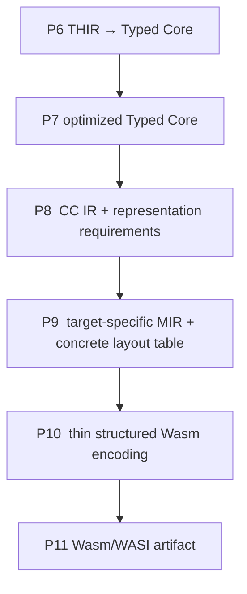

# Backend IR Boundaries and Representation Lowering

**Feature:** F-02  
**Status:** Stable (design)  
**Prerequisites:** functional-programming, WebAssembly, and compiler basics
(lexical scoping, strict evaluation, SSA/CFGs, the Wasm GC and typed
function-reference type systems). Read [D-01](../D-01-frontend-and-ir-boundaries.md)
first for the complete pass pipeline, then [functional core](fp/functional-core.md),
[CC IR](fp/cc-ir.md), and [MIR](fp/mir.md).  
**Summary:** The backend is one pipeline with distinct long-lived
representations: Typed Core (P6/P7), target-neutral CC (P8), target-specific MIR
(P9), and the thin structured Wasm encoding (P10) that becomes the P11 artifact.
This document assigns every representation, target, and platform decision to
exactly one stage, defines the IR ownership table, and states the
boundary-verification philosophy that lets each stage rely on the previous one.

## Scope

This document owns the backend pass pipeline (P6–P11), the IR ownership table,
the boundary-verification philosophy, and the responsibilities of the thin Wasm
encoding (P10) and artifact production (P11). It is the cross-cutting contract
between the two backend concerns.

It does not own the individual representations or topics. The typed core
calculus is [functional core](fp/functional-core.md); ANF and closure conversion
are [CC IR](fp/cc-ir.md); SSA/CFG and representation planning are [MIR](fp/mir.md);
control-flow structuring and tail calls are
[control flow and tail calls](fp/control-flow-and-tail-calls.md); scalar
semantics are [scalars and primitives](fp/scalars-and-primitives.md); concrete
GC layouts are [data representation](fp/data-representation.md); erasure is
[polymorphism and erasure](fp/polymorphism-and-erasure.md); pattern matching is
[pattern matching](fp/pattern-matching.md); dictionary passing is
[type classes and dictionaries](fp/type-classes-and-dictionaries.md); effects
are [effects](fp/effects.md). On the target side, [Wasm
encoding](wasm/encoding-and-structuring.md) owns structured encoding and binary
emission, [capability profile](wasm/capability-profile.md) owns capability
gating, [canonical ABI and WIT](wasm/canonical-abi-and-wit.md) owns WIT bindings
and canonical ABI adaptation, [linear memory
boundary](wasm/linear-memory-and-canonical-abi-boundary.md) owns linear memory,
and [WASI platform library](wasm/wasi-platform-library.md) owns platform
services.

Non-goals: CC is not a portable serialized interchange format; MIR is not
target-neutral and does not preserve PureScript type semantics; the thin Wasm
encoding is not another optimization IR; and the design supports exactly one
language heap ([DEC-09](../../decision/DEC-09-gc-only-language-heap.md)).
Supporting the GC planner is not a claim of complete Wasm proposal, Component
Model, or WASI service coverage.

## Background

### The two concerns

The backend does exactly two jobs, and every representation decision has to be
assigned to one of them. **Functional semantics** represent and execute a typed
functional core: functions and closures, algebraic data types and pattern
matching, records and arrays, polymorphism and erasure, recursion and control
flow. **The Wasm/WASI target** lowers those representations to Wasm GC and the
WASI 0.2 Component Model. If the two concerns are not separated, the functional
IRs acquire target details that make them unusable for anything but one runtime,
and the target layer starts making semantic choices it cannot justify.

### Foundations

The functional pipeline is not novel. Where a representation choice exists,
established theory decides it, and the topic documents own the details:

- **ANF and closure conversion.** Flanagan, Sabry, Duba, and Felleisen (1993);
  Steele (1978); Appel, *Compiling with Continuations* (1992). CC makes
  evaluation order explicit and closure-converts lambdas with ordered capture
  lists ([CC IR](fp/cc-ir.md)).
- **SSA/CFG is a functional IR.** Kelsey (1995); Appel, *SSA is Functional
  Programming* (1998). MIR's basic blocks with parameters and explicit jumps are
  the continuation form of the same program, so representation can be lowered
  and verified there without a separate control IR ([MIR](fp/mir.md)).
- **Type erasure needs no runtime tags.** Crary, Weirich, and Morrisett,
  *Intensional Polymorphism in Type-Erasure Semantics*. The erased
  representation is the standard uniform representation and is sound because
  the typed core performs no runtime type analysis; polymorphism is recovered
  through dictionaries, not tags ([polymorphism and erasure](fp/polymorphism-and-erasure.md)).
- **Dictionary passing.** Wadler and Blott (1989); Peyton Jones, Jones, and
  Meijer (1997). Type classes become records of method closures, so the GC
  product and closure representation already suffices
  ([type classes and dictionaries](fp/type-classes-and-dictionaries.md)).
- **Pattern matching.** Augustsson (1985); Wadler (1987); Maranget (2007, 2008).
  The decision compiler produces ordered tests, and coverage and redundancy are
  checked with the pattern-matrix algorithm ([pattern matching](fp/pattern-matching.md)).
- **Structured targets.** The Relooper (Zakai) and the LLVM WebAssembly
  stackifier (Gohman). [Control flow](fp/control-flow-and-tail-calls.md) lowers
  MIR's arbitrary CFG to structured Wasm.
- **Tail calls.** Standard loopification and `return_call`, as in GHC.
  [Control flow](fp/control-flow-and-tail-calls.md) represents self tail
  recursion as a loop and other tail calls as `return_call*`.
- **Effects.** Wadler's monadic translation; Levy's call-by-push-value. The
  effect representation separates values from computations and lowers through
  ordinary functions and dictionaries ([effects](fp/effects.md)).

Deliberately not used: lazy evaluation and strictness analysis (the source is
strict), typed low-level IRs such as FLINT/TAL (this design verifies each
boundary instead), and a hand-written collector (the engine's Wasm GC is used,
[DEC-09](../../decision/DEC-09-gc-only-language-heap.md)).

### Stage contracts

Each pass consumes one defined representation and produces another through an
explicit conversion ([DEC-01](../../decision/DEC-01-distinct-ir-boundaries.md)):



P8 makes evaluation order, captures, and abstract representation requirements
explicit. P9 chooses how those requirements are represented for the selected
target. P10 may optimize in ways that preserve MIR types, structure control flow,
and assign final indices mechanically, but it must not choose a representation.

## Model

### Boundary

A backend *boundary* is the pair (producer representation, consumer
representation) together with the verifier that the consumer runs before it
trusts its input and the ownership rule that says which side may make which
decision. A boundary is meaningful only if the producer's verifier proves the
invariants the consumer relies on. The boundaries in the pipeline are P8 (Core to
CC), P9 (CC to MIR), P10 (MIR to structured Wasm), and P11 (structured encoding
to artifact).

### Ownership

| Concern | Typed Core | CC IR | MIR | Wasm/platform layer |
| --- | --- | --- | --- | --- |
| PureScript types and constructors | Owns | Lowered to abstract shapes | Absent | Absent |
| Evaluation order | Implicit in expressions | Explicit ANF order | Explicit SSA/CFG order | Preserved |
| Lambdas and free variables | Owns lambdas | Explicit functions and capture lists | Concrete closure operations | Encoded |
| Direct versus closure calls | Semantic call | Explicit | Concrete call convention | Encoded |
| Runtime representation | None | Symbolic requirements only | Owns selected layout | Consumes |
| Wasm value/reference types | None | Forbidden | Owns | Consumes |
| Wasm type table and indices | None | Forbidden | Owns and verifies | Emits |
| Target capabilities | None | Independent | Selection and legality | Final validation |
| WIT interface/function names | External binding metadata | Forbidden | Forbidden | ABI registry/side table owns |
| Canonical ABI signature | None | Forbidden | Canonical imports and adapter code | Names and component metadata |

The rule behind the table is single ownership. In particular, runtime
representation is owned by exactly one stage, P9; a value type or physical
layout anywhere above MIR is a bug, and a representation choice in P10 or P11
is a bug.

### Identifiers

Each representation uses its own index spaces, and mixing them is a type error
rather than a runtime surprise. Source-level `SymbolId` and `LocalId` identify
declarations and locals in Core and survive into CC for diagnostics. CC owns
`ValueId`, `ReprId`, and `SignatureId`. MIR owns `DefinedTypeId`, `FunctionId`,
`BlockId`, `MemoryId`, `DataId`, and its own `ValueId`. P10 maps MIR identities
to final Wasm indices but never the reverse.

## Design

### Distinct long-lived representations

CC and MIR are distinct Rust types with their own invariants; MIR is the lowest
long-lived IR and lowers into a thin structured encoding, not into a separate IR
family. Wasm is a target encoding. This is the decision of
[DEC-01](../../decision/DEC-01-distinct-ir-boundaries.md): reusing one broad tree
would mix source syntax, resolved IDs, types, and runtime layout, and obscure
which invariants a pass may rely on.

### Representation lowering assignment

The pipeline separates three questions: what computations exist (P8), how values
are represented (P9), and how the representation is encoded (P10/P11). The
representation-requirement model in [CC IR](fp/cc-ir.md) is the seam: CC states
abstract shapes such as `Variant`, `Product`, `Array`, and `Closure(signature)`,
and P9's planner maps each to a concrete `DefinedType`. The planner is a trait
with a single implementation today; the point of the trait is that CC never
mentions a concrete layout. Concrete layouts and the Wasm GC encoding are owned
by [MIR](fp/mir.md) and [data representation](fp/data-representation.md).

### One language heap

[DEC-09](../../decision/DEC-09-gc-only-language-heap.md) selects Wasm GC as the
single language heap and reserves linear memory for the canonical ABI boundary.
The design does not support a second language-heap strategy; an attempt to add
one is a boundary violation, not an alternative backend.

### Boundary verification philosophy

Every boundary is verified independently, and passing a later verifier does not
replace verification of an earlier representation. A later pass is allowed to
trust its input only because the producer's verifier proved the invariants it
needs. The CC and MIR checks are specified with their representations in
[CC IR](fp/cc-ir.md) and [MIR](fp/mir.md); Wasm validation is described below.
The verifiers are not best-effort: a failed check is a compiler bug or an
unsupported program and is reported with a source span, never silently
downgraded into output.

### Thin Wasm target: P10 and P11

P10 consumes verified MIR and performs optimizations that preserve MIR types,
then structures the CFG for Wasm. The structured form owns module sections and
structured control regions. Leaf operations may use `wasm_encoder::Instruction`
values, as established by
[DEC-02](../../decision/DEC-02-thin-structured-wasm-encoding.md); the encoder
must not re-declare the instruction set.

P10 and P11 consume the type table P9 allocated. They may assign final indices
for functions and other module entities as a mechanical consequence of section
order. They must not deduplicate or create types, decide that a closure is a GC
struct, change a sum encoding, introduce canonical ABI adaptation, or infer a
missing layout.

### Rejected alternatives

- **One broad IR for the whole backend.** Rejected: it would not have a single
  set of invariants, so no pass could rely on anything
  ([DEC-01](../../decision/DEC-01-distinct-ir-boundaries.md)).
- **Wasm types in CC.** Rejected: it would make CC target-specific and forbid
  any non-GC planner; the requirement model keeps CC independent
  ([CC IR](fp/cc-ir.md)).
- **Target-neutral MIR.** Rejected: representation must be fixed before
  encoding, and choosing it at the Wasm boundary conflates structuring with
  representation ([MIR](fp/mir.md)).
- **WIT names in CC or MIR.** Rejected: it would put the platform ABI into IR
  identity, dumps, and equality; a side table keeps it out.
- **Optimizing in the encoder.** Rejected: the encoder is a thin, verifiable
  translation; optimizations belong in MIR-preserving passes.

## Algorithms

### Stage gating

```text
run_stage(stage, input):
    verify_input(input)                 // the previous stage's verifier
    output = lower(stage, input)
    verify_output(output)               // this stage's verifier
    return output
```

Every stage follows this shape. P8 verifies Core (`Module::verify`) and the
binding projection (`validate_core`) before lowering, then verifies CC
(`cc::verify::verify_module`). P9 validates the bindings against CC
(`validate_cc`), plans the layout, lowers, then verifies MIR with the selected
capability profile. P10 re-runs the MIR verifier and verifies the structured
Wasm. P11 refuses to encode a module that did not pass P10's verifier.

### Import projection

A resolved external that a program never calls must not add a runtime import.
P9 resolves and validates every binding, then keeps only imports a lowered call
references:

```text
lowered = [ lower(f) for f in cc.functions ]
used    = symbols of DirectCall/CallVoid targets in lowered
imports = [ i for i in wasi.imports() if i.symbol in used ]
```

A malformed or unsupported declaration still fails during resolution, with its
own source-associated ABI diagnostic, whether or not it is called.

### Final index assignment

P10 assigns Wasm indices from MIR identities without making semantic choices:

```text
function_indices = { f.symbol : import_count + f.id for f in mir.functions }
                 ∪ { import.symbol : index } for each import in order
```

Type indices come from MIR's type table, emitted after the function types at a
fixed base; P10 does not create, deduplicate, or reorder types. The artifact
step may also intern the function types P9 left implicit, but only as a
mechanical encoding of already-verified signatures.

### Boundary validation

External binding validation runs in both directions. P8 checks that the side
table is exactly the source WIT externals (`validate_core`); P9 checks that
every binding has one CC external with a matching abstract signature
(`validate_cc`). This prevents a caller from making a target binding disappear
or disagree with the representation CC used while type-checking calls.

## Code map

This section fixes the crate-level organization contract for the Wasm backend.
The backend is one crate, `psrs-backend`, rooted at
`crates/psrs-backend/src/`. Each concern has exactly one owning module: an IR,
its planner, and its verifier live together, and no other module may implement
that concern. Representation decisions live only under `mir/`; no module under
`cc/` or `wasm/` may select or inspect a physical layout, a Wasm value type, or a
Wasm index. Every other backend topic document refers to this tree rather than
restating it.

```text
crates/psrs-backend/src/
lib.rs            crate surface: `compile` / `compile_with_target`, `ExternalBindings`
capability.rs     `TargetCapabilities` and validator feature mapping
types.rs          shared Wasm value/type model
abi.rs, abi/      WIT registry, canonical ABI classification, source signatures
component.rs      component packaging
cc/               CC IR (functional)
  mod.rs           `Module`, `Function`, `Assignment`, `AssignmentKind`, lowering entry
  representation.rs `ReprId`, `ValueShape`, `Reference`, `RefShape`, `Representation`, `RepresentationTable`
  layout/          P8 layout requirement construction
  lower/           P8 lowering: ANF, closure conversion, patterns
  verify/          CC verifier
mir/              MIR
  mod.rs           `Module`, `Function`, `BasicBlock`, `Terminator`, `Import`, entry points
  instruction.rs   `Instruction`
  planner.rs       `RepresentationPlanner` trait and `GcPlanner`
  layout/          `PlannedLayout` and concrete GC layouts
  lower/           CC -> MIR lowering
  verify/          MIR verifier
  wit/             canonical ABI adaptation for WIT calls
  reachable.rs     reachability of representation requirements
  scalar_helpers.rs, numeric.rs   scalar operations and helpers
wasm/             thin structured Wasm target
  mod.rs           Wasm IR: `Module`, `Op`, `Function`, `Export`, `DataSegment`
  encode.rs        binary encoding
  verify.rs        structural verification
  lower/           MIR -> structured Wasm
    structure/     structuring and instruction emission
    realloc.rs     `cabi_realloc`
    runtime.rs     data segments and strings
```

The crate's public entry points are the only cross-crate surface:

- `compile(module: psrs_core::Module) -> Result<Artifact, Vec<BackendError>>`
- `compile_with_target(module: psrs_core::Module, target: TargetCapabilities) -> Result<Stages, Vec<BackendError>>`
- `ExternalBindings`, the side table carried beside CC and validated in both
  directions, exposed at the crate root for callers that own the binding
  boundary.
- Stage entry points: `cc::lower_module` and `cc::lower_module_with_bindings`
  (P8), `mir::lower_module` and `mir::lower_module_with_bindings` (P9), and
  `wasm::lower_module` and `wasm::lower_module_with_capabilities` (P10).

## Invariants and verification

These are the architecture's invariants and the acceptance criteria for the
boundary:

1. No module under `cc` imports the MIR/Wasm type model or stores a Wasm index.
2. CC verification covers every operation's operand and result representations,
   calls, captures, aggregates, variants, arrays, and branch results
   ([CC IR](fp/cc-ir.md)).
3. P9 builds the concrete layout table from reachable CC requirements for an
   explicit target profile. There is exactly one language-heap planner (GC), and
   linear memory carries no language objects.
4. MIR verification covers SSA, CFG, concrete types, subtyping, references,
   aggregates, variants, calls, memory, imports, and target legality
   ([MIR](fp/mir.md)).
5. WIT names live only in external-binding/ABI/artifact data, never in CC or
   MIR.

### Wasm validation

P11 encodes the module and runs an independent Wasm validator configured with
the same capability profile. Component artifacts additionally require WIT
metadata validation and a component-model round trip. Runtime execution tests
remain necessary for observable behavior; structural validation alone is not
sufficient. The validator deliberately starts from the core Wasm (MVP) feature set and adds
only the proposals the selected profile declares, so a dependency upgrade
cannot silently broaden the artifact contract.

## Worked example

Trace `main = 1 + 2` through every stage.

**P6 Typed Core.** One declaration with a `Primitive { op: Add, left: Integer(1),
right: Integer(2) }`, checked at `Int`.

**P8 CC.** The left-to-right traversal names both operands and the sum:

```text
v0 = Constant 1
v1 = Constant 2
v2 = Primitive(IntAdd, v0, v1)
result = v2
```

Both values have `ValueShape::Integer`, and there are no representation
requirements to plan.

**P9 MIR.** The planner maps `Integer` to `i32` and allocates no GC types. The
single block is:

```text
B0:
    v0 = Constant 1
    v1 = Constant 2
    v2 = Primitive(IntAdd, v0, v1)
    Return v2
```

with `main : () -> i32`. The verifier checks SSA, dominance, and the primitive's
operand and result types.

**P10 structured Wasm.** The structurer emits a function type `() -> i32`, then
`i32.const 1`, `i32.const 2`, `i32.add`, and a return of the result. It assigns
`main` a final `FunctionIndex` from its MIR `FunctionId`, adds the synthesized
`run` entry that calls `main`, and hands `main`'s `i32` to
`wasi:cli/exit.exit-with-code`.

**P11 artifact.** The encoder emits the core module, `wit-component` lifts it
into a component declaring `wasi:cli/run@0.2.12`, the validator checks it
against the profile, and the WAT printer renders it. No stage after P9 made a
representation decision; P10's only choices were structural and mechanical.

If `main` instead had a `String` result or called an imported function, the same
trace would add a canonical ABI import at P9 and its adaptation instructions,
and P10/P11 would name it from the ABI registry; CC would be unchanged.

## Boundaries and interfaces

- **Frontend to P7.** The front end produces linked, pruned Typed Core with an
  `entry` `SymbolId`. The backend may not infer semantic identity from source
  text; no stage above MIR may depend on memory offsets, Wasm indices, or
  target calling conventions ([D-01](../D-01-frontend-and-ir-boundaries.md), [Wasm
  encoding](wasm/encoding-and-structuring.md)).
- **P7 to P8.** A verified Core module plus the external binding side table.
  See [functional core](fp/functional-core.md) and [CC IR](fp/cc-ir.md).
- **P8 to P9.** A `BackendInput { cc, externals }` plus an explicit
  `TargetCapabilities` profile. See [CC IR](fp/cc-ir.md) and
  [capability profile](wasm/capability-profile.md).
- **P9 to P10.** Verified MIR, its concrete type table, and the ABI registry. See
  [MIR](fp/mir.md) and [canonical ABI and WIT](wasm/canonical-abi-and-wit.md).
- **P10 to P11.** The structured encoding, encoded to a core module and
  componentized. See [Wasm encoding](wasm/encoding-and-structuring.md).

## Open questions and future work

- **Optimization placement.** No MIR-preserving optimization pass exists yet.
  Inlining, DCE, unboxing, and local coalescing are planned as MIR-preserving
  passes between P9 and P10.
- **Optimizing across the boundary.** Any optimization that needs source types
  must run at or above Core; a boundary-crossing optimization must state which
  invariants it preserves.
- **Optional target tracks.** SIMD, tail calls, exceptions, threads, memory64,
  and WASI 0.3 are separate capability tracks
  ([capability profile](wasm/capability-profile.md)); they must not leak above
  P9.
- **Multi-value.** MIR's type model admits multiple results where functions
  currently have one; changing that is a P9 decision with encoder work, not a
  boundary change.

## Implementation notes

The pipeline, ownership table, and verification discipline above describe the
resulting architecture. The current code implements the stages with the
deviations recorded in [CC IR](fp/cc-ir.md) and [MIR](fp/mir.md); the
linear-memory language-heap detour was retired by
[DEC-09](../../decision/DEC-09-gc-only-language-heap.md). Decision records
preserve the rationale ([DEC-01](../../decision/DEC-01-distinct-ir-boundaries.md),
[DEC-02](../../decision/DEC-02-thin-structured-wasm-encoding.md),
[DEC-08](../../decision/DEC-08-target-neutral-variant-representation.md),
[DEC-09](../../decision/DEC-09-gc-only-language-heap.md)); this document
describes the architecture they produced.

## References

- Appel, *SSA is Functional Programming* (1998); *Compiling with Continuations*
  (1992).
- Kelsey, *A Correspondence between Continuation Passing Style and Static Single
  Assignment Form* (1995).
- Flanagan, Sabry, Duba, and Felleisen, *The Essence of Compiling with
  Continuations* (1993).
- Steele, *Rabbit: A Compiler for Scheme* (1978).
- Wadler and Blott, *How to Make Ad-hoc Polymorphism Less Ad Hoc* (1989);
  Wadler, *The Essence of Functional Programming* (1992).
- Crary, Weirich, and Morrisett, *Intensional Polymorphism in Type-Erasure
  Semantics* (2002).
- Augustsson, *Compiling Pattern Matching* (1985); Wadler, *Efficient
  Compilation of Pattern Matching* (1987); Maranget (2007, 2008).
- Zakai, *The Relooper*; Gohman, the LLVM WebAssembly stackifier.
- WebAssembly 3.0: GC, typed function references, and the core type system.
- [D-01 Frontend and IR Boundaries](../D-01-frontend-and-ir-boundaries.md).
- [DEC-01](../../decision/DEC-01-distinct-ir-boundaries.md),
  [DEC-02](../../decision/DEC-02-thin-structured-wasm-encoding.md),
  [DEC-04](../../decision/DEC-04-official-test-suite-roadmap.md),
  [DEC-08](../../decision/DEC-08-target-neutral-variant-representation.md),
  [DEC-09](../../decision/DEC-09-gc-only-language-heap.md).
