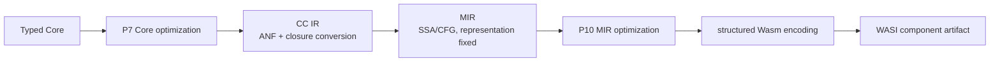

# Backend Design

The backend implements functional semantics and a Wasm/WASI target.
Optimization crosses those concerns without adding a representation;
`00-ir-boundaries.md` is their shared stage contract.

1. **Functional semantics** (`fp/`) — represent and execute a typed functional
   core: functions and closures, algebraic data types and pattern matching,
   records and arrays, polymorphism and erasure, recursion and control flow, and
   later type classes and effects.
2. **The Wasm/WASI target** (`wasm/`) — lower those representations to Wasm GC
   and the WASI 0.2 Component Model: encoding and structuring, the capability
   profile, the canonical ABI and WIT, the linear-memory boundary, and the WASI
   platform library.

## Pipeline

Each arrow is a pass; the topic tables below link the documents for each stage.

Representation decisions belong to MIR; the Wasm layer only structures and
encodes. `00-ir-boundaries.md` states the ownership and verification contract.

## Topics

### Cross-cutting

| Document | Owns |
| --- | --- |
| [00-ir-boundaries.md](00-ir-boundaries.md) | Pass pipeline, IR ownership, boundary verification, P10/P11 |

Typed Core is the frontend output and backend input. Its producer-owned model
is [Functional Core](../frontend/semantics/functional-core.md).

### Functional (`fp/`)

| Document | Owns | Depends on |
| --- | --- | --- |
| [cc-ir.md](fp/cc-ir.md) | ANF, closure conversion, CC operations and verifier | frontend Functional Core |
| [mir.md](fp/mir.md) | SSA/CFG model, representation planning, MIR verifier | cc-ir |
| [polymorphism-and-erasure.md](fp/polymorphism-and-erasure.md) | Rank-1 polymorphism, erased representation, adapters | mir |
| [scalars-and-primitives.md](fp/scalars-and-primitives.md) | Scalar values and numeric operations | mir |
| [data-representation.md](fp/data-representation.md) | ADTs, records, arrays, closures; GC layouts and evidence | mir |
| [pattern-matching.md](fp/pattern-matching.md) | Pattern decision trees and exhaustiveness | cc-ir |
| [control-flow-and-tail-calls.md](fp/control-flow-and-tail-calls.md) | CFG structuring, `Switch`, tail calls | mir |
| [type-classes-and-dictionaries.md](fp/type-classes-and-dictionaries.md) | Dictionary passing and instance evidence | functional-core |
| [effects.md](fp/effects.md) | Effect representation and the platform boundary | functional-core |

### Wasm/WASI (`wasm/`)

| Document | Owns | Depends on |
| --- | --- | --- |
| [encoding-and-structuring.md](wasm/encoding-and-structuring.md) | Structured Wasm encoding and binary emission | 00-ir-boundaries |
| [capability-profile.md](wasm/capability-profile.md) | Target capability profile and gating | encoding-and-structuring |
| [canonical-abi-and-wit.md](wasm/canonical-abi-and-wit.md) | WIT bindings and canonical ABI adaptation | encoding-and-structuring |
| [linear-memory-and-canonical-abi-boundary.md](wasm/linear-memory-and-canonical-abi-boundary.md) | Linear memory as the ABI boundary | canonical-abi-and-wit |
| [wasi-platform-library.md](wasm/wasi-platform-library.md) | Component packaging and WASI services | canonical-abi-and-wit |

### Optimization (`opt/`)

| Document | Owns | Depends on |
| --- | --- | --- |
| [core.md](opt/core.md) | P7 Core simplification, specialization, and effect-aware inlining | functional-core, effects |
| [mir.md](opt/mir.md) | P10 MIR-preserving CFG and instruction passes | mir, capability-profile |

[Optimization index](opt/README.md) summarizes the pass placement and shared
rules.

## Ordering

Read the functional concern bottom-up: functional core, then CC and MIR, then
representation topics (erasure, scalars, data, patterns, control flow), then
dictionaries and effects. Read P7 optimization after Core and P10 optimization
after MIR and the target capability profile. Wasm/WASI encoding consumes the
optimized MIR.

## Writing

Every topic document follows the template in [`AGENTS.md`](../../../AGENTS.md):
Scope, Background, Model, Design, Algorithms, Code map, Invariants and
verification, Worked example, Boundaries and interfaces, Open questions,
References. Each document is a complete design and also a learning resource for
readers with a functional-programming, WebAssembly, and compilers background.
