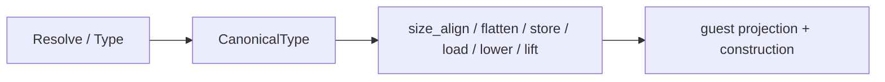

# Compositional Canonical ABI Lowering

**Feature:** F-02
**Status:** Draft
**Prerequisites:** the Component Model Canonical ABI and its recursive algorithms (`despecialize`, `flatten`, `size`, `align`, `load`, `store`, `lift`, `lower`), WIT as a recursive type system, the difference between a canonical value and a guest value, and Wasm GC as the language heap. Read [canonical ABI and WIT](canonical-abi-and-wit.md), [linear memory and the canonical ABI boundary](linear-memory-and-canonical-abi-boundary.md), [canonical buffer allocation and lifetime](canonical-buffer-allocation-and-lifetime.md), [IR boundaries](../../D-01-frontend-and-ir-boundaries.md), and [DEC-12](../../../decision/DEC-12-resolved-wit-bindings.md) first.
**Summary:** WIT is a recursive type system and the Canonical ABI is already a set of recursive algorithms. This document replaces the current one-enum-per-WIT-shape, one-code-path-per-nesting model with a single normalized recursive canonical type and generic `size_align`, `flatten`, `store`/`load`, `lower`, `lift`, and free-plan operations. Adding a new nesting shape becomes a case the existing recursion already reaches, not edits across several parallel hand-written descriptors.

## Scope

This document owns the internal model of a canonical ABI value and the generic
lowering adaptation built on it: the normalized recursive canonical type, its
flattening, size and alignment, canonical memory store and load, canonical
lower and lift, the indirect-parameter and return-area decisions, ownership and
buffer-free planning, and the guest-side projection and construction walk.

It does not own the WIT binding contract and its validation
([canonical ABI and WIT](canonical-abi-and-wit.md)), linear memory and the
allocator ([linear memory and the canonical ABI boundary](linear-memory-and-canonical-abi-boundary.md),
[canonical buffer allocation and lifetime](canonical-buffer-allocation-and-lifetime.md)),
the target capability profile ([capability profile](capability-profile.md)), the
structured Wasm encoding ([Wasm encoding](encoding-and-structuring.md)), the
component world and WASI package set
([WASI platform library](wasi-platform-library.md)), or the WIT-root and
`stdlib.toml` packaging work tracked by issue #66. It does not change the
source-language contract: `Int` for every WIT integer, `String` as a GC array
of canonical UTF-8 bytes
([DEC-16](../../../decision/DEC-16-scalar-strings-and-utf8-storage.md)), and
explicit library-owned handle drops
([DEC-14](../../../decision/DEC-14-resource-handle-ownership.md)) are preserved.

The design supersedes the shape-enumerating internals of
[canonical ABI and WIT](canonical-abi-and-wit.md) — the parallel descriptors and
per-shape lowering — while that document keeps owning the WIT binding contract,
the source type mapping, and the boundary validation.

## Background

**WIT is recursive.** A WIT value is built from scalars, `string`, `list<T>`,
`fixed-length list<T, N>`, `record`, `tuple`, `variant`, `option`, `result`,
`enum`, `flags`, and resource handles. Every aggregate nests arbitrarily:
`list<option<string>>`, `list<variant { ... }>`, `list<list<T>>`,
`record { f: list<record { g: variant { s(string), n(u32) } }> }`,
`list<own<T>>`, and `flags` inside any of those are ordinary WIT.

**The Canonical ABI is recursive.** The specification defines `despecialize`,
`flatten_type`, `size`, `alignment`, `load`, `store`, `lift`, and `lower` as
mutually recursive functions over the value type. `flatten_type` maps a
component value type to a sequence of core value types; when the whole
parameter tuple or the result is too large, the call switches to an indirect
parameter record or a trailing return pointer. Nothing in those algorithms is
shape-specific; they recurse.

**The current implementation duplicates the structure instead.** There is no
single canonical type. Several shallow, parallel descriptions of the same
declaration coexist, each maintained by hand:

- `WasiParamKind` and `WasiResultKind` are two enums that each mirror WIT
  (`crates/psrs-backend/src/abi/mod.rs:113`, `:178`). `param_kind` and
  `result_kind` walk `wit_parser` separately, with their own copies of
  `classify_variable_list`, `classify_list_element`, `list_is_bytes`,
  `string_like_element`, `contains_rejected_list`, and `direct_parameter`
  (`crates/psrs-backend/src/abi/classification.rs:78`, `:101`, `:212`, `:376`).
- `FlatSlot` is an independent flattening walk with its own recursion
  (`crates/psrs-backend/src/abi/flatten.rs:15`, `:104`, `:130`), and
  `push_cases` re-derives variant payload joining (`:210`).
- `ListElement` is a third list-element enum that rejects aggregates by
  construction (`crates/psrs-backend/src/abi/lists.rs:12`, `:31`, `:57`).
- `cc::PayloadNode` / `cc::ExternalPayloads` is a fourth recursive tree built
  from the Core type (`crates/psrs-backend/src/cc/source_abi.rs:18`, `:75`,
  `:127`) that shadows both the canonical type and `WasiParamKind`.
- `layout.rs` re-derives size, alignment, and slots from `WasiParamKind` in yet
  another recursion (`crates/psrs-backend/src/abi/layout.rs:37`, `:90`); the
  lowering has per-shape modules `mir/wit/parameters/{primitive,narrow,indirect}.rs`,
  `mir/wit/aggregate/{parameter,result,decode,memory,collections}.rs`, and
  `mir/wit/lists/{record,flags}.rs`, plus hand-rolled free plans
  `StringFree::{Scalars,Records}` (`crates/psrs-backend/src/mir/wit/mod.rs:39`)
  and `ListFieldCopy` / `ListFlagsField`
  (`crates/psrs-backend/src/mir/instruction/mod.rs:20`, `:35`).

Because composition is handled by enumerating cross-product cases,
`WasiParamKind::Unsupported` is widespread, `flat_types`/`payload_cases`/
`case_node` re-walk the same tree
(`crates/psrs-backend/src/mir/wit/aggregate/mod.rs:58`–`:113`), and
`unsupported_shape` exists to catch divergence between hand-written
classification and flattening
(`crates/psrs-backend/src/abi/classification.rs:9`).
[DEC-12](../../../decision/DEC-12-resolved-wit-bindings.md) removed `SourceType`
but kept the descriptors; a shape such as `list<option<T>>` still forced
coordinated edits in classification, `FlatSlot`, `ListElement`, `PayloadNode`,
`layout.rs`, and the MIR modules. Migration steps 1–2 removed the descriptors:
classification, flattening, layout, conformance, and the MIR lowering now read
`CanonicalType` directly, and only the CC `PayloadNode` guest shape remains.



## Model

### The canonical type

`CanonicalType` is a crate-local, normalized, finite recursive value produced
once from `wit_parser::Resolve` and `wit_parser::Type` by a single recursive
walk, so it is the only description of a WIT value the ABI layer consults.

```text
CanonicalType =
    Bool
  | Int   { width: 8 | 16 | 32 | 64, signed: bool }
  | Float { width: 32 | 64 }
  | Char
  | String                              # UTF-8 bytes on the wire and in the GC guest string
  | List      { element: Box<CanonicalType> }
  | FixedList { element: Box<CanonicalType>, length: u32 }
  | Record    { fields: Vec<CanonicalField> }
  | Variant   { cases: Vec<CanonicalCase> }
  | Option    { payload: Box<CanonicalType> }
  | Result    { ok: Option<Box<CanonicalType>>, err: Option<Box<CanonicalType>> }
  | Enum      { cases: Vec<String> }
  | Flags     { names: Vec<String> }
  | Handle    { resource: ResourceId, ownership: Ownership }

CanonicalField = { name: String, ty: CanonicalType }
CanonicalCase  = { name: String, payload: Option<Box<CanonicalType>> }
ResourceId = { interface: String, name: String }
Ownership  = Own { drop: SymbolId } | Borrow
CoreVal    = I32 | I64 | F32 | F64
SizeAlign  = { size: u32, align: u32 }         # align is a power of two <= 8
```

A WIT `tuple<A, B>` and a method receiver are records; a tuple's field names are
`_1`, `_2`, ... ([DEC-13](../../../decision/DEC-13-wit-to-source-type-mapping.md)).
`Option`, `Result`, `Variant`, and `Enum` stay distinct from `Variant` because
the guest mapping and diagnostic names differ, but every ABI operation first
calls `despecialize`, which rewrites `Option`, `Result`, and `Enum` into
`Variant` and is idempotent. `String` is distinct from `List` because it is
validated Unicode text: the guest value is a GC array of canonical UTF-8, and
the boundary copies those bytes after strict validation. `list<u8>` is an
uninterpreted byte list whose source type is `Array Int`, not `String`. A
resource handle carries its ownership as wire metadata on the type, never as a
separate code path: an `Own` handle is an `i32`
table index plus a drop obligation discharged by the standard library, and a
`Borrow` handle is a call-scoped `i32` that must not appear in a result
([DEC-14](../../../decision/DEC-14-resource-handle-ownership.md)). The drop
symbol is interned and bound into the handle when the import is resolved; a
borrow has no drop and never appears in a result.

A canonical function is the parameter list, the optional result, and the derived
ABI decisions. The thresholds are the canonical constants and the repo scratch
size:

```text
CanonicalFn = { parameters: Vec<CanonicalType>, result: Option<CanonicalType>, abi: FnAbi }
FnAbi = { flat_params: Vec<CoreVal>, flat_results: Vec<CoreVal>,
          indirect_params: bool, retptr: bool, result_area: Option<SizeAlign> }

MAX_FLAT_PARAMS = 16    MAX_FLAT_RESULTS = 1
WORD_SIZE = 4           MIN_BLOCK = 8        SCRATCH_SIZE = 16
```

`indirect_params` is `flat_params.len() > MAX_FLAT_PARAMS`; `retptr` is
`flat_results.len() > MAX_FLAT_RESULTS`; `result_area` is `size_align(result)`
when `retptr`. `Resolve::wasm_signature(GuestImport, f)` remains the oracle:
`flat_params` plus the derived pointer slots must equal the canonical core
signature.

### The guest half

The canonical type says how bytes cross the boundary; it cannot say how the
guest stores a record, variant, or array, which is CC's concern
([IR boundaries](../../D-01-frontend-and-ir-boundaries.md)). The guest half is
not a second tree: it is CC's own layout, consumed through one recursive
accessor. A `ValueShape` already reaches the representation table through
`RefShape::Repr(ReprId)`, and a `Representation` names its fields, cases, or
element as further `ValueShape`s, so the table is a single recursive layout
tree. The ABI bounds each node to a `BoundType`:

```text
GuestLayout =
    Scalar  { shape: ValueShape }                 # Integer | Boolean | Number | String
  | Boxed   { shape: ValueShape }                 # a boxed value in an erased field
  | Product { repr: ReprId, labels: &[String], fields: &[ValueShape] }
  | Variant { repr: ReprId, cases: &[VariantCase] }
  | Array   { repr: ReprId, element: ValueShape }

BoundType = { canonical: CanonicalType, guest: ValueShape }
BoundFn    = { parameters: Vec<BoundType>, result: BoundType }
```

`guest_layout(shape, table)` resolves a `ValueShape` to its `GuestLayout`:
`Reference { heap: Repr(repr) }` looks up `Representation` and recurses into a
`Product`, `Variant`, `Array`, or `Boxed` node; any other shape is a `Scalar`.
`Scalar::String` covers `String` and a byte list; `Array` covers `List` and
`FixedList`. A `BoundType` is validated once by walking the canonical type and
`guest_layout` in lockstep and requiring the same shape and arity; the lowering
then never performs a second structural search. Labels and variant case shapes
come from CC's representation table because the canonical type does not carry
guest layout; the table *is* the guest half, so it never becomes a parallel
description of WIT.

### Invariants

- `CanonicalType` is finite: WIT has no by-value recursive aggregate, so a
  cycle in `Resolve` is only reachable through a resource or a rejected
  indirection, and the resolved value type is a tree.
- `despecialize` is total and idempotent and preserves size, alignment, and
  flattening.
- `size_align` is total; `align` is a power of two at most `8`; `size` is a
  multiple of `align`; a wider profile field width widens both together.
- `flatten` is total and mirrors `Resolve::wasm_signature`: a variant joins its
  case payloads position-wise and extends to the longest case, so a 32-bit
  integer/float union is `i32` and any union involving a 64-bit value is `i64`.
  The parameter and result length thresholds — not a type property — select
  indirect parameters and the return pointer.
- `store` and `load` use exactly the offsets and widths `size_align` computes,
  and `load(store(v)) == v` for every flattened value and type.
- Ownership lives on `Handle` and nowhere else; `Borrow` never appears in a
  result. Classification and flattening cannot diverge because there is one
  source of truth: classification *is* the canonical type.

## Design

### One normalized type, one recursive walk

`abi::canonical::resolve` is the only code that reads `wit_parser`. It follows
`TypeDefKind::Type` aliases, expands tuples to labeled records, classifies
`Handle` with its `Own`/`Borrow` mode and drop symbol, and records `Flags`
names. Every other module consumes `CanonicalType`. A shape the source cannot
express is a guest-shape failure at binding time, not an `Unsupported`
canonical kind: the canonical type describes the wire, and the guest half
decides reachability.

### The generic operations

All operations are total functions over `CanonicalType`, mutually recursive
where the specification says so:

```text
size_align : CanonicalType -> SizeAlign
flatten    : CanonicalType -> Vec<CoreVal>
store      : CanonicalType -> addr -> Vec<CoreVal> -> Effects
load       : CanonicalType -> addr -> Vec<CoreVal>
lower      : BoundType -> guest value -> Vec<CoreVal>
lift       : BoundType -> Vec<CoreVal> -> guest value
free_plan  : BoundType -> FreePlan
```

Each shape recurses through these rather than through per-shape code. Scalars
(`Bool`, `Int`, `Float`, `Char`, `Handle`) are one row in each operation.
`String`/`List`/`FixedList` allocate a `(pointer, length)` buffer and recurse
into the element for `store`, `load`, `lower`, `lift`, and `free_plan` (a
fixed-length list uses `length` static elements). `record` folds fields in WIT
order for layout, projects or builds fields by label for the guest, and
concatenates field slots. `variant` (and despecialized `option`, `result`,
`enum`) writes the discriminant, joins the payload slots, branches on the guest
tag for `lower`, branches on the canonical tag for `lift`, and selects the
active case in `free_plan`. `flags` is `ceil(n/32)` flattened `i32` words and a
packed `1`/`2`/`4`-byte canonical integer, both from the same `n`. `handle` is
one `i32` with ownership metadata.

### Indirect parameters, the return area, and free plans are decisions, not shapes

`FnAbi` is computed from the flattened parameter count and `size_align(result)`
alone. A parameter record is `Record { fields: parameters }`; the generic
`store` lays it out and the generic `free_plan` frees it. The return area is
`size_align(result)`: no larger than `SCRATCH_SIZE` uses `PRINT_SCRATCH = 0`,
otherwise `cabi_realloc` reserves it and the free plan frees it. There is no
per-shape `retptr` branch. Flattening a variant is total: a case payload that is
wider than the others extends the joined slots rather than failing, so a
parameter that does not fit `MAX_FLAT_PARAMS` simply becomes indirect and its
tuple is stored in memory, where each case is laid out by `store`.

Ownership is metadata, and nothing is dropped by the compiler
([DEC-14](../../../decision/DEC-14-resource-handle-ownership.md)). Which
transient buffers to free is a `FreePlan` derived from the same `BoundType` that
drove `lower`:

```text
FreePlan = NoFree
         | Buffer   { align: u32, length: FlatRef }
         | Fields   { fields: Vec<FreePlan> }
         | Case     { cases: Vec<FreePlan> }        # select by the lifted tag
         | Elements { element: Box<FreePlan> }      # each element, then the buffer
```

`Elements` subsumes `StringFree::{Scalars,Records}` and recurses, so
`list<list<string>>` frees the inner and outer buffers, and
`list<record { s: string }>` frees each field's buffer element-wise. `Case` lets
a `list<option<string>>` free only the present `Just` payloads. The free walk
and the lift walk share the discriminant they read, so freeing exactly matches
what was read and what was allocated.

### The guest projection is one parameterized walk

Guest projection and construction are one mutual recursion over
`(CanonicalType, ValueShape)`, resolving each guest node with `guest_layout`, and
parameterized by an interface, not per-shape modules:

```text
trait GuestProjection {
    fn scalar        (&mut self, ct, shape) -> ValueId
    fn string_bytes  (&mut self, guest) -> (pointer, length)   # copy canonical UTF-8
    fn product_field (&mut self, guest, repr, index) -> ValueId
    fn variant_tag   (&mut self, guest, repr) -> ValueId
    fn variant_case  (&mut self, guest, repr, case) -> ValueId
    fn variant_new   (&mut self, repr, case, payload) -> ValueId
    fn array_len / array_element / array_new / array_set
    fn box / unbox / cast / string_new
}
```

`lower` projects and recursively lowers; `lift` reads and recursively
constructs. The erased aggregate-field protocol (box a scalar, cast a reference)
is one helper selected by the guest `Boxed` node, not variant code.

### Rejected alternatives

- **Keep the parallel enums and add more cross-product cases.** Rejected: it is
  the current state, and each nesting multiplies the edits; divergence between
  classification and flattening is why `unsupported_shape` exists.
- **Code-generate one function per concrete WIT shape.** Rejected: the shape
  space is open (vendored plus user WIT), it grows the emitted module with
  unreachable specializations, and it does not remove the need for a recursive
  type.
- **Use `wit_parser::Type` directly with no normalized form.** Rejected: it
  scatters alias folding, tuple labeling, despecialization, and handle
  ownership across every operation and couples the lowering to a parser
  representation instead of a stated ABI model.
- **Move WIT metadata into CC or MIR.** Rejected by
  [DEC-06](../../../decision/DEC-06-runtime-interface-via-wit.md) and
  [DEC-12](../../../decision/DEC-12-resolved-wit-bindings.md): CC and MIR keep
  runtime shapes; the canonical type stays in the ABI side table.
- **Synthesize a separate guest tree (`cc::PayloadNode`).** Rejected: it is a
  fourth parallel description of the same declaration. CC's `Representation`
  table already is a recursive layout tree keyed by `ValueShape`, so the ABI
  reads it through one accessor and the two cannot disagree.
- **Lower every value through memory.** Rejected: it emits far more allocator
  traffic than the canonical ABI requires and would not match `wasm_signature`.

## Algorithms

### Resolve, flatten, size and alignment

```text
resolve(resolve, ty):
    Bool -> Bool; S8/U8/S16/U16/S32/U32/S64/U64 -> Int { width, signed }
    F32/F64 -> Float { width }; Char -> Char; String -> String
    Id(id) -> match kind(resolve, id):
        Type(inner) -> resolve(inner)                 # follow alias
        List(inner) -> List(resolve(inner))
        FixedLengthList(inner, n) -> FixedList(resolve(inner), n)
        Record(fields) -> Record([field(name, resolve(ty))])
        Tuple(types) -> Record([("_1", ..), ("_2", ..), ..])
        Variant(cases) -> Variant([case(name, payload?)])
        Option(inner) -> Option(resolve(inner)); Result(ok, err) -> Result(ok?, err?)
        Enum(cases) -> Enum(names); Flags(names) -> Flags(names)
        Handle(h) -> Handle(resource, ownership(h))
        Map/Future/Stream/Resource -> NotExpressible    # no guest mapping

flatten(t):
    Bool | Int8|16|32 | Char | Handle | Enum -> [I32]
    Int64 -> [I64]; Float32 -> [F32]; Float64 -> [F64]
    String | List -> [I32, I32]
    FixedList(e, n) -> repeat(flatten(e), n)
    Record(fields) -> concat(flatten(field))
    Flags(names) -> [I32; ceil(len(names) / 32)]     # an empty flags is []
    Option(p) -> [I32] + flatten(p)
    Result | Variant -> [I32] + join(cases)

join(cases):
    length = max(len(flatten(case)) for each present case)
    for each payload position i < length:
        slot = [ flatten(case)[i] for the present cases that reach i ]
        all equal -> that type;  {I32, F32} -> I32;  otherwise I64

function_abi(f): concat(flatten(parameter)) for every parameter.
    indirect_params = len(flat_params) > MAX_FLAT_PARAMS. Indirect core params
    are one pointer to the parameter record, plus the return pointer when retptr.

size_align(t):
    Bool | Int8 | U8 -> (1,1); Int16 | U16 -> (2,2)
    Int32 | U32 | Float32 | Char | Handle -> (4,4); Int64 | U64 | Float64 -> (8,8)
    String | List -> (8,4)                                  # (pointer, length)
    FixedList(e, n) -> align_up(n * size(e), align(e))
    Record(fields) -> fold: offset = align_up(offset, align(field)); offset += size(field)
                     align = max(align(field)); size = align_up(offset, align)
    Flags(names) -> 1..8 -> (1,1); 9..16 -> (2,2); 17..32 -> (4,4); else (4*k, 4)
    Option | Result | Variant | Enum -> discriminant + joined payload:
        disc = disc_width(case_count)                       # 1, 2, or 4 bytes
        poff = align_up(disc, max payload align)
        psize = max payload size (0 for nullary cases)
        align = max(disc, max payload align); size = align_up(poff + psize, align)
```

### Store, load, lower and lift

```text
store(t, addr, values):
    scalar -> StoreWidth(addr, values[0], width(t))
    String | List -> Store(addr, ptr); Store(addr + 4, len)
    FixedList(e, n) -> for i in 0..n: store(e, addr + i*size(e), element i)
    Record(fields) -> for field at offset o: store(field, addr + o, slice)
    Flags(n) -> StoreWidth(addr + 4*i, word_i, flag_width(n))
    Variant -> StoreDisc(addr, values[0]);
               store(active_case, addr + payload_offset, payload)

load(t, addr) -> values:                 # exact inverse; reads only the active case

lower(bt, guest, out):
    scalar -> out.push(project_scalar(ct, guest))          # narrow/widen as needed
    String | List -> (ptr, len) = write_buffer(bt.guest, guest, free_plan(bt))
                     out.push(ptr); out.push(len)
    FixedList(e, n) -> for i in 0..n: lower(element_i, guest[i], out)
    Record(fields) -> for i in field order: lower(fields[i], product_field(guest, i), out)
    Flags(names) -> for each word: pack selected booleans into one i32
    Variant/Option/Result/Enum:
        out.push(variant_tag(guest))
        switch tag:
            case i with payload -> lower(payload_i, variant_case(guest, i), case_flat)
                                   pad(case_flat, joined_length, zero)
            case i nullary      -> zeroes(joined_length)
        jump(merge) with the joined values
    Handle -> out.push(handle_index(guest))                # ownership is metadata

lift(bt, values_or_addr):
    scalar -> construct_scalar(ct, values)
    String | List -> (ptr, len) = values or load(addr)
                     guest = string_or_array_from_bytes(ptr, len, element)
                     free_buffer(ptr, len * element_size, element_align)
    Record -> for each field: construct(field, recurse)
    Flags -> unpack words into a guest boolean record
    Variant/Option/Result/Enum:
        switch tag: nullary -> variant_new(repr, i, [])
                    payload -> construct payload; variant_new(repr, i, [field])
    Handle -> construct handle from the i32 index
```

### Indirect parameter record, return-area recovery, and free plan

```text
lower_parameters(fn, args, out):
    if not fn.abi.indirect_params:
        for (bt, arg) in zip(fn.parameters, args): lower(bt, arg, out)
        return
    record = Record(fn.parameters); (size, align) = size_align(record)
    address = cabi_realloc(0, 0, align, size)
    store(record, address, flattened_parameters)
    push_free(Buffer { align, length: size }, free_plan(record))
    out.push(address)

return_area(result):
    (size, align) = size_align(result)
    size <= SCRATCH_SIZE ? PRINT_SCRATCH
                         : (address = cabi_realloc(0, 0, align, size); push_free(Buffer { .. }))

free_plan(bt):
    String | List -> Elements { element: free_plan(element) }   # NoFree for bytes
    FixedList(e, n) -> Fields { [free_plan(e); n] }
    Record(fields) -> Fields { [free_plan(field)] }
    Variant -> Case { [free_plan(case) for each case] }
    Flags | scalar | Handle -> NoFree

emit_free(plan, buffer_values, tag):
    NoFree -> ()
    Buffer { align, length } -> free_buffer(pointer, length, align)
    Fields { fields } -> for field_plan, field_value: emit_free(field_plan, ..)
    Elements { element } -> for i in 0..count: emit_free(element, element i)
                            free_buffer(pointer, count * stride, align)
    Case { cases } -> emit_free(cases[tag], ..)                # tag read by lift
```

### Edge cases

- **Nested lists** (`list<list<T>>`): a list flattens to `(pointer, length)`
  regardless of element, so direct flattening never recurses; `store`, `load`,
  `lower`, and `free_plan` recurse, allocating and freeing the inner buffers
  through `Elements`.
- **List of variants** (`list<variant { ... }>`): each element is laid out by
  `size_align(variant)` and stored by `store`; the list is still
  `(pointer, length)`, so an unjoinable inner variant does not force the outer
  call indirect.
- **Multi-word flags anywhere**: `flatten` emits `ceil(n/32)` words and
  `size_align` the packed `1`/`2`/`4`-byte integer from the same `n`, so a flags
  value in a record field, list element, or variant payload is consistent; a
  33-flag value is two words and an 8-byte integer.
- **Fixed-length list**: `flatten` repeats the element slots statically,
  `size_align` is `n * size(element)` aligned, and `lower`/`lift` unroll or
  loop; a `fixed-length list<u8, N>` uses the byte-list copy.
- **Handles in lists**: `list<own<T>>` is an array of `i32` indices; ownership
  is metadata, so per [DEC-14](../../../decision/DEC-14-resource-handle-ownership.md)
  the library drops each extracted handle. A `list<borrow<T>>` or `borrow<T>`
  result is rejected because the borrow scope is the ended call.
- **Unit-success result** (`result<_, _>`): a variant whose ok position is
  absent; `flatten` is `[I32]` when the error payload is also empty, so the
  result is direct. `result<_, E>` maps to `Either E Unit`
  ([DEC-13](../../../decision/DEC-13-wit-to-source-type-mapping.md)): `lift`
  reads the canonical tag, decodes the error payload when present, and builds
  `Left err` or `Right ()`. The canonical cases are `[ok, err]` while the
  `Either` constructors are `Left`(err), `Right`(ok), so the tag swaps. There is
  no trap path.
- **Large error payload** (`result<_, string>`): `flatten` is
  `[I32, I32, I32]`, so `retptr` is set and `size_align` sizes the return area;
  the error branch reads `(pointer, length)` and frees the buffer.

## Code map

This is the intended organization; the implementation must conform to it. No
other module may read `wit_parser` for ABI purposes, synthesize canonical memory
layout, or describe a WIT shape.

```text
crates/psrs-backend/src/
  abi/
    canonical/
      mod.rs        CanonicalType, Ownership, despecialize, source-ABI predicates
      resolve.rs    Resolve/Type -> CanonicalType (the only wit_parser walk)
      flatten.rs    flatten, join
      leaves.rs     flat source leaves and handle-at-flat-index
      memory.rs     size_align
      plan.rs       FnAbi derivation and the indirect/return-area decisions
    handles.rs      Handle ownership metadata and bound drop symbols
    layout.rs       canonical memory slots for indirect records and list elements
    link/           ExternalBindings, BoundExternal, bind, validate
  cc/
    representation.rs  RefShape, ValueShape, Signature, RepresentationTable,
                       Representation, GuestLayout, guest_layout
    source_abi.rs      Signature from the resolved Core type
  mir/
    wit/
      mod.rs        BoundType/BoundFn and canonical call lowering
      free.rs       FreePlan and its derivation
      parameters/   direct and indirect parameter flattening
      aggregate/    option/result/variant tag branching
      lists/        non-byte list copy
      call_lowerer.rs / function_lowerer.rs  the target-operation interface
```

Key entry points the implementation must provide:

```rust
pub enum CanonicalType { /* Model */ }
pub enum Ownership { Own { drop: SymbolId }, Borrow }
pub struct SizeAlign { pub size: u32, pub align: u32 }
pub struct FnAbi {
    pub flat_params: Vec<CoreVal>,
    pub flat_results: Vec<CoreVal>,
    pub indirect_params: bool,
    pub retptr: bool,
    pub result_area: Option<SizeAlign>,
}
pub struct BoundType { pub canonical: CanonicalType, pub guest: ValueShape }
pub struct BoundFn { pub parameters: Vec<BoundType>, pub result: BoundType }
pub enum GuestLayout<'a> { /* Model */ }

pub(crate) fn resolve(resolve: &Resolve, ty: &WitType) -> Option<CanonicalType>;
pub(crate) fn despecialize(ty: &CanonicalType) -> CanonicalType;
pub(crate) fn flatten(ty: &CanonicalType) -> Vec<CoreVal>;
pub(crate) fn function_abi(resolve: &Resolve, f: &Function) -> Option<FnAbi>;
pub(crate) fn size_align(ty: &CanonicalType) -> SizeAlign;
pub(crate) fn guest_layout<'a>(
    shape: ValueShape,
    table: &'a RepresentationTable,
) -> Option<GuestLayout<'a>>;
pub(crate) fn free_plan(ty: &BoundType) -> FreePlan;

pub(crate) fn lower<L: WitCallLowerer>(
    lowerer: &mut L,
    function: &CanonicalFn,
    bound: &BoundFn,
    destination: ValueId,
    arguments: &[ValueId],
    span: TextRange,
    entry: BlockId,
) -> Result<BlockId, Vec<BackendError>>;
```

`GuestProjection` is implemented for the MIR function lowerer over the same
`ReprId` table CC already builds. `canonical/layout.rs` may keep a thin
`parameter_layout` shim for callers that migrate later, but it must delegate to
`canonical::memory` and must not re-walk `WasiParamKind`.

## Invariants and verification

The design makes several previously hand-checked properties structural:

- **One source of truth.** Classification and flattening cannot disagree,
  because classification is `resolve` and flattening is `flatten` over the same
  value. `unsupported_shape` and `FlatSlot::Ambiguous` are deleted.
- **One guest layout.** The guest half is CC's `RepresentationTable`, read
  through `guest_layout`; there is no second tree to keep aligned. The
  canonical/guest lockstep walk fails at bind time if their shapes or arities
  differ.
- **Signatures agree.** For every resolvable WIT function, the core signature
  derived by `function_abi` must equal
  `Resolve::wasm_signature(GuestImport, f)`; a mismatch is a binding diagnostic,
  never an approximation.
- **Memory is exact.** `size_align` is total and well-formed; `store`/`load`
  use only its offsets and widths; `load(store(v)) == v` for representatives of
  every shape, including variants, flags, and fixed-length lists.
- **Ownership is metadata.** Every `Own` handle carries exactly one drop
  obligation; the compiler inserts no drop
  ([DEC-14](../../../decision/DEC-14-resource-handle-ownership.md)); a
  `Borrow` result is rejected.
- **Free matches lower.** The `FreePlan` frees exactly the buffers `lower`
  allocated, selected by the same discriminant `lift` read; no buffer is freed
  twice.
- **Extent and provenance.** A `store` into a parameter record addresses a
  pointer returned by `cabi_realloc` with a statically known size, satisfying
  the allocator-provenance rule of the static access-extent pass
  ([canonical buffer allocation and lifetime](canonical-buffer-allocation-and-lifetime.md));
  the generic store never emits a dynamic store into an unproven pointer.

Verification is four layers. Unit tests cover each operation per shape
(nested lists, list-of-variant, multi-word flags as a list element and record
field, fixed-length list, handles in lists, unit-success result, large error
payload). A conformance test over the vendored WASI surface asserts the
`function_abi` core signature equals `wasm_signature(f)` for every resolved
function so a divergence fails in CI, not at runtime. Synthesized Wasm fixtures
in the style of
`crates/psrs-backend/src/mir/indirect_tests/` cover compound shapes no source
construct names, and driver execution tests with `PSRS_REQUIRE_WASMTIME=1` cover
the source-reachable ones. The four gates are `cargo fmt --all --check`,
`cargo test --workspace`,
`cargo clippy --workspace --all-targets -- -D warnings`, and the 500-line
source-layout rule.

ABI-08 evidence records the shapes actually exercised; because
`option`/`result`/`variant` and their nestings now lower through one path, the
evidence is the same fixtures plus the new nesting cases. BE-11 and BE-17..BE-20
and the corresponding rows in [D-04](../../D-04-suite-roadmap.md) are updated as
the migration steps land.

## Worked example

Trace the import

```wit
package wasi:io@0.2.12;
interface streams {
    read-nested: func() -> result<list<option<string>>, string>;
}
```

**Resolve.** `result<list<option<string>>, string>` becomes
`Result { ok: Some(List { element: Option { payload: String } }), err: Some(String) }`.

**Flatten and `FnAbi`.** `flatten(List(..)) = [I32, I32]` and
`flatten(String) = [I32, I32]`, so `flatten(Result) = [I32 tag, I32, I32]`. There
are no parameters, so `flat_params = []` and `indirect_params = false`. The
result flat length is `3 > MAX_FLAT_RESULTS = 1`, so `retptr = true`.

**Return area.** `size_align(Result)`: discriminant `1` byte; both payloads are
`(8, 4)`, so `poff = align_up(1, 4) = 4`, `size = align_up(4 + 8, 4) = 12`,
`align = 4`. `12 <= SCRATCH_SIZE = 16`, so the return pointer is
`PRINT_SCRATCH = 0`.

**Lower the call.** No parameters; emit `CallVoid read-nested(retptr = 0)`.

**Recover the result.** `tag = Load8U(0)`; the discriminant width is `1` and the
payload begins at offset `4`.

- *tag 0 (`ok`)*: the payload is a `list<option<string>>`, so
  `Load(4) = pointer`, `Load(8) = length`. The element `option<string>` has
  `size_align = (12, 4)`: a 1-byte tag and a `(pointer, length)` at offset 4.
  For each element `e` at `pointer + i*12`, `opt_tag = Load8U(e)`: if `0`, build
  `Nothing`; if `1`, read `(s_ptr, s_len) = Load(e + 4), Load(e + 8)`, call
  `BYTES_TO_STRING(s_ptr, s_len)`, and build `Just s`. Build a GC array from the
  elements and `Right array` (the `Either` ok branch).
- *tag 1 (`err`)*: read `(ptr, len)` at offset `4`, `BYTES_TO_STRING(ptr, len)`,
  and build `Left string` (the `Either` error branch).

**Free.** `free_plan` for the result is
`Case([Elements(free_plan(option<string>)), Buffer])`. On the `ok` branch it
frees each present `Just` string buffer and then the list buffer; on the `err`
branch it frees the string buffer. In every case it frees exactly what `lift`
read, using the same discriminant, and the scratch return area `[0, 16)` needs
no free.

The same fixture with sixteen leading scalar parameters and this result would
set `indirect_params = true`: `store` writes the scalars into a `cabi_realloc`
parameter record, the core parameters become `[i32 pointer, i32 retptr]`, and
the free plan frees the record after the call.

## Boundaries and interfaces

- **From linking / `ExternalBindings`.** The linking stage resolves each
  `ExternalKind::Wit` import once, interns the declaration's resolved Core type,
  and binds it to a `CanonicalFn` and a `BoundFn`. Binding validates
  the guest layout against the canonical type and records any shape with no
  guest mapping as a source-spanned diagnostic
  ([canonical ABI and WIT](canonical-abi-and-wit.md),
  [DEC-12](../../../decision/DEC-12-resolved-wit-bindings.md)).
- **To CC.** CC derives each external's abstract `Signature` and
  `RepresentationTable` from the resolved Core type and exposes the recursive
  `guest_layout` accessor; the ABI pairs each `ValueShape` with its
  `CanonicalType`. CC gains no WIT or canonical type
  ([IR boundaries](../../D-01-frontend-and-ir-boundaries.md),
  [DEC-06](../../../decision/DEC-06-runtime-interface-via-wit.md)).
- **To MIR.** `mir::wit::lower` emits only ordinary MIR: calls, loads, stores,
  list copies, and scalar conversions. No WIT name, interface, canonical
  signature, or `CanonicalType` enters MIR.
- **To the Wasm encoder.** P10 structures the generic `store`/`load`/list-copy
  lowering into loops and leaf loads/stores carrying the `MemoryId` and `MemArg`
  ([linear memory and the canonical ABI boundary](linear-memory-and-canonical-abi-boundary.md)).
- **To the componentizer.** `FnAbi` must match `Resolve::wasm_signature` so
  `componentize` links the core import
  (`crates/psrs-backend/src/component.rs:74`).
- **To the allocator.** The generic parameter record and return area allocate
  and free through `cabi_realloc`, following
  [canonical buffer allocation and lifetime](canonical-buffer-allocation-and-lifetime.md).
- **To the standard library.** A WIT form maps to a library type per
  [DEC-13](../../../decision/DEC-13-wit-to-source-type-mapping.md); the library
  owns handle drops per [DEC-14](../../../decision/DEC-14-resource-handle-ownership.md).
  This document adds no compiler source type.

## Open questions and future work

- **Normalization boundary.** `resolve` normalizes aliases, tuples, and
  aggregate forms but keeps `Option`/`Result`/`Enum` distinct until
  `despecialize`. Whether to normalize eagerly and record the source form as a
  `Variant` tag, or lazily as here, is an internal choice to settle during
  migration.
- **Fixed-length lists and borrowed handles.** `fixed-length list<T, N>` is not
  always representable from source; the canonical operations support it and the
  guest mapping is a later library decision.

### Migration

An ordered, behavior-preserving migration. Each step keeps the workspace green
under `cargo fmt --all --check`, `cargo test --workspace`, and
`cargo clippy --workspace --all-targets -- -D warnings`, and keeps every module
below 500 lines.

1. **Introduce the canonical type.** Add `abi::canonical::{resolve, flatten,
   size_align, despecialize}` and the conformance test over the vendored WASI
   surface. Nothing consumes it yet, so the step is additive.
2. **Derive the existing descriptors.** Re-express `WasiParamKind`,
   `WasiResultKind`, and `FlatSlot` as views of `CanonicalType`, then delete the
   hand-written `param_kind`/`result_kind`/`push_type` recursions; delete
   `unsupported_shape` and `FlatSlot::Ambiguous`. Keep the public types so
   callers migrate incrementally.
3. **Replace layout.** Move `MemoryLayout`/`MemorySlot`/`parameter_layout`/
   `aggregate_layout`/`result_area` onto `canonical::memory::{store, load,
   size_align}`; keep `parameter_layout` only as a delegating shim.
4. **Replace list elements.** Remove `ListElement`/`element_layout`; have P10's
   list copy take the element `CanonicalType` and its guest `ValueShape`.
5. **Replace free plans.** Replace `StringFree`, `ListFieldCopy`,
   `ListFlagsField`, `ListCopyRecord`, and `ListCopyFlags` with `FreePlan` and
   one parameterized list-copy instruction.
6. **Replace `PayloadNode` with CC's table.** Add the `guest_layout` accessor to
   `representation.rs`, reduce `source_abi` to `BoundType` (canonical +
   `ValueShape`), delete `PayloadNode`/`ExternalPayloads`, and make
   `lower_parameter`/`decode` one mutual recursion over `(CanonicalType,
   ValueShape)` resolved against the table; remove `mir/wit/parameters/*`,
   `mir/wit/aggregate/*`, and `mir/wit/lists/*` as their logic is absorbed.
7. **Delete dead shells and update evidence.** Remove empty modules; update
   ABI-08 and the BE-11 / BE-17..BE-20 rows in
   [D-04](../../D-04-suite-roadmap.md) and the
   [linear memory acceptance](../../../implementation/backend/linear-memory-and-canonical-abi.md)
   so each newly exercised nesting has implementation, verifier, and execution
   evidence. ABI-08 stays `In progress` while the source-reachable subset is
   incomplete, even when new backend fixtures pass.

Migration steps 1–7 are implemented. `crates/psrs-backend/src/abi/canonical/`
holds `resolve`, `flatten`, `size_align`, `despecialize`, `function_abi`, and
the flat source leaves, with a conformance test asserting the derived core
signature equals `Resolve::wasm_signature` for every vendored WASI function. The
legacy `WasiParamKind`, `WasiResultKind`, and `FlatSlot` descriptors,
`abi/classification.rs`, `abi/flatten.rs`, `abi/lists.rs`, and the transitional
`view` adapter are deleted; `WasiImport` carries `params`/`canonical_result`/
`FnAbi`, conformance compares the resolved Core type against `CanonicalType`,
`layout.rs` computes its slots from `CanonicalType`, and `Ownership::Own` carries
the bound drop symbol. The guest half is CC's `RepresentationTable` through
`guest_layout`, paired with the canonical type as `BoundType` in `mir/wit`, and
`PayloadNode`/`PayloadField`/`ExternalPayloads` are deleted. One `ListCopy`
instruction and the recursive `FreePlan` replace the per-shape list and free
plans. Two intentional behavior changes are recorded: a `flags` list element now
uses its canonical 1/2/4-byte packed width (the old path hard-coded four bytes),
and `free_plan` derives from the canonical type alone rather than the guest
shape. Evidence rows still need updating.

Issue #58's remaining shapes (non-byte lists of aggregate elements, nested
lists) become ordinary recursive cases rather than new cross-product entries,
and the `list<record>`/`list<flags>` fixtures generalize to nested elements. The
WIT-root and `stdlib.toml` packaging tracked by issue #66 is unaffected: this
document changes the ABI internals, not where WIT lives.

### GC canonical ABI

The Component Model pre-proposal
([WebAssembly/component-model#525](https://github.com/WebAssembly/component-model/issues/525))
would lower component types directly to core Wasm GC types behind a `gc`
canonical option plus a `core-type`. The recursion here is representation
agnostic: the guest layout and `CanonicalType` already share a skeleton with the
proposed GC core types (`struct` for record/variant, `array` for list, GC
`(array (mut i8))` for the project's UTF-8 `String`). A future `gc` backend
replaces `store`/`load`/`cabi_realloc` with typed-reference `lift`/`lower` and
`struct.get`/`array.get`, while `flatten`, `size_align` (for hosts that still
need the linear form), and the guest walk compose unchanged. Until a supporting
toolchain lands, the linear-memory boundary and its allocator remain the
required path ([canonical ABI and WIT](canonical-abi-and-wit.md#gc-canonical-abi)).

## References

- [WebAssembly Component Model specification](https://github.com/WebAssembly/component-model/blob/main/design/mvp/Explainer.md#canonical-abi):
  `despecialize`, `flatten`, `size`, `alignment`, `load`, `store`, `lift`,
  `lower`, `realloc`, the return pointer, and `post-return`.
- `wit-parser` `Resolve::wasm_signature`, `AbiVariant`, `Type`, `TypeDefKind`.
- [canonical ABI and WIT](canonical-abi-and-wit.md),
  [linear memory and the canonical ABI boundary](linear-memory-and-canonical-abi-boundary.md),
  [canonical buffer allocation and lifetime](canonical-buffer-allocation-and-lifetime.md),
  [primitive FFI and the standard library](primitive-ffi-and-stdlib.md),
  [Wasm encoding](encoding-and-structuring.md).
- [IR boundaries](../../D-01-frontend-and-ir-boundaries.md),
  [D-04 backend matrix](../../D-04-suite-roadmap.md).
- [DEC-06 — Runtime Interface via WASI and the Component Model](../../../decision/DEC-06-runtime-interface-via-wit.md),
  [DEC-10 — Canonical ABI Buffer Ownership and Lifetime](../../../decision/DEC-10-canonical-abi-buffer-lifetime.md),
  [DEC-12 — Resolved WIT Bindings and Descriptor-Based Lowering](../../../decision/DEC-12-resolved-wit-bindings.md),
  [DEC-13 — WIT-to-Source Type Mapping for Aggregates](../../../decision/DEC-13-wit-to-source-type-mapping.md),
  [DEC-14 — Resource Handle Ownership via Explicit Drops](../../../decision/DEC-14-resource-handle-ownership.md).
- [linear memory and canonical ABI acceptance](../../../implementation/backend/linear-memory-and-canonical-abi.md),
  [canonical buffer allocation acceptance](../../../implementation/backend/canonical-buffer-allocation.md).
