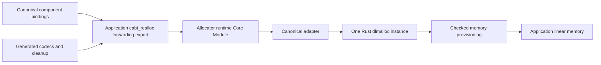

# Canonical Realloc Runtime Adapter

**Feature:** [F-02 — Build Portable Program Artifacts](../../../feature/F-02-portable-programs.md)\
**Status:** Draft\
**Prerequisites:** [Canonical buffer allocation and lifetime](canonical-buffer-allocation-and-lifetime.md), [linking and runtime](linking-and-runtime.md), and [compilation units and runtime linking](core-object-linking-and-compilation-units.md).\
**Summary:** Replace compiler-synthesized heap management with Rust `dlmalloc` 0.2.14 behind a small canonical adapter. Bind one allocator runtime instance to the application's memory and planned heap boundary, initialize lazily after bindings resolve, and preserve allocation, lifetime, and provenance obligations. The linker connects a pinned Core Module; there is no application object-linking prerequisite.

## Scope

This topic owns crate selection, canonical dispatch, memory provisioning and
initialization for the allocator runtime provider. The buffer-lifetime topic
continues to own call-local/import-result/export-result ownership and post-return.
The linker owns provider binding and the shared memory plan.

The selected provider replaces the handwritten block/free-list strategy after
acceptance. Existing behavior remains the migration baseline. This draft does
not claim that the crate is installed, runtime integration works, or acceptance
has executed.

## Background

Language values live in Wasm GC. Canonical component bindings use linear-memory
buffers and request them through `cabi_realloc`. Retaining that name preserves
the interface while replacing heap management. `cabi` means Canonical ABI.

The backend currently synthesizes `build_realloc`, initializes its own fixed
state bytes, and directs codecs and cleanup to that generated function. The
application verifier recognizes that specific state layout. Runtime replacement
must change these connected contracts together, rather than only swap a function.

## Model

```text
CanonicalRealloc = (old_ptr: i32, old_len: i32, align: i32, new_len: i32) -> i32
AllocatorProvider = {
  pinned_core_module, canonical_export,
  memory_import, heap_getter_import,
  state_and_stack_reservations, initialization_protocol,
  exclusive_growth_ownership, allocation_provenance_contract
}
```

The target is single-threaded wasm32 with one shared linear memory between the
application and selected runtime Core instances. Here shared means the same
memory instance, not Wasm's atomic/shared-memory type. Memory64, multiple heaps,
threads and multiple allocator instances are unsupported by this contract.

The selected crate is Rust `dlmalloc` at exact version `0.2.14`. Use one explicitly
owned `Dlmalloc` instance with a custom underlying memory provider. Lock the
crate checksum, toolchain, build recipe and output digest during implementation.
The crate's established Wasm use and configurable underlying allocator motivate
the choice; upstream documentation is not project runtime acceptance.

## Design

### Provider and application wiring



The allocator artifact imports the application's memory and a scalar
`__main_module__.get_heap_base: () -> i32` function. Catalog data owns the import
identity and signature; artifact verification checks the real import. The
application exports memory, the heap getter, and a canonical forwarding function.
All generated allocation/free/resize calls and canonical bindings use that
forwarder and therefore the same provider instance.

Core library composition may use a function shim for the application/runtime
instance cycle. No start function or data initializer may call the forwarding
entry or getter. Resolve the shim before any allocation call. The composer uses
its application-export import namespace to bind the getter without host imports.

### Layout and lazy initialization

The target planner first reserves canonical scratch, runtime static data/stacks,
and allocator metadata, then derives one aligned `heap_start`. The application
exports a `() -> i32` function containing only `i32.const heap_start; end`.
This lets the artifact remain pinned while its heap boundary varies with the selected runtime closure.

Provider states are `Uninitialized`, `Initializing`, and `Ready`. On the first
canonical call, call the bound getter once, validate alignment and memory coverage,
and create the allocator over the unclaimed region beginning there. Enter `Ready`
only after initialization succeeds. Reentry during initialization traps; no host
callback occurs while allocator state is mutably borrowed. Invalid input and
zero-sized calls follow the same validation contract described below.

The provider's globals and active static data initialize only its declared
reservation. The Rust artifact is emitted directly, with LTO enabled and no
binary rewriting. Its allocator phase, registry head and `dlmalloc` instance
form one static `State` in `src/allocator/wasm.rs`, initialized by an active data
segment. The portable algorithm, phase protocol and segment planner are sibling
modules; shared binding/storage contracts live in `src/abi/allocator.rs`, and
the pinned artifact and unit metadata live in `src/catalog/allocator.rs`. The build uses
`--stack-first -zstack-size=32768 --global-base=32768`: static data owns
`[32768, 65536)`, and the permitted stack suffix is `[16384, 32768)`.
Static frame analysis must prove that execution stays in this suffix, above
canonical scratch; LLVM's unused lower stack prefix is not allocator storage.
No executable start or eager constructor is allowed. This lazy protocol avoids an initializer call before component shims resolve.

### Memory provisioning

Use a custom implementation of the crate's underlying `Allocator` contract,
separate from the canonical adapter. Maintain a checked acquisition cursor whose
initial value is `heap_start`; acquire suitably aligned segments from the unused
interval up to current `memory.size` before requesting additional pages.
Honor all upstream segment size/alignment/zeroing guarantees, not only requested
payload sizes. Segment ownership transfers to `dlmalloc` only on success.

Compute page growth and address arithmetic with overflow checks. Only this
provider grows the shared memory. On `memory.grow` failure, return allocation
failure without advancing the acquisition cursor or publishing a segment; the
adapter converts failure to the required trap. Zero only ranges the provider
owns if zeroing is needed. Do not rewrite live data after growth.

Wasm pages are retained: unsupported shrink/remap/release operations report that
they are unavailable according to the crate API. Free blocks remain reusable
inside `dlmalloc`; freeing a buffer need not shrink `memory.size`. Other runtime
units using the heap must call this provider, not claim pages through another
Rust global allocator or grow the memory independently.

### Canonical adapter and allocation evidence

The adapter owns canonical input validation and allocation identity; `dlmalloc`
owns bins, free lists, coalescing and block reuse. Do not recreate these algorithms.
Do not pass unchecked caller lengths/alignment into unsafe crate methods.

Maintain runtime-owned records of live canonical allocations: user pointer,
requested length, backing pointer, backing size/alignment, and links for a live
allocation registry. Records may be stored in an aligned prefix of each backing
allocation. Locate a supplied user pointer by traversing trusted live records,
not by first dereferencing a caller-derived header address. A pointer not in the
registry traps. Validate non-null resize length against the stored requested length.

This registry checks the canonical contract and supplies true backing layouts
for Rust deallocation. It is not a second free-list allocator. Its traversal
cost is explicit; optimize lookup only with equivalent ownership checks. It
cannot distinguish a stale numeric pointer from a new live allocation reusing
that address, and it makes no stronger temporal-safety claim.

Use allocate/copy/free for resize when necessary, including alignment changes.
The canonical alignment argument need not equal the backing allocation's original
alignment, so it cannot blindly be used as Rust's old layout. In-place resize is
an optimization requiring correct record updates and the same failure guarantees.

## Algorithms

1. Validate `align` as a nonzero power of two for every call, including zero sizes.
   Apply checked payload/prefix/alignment arithmetic before allocator mutation.
2. For `new_len == 0`, locate and free any non-null live allocation using its
   stored backing layout, unlink its record, and return zero. Preserve the
   existing free-path old-length treatment; do not pass that length to Rust.
3. For nonzero allocation with null `old_ptr`, require `old_len == 0`. Allocate
   backing storage, form an aligned user range, and register it only on success.
4. For nonzero resize, require a live pointer and matching stored requested length.
   Allocate a replacement with the requested alignment, copy exactly
   `min(old_len, new_len)` bytes, then release the old backing allocation and
   replace the live record. Allocation failure leaves the old allocation intact.
5. Translate null/failure into a trap; never publish a successful-looking pointer
   or lose the old block before replacement succeeds.

Metadata registry operations must not recursively allocate. Its records live
in the backing blocks; registry roots and acquisition state live in declared
provider storage. All internal deallocations use actual backing size/alignment.

## Code map

| Owner | Intended responsibility |
| --- | --- |
| Runtime allocator unit: adapter | Canonical dispatch, validation, live records, copy/free behavior |
| Runtime allocator unit: provisioning | `dlmalloc` underlying memory provider, checked cursor/growth |
| Runtime allocator unit: state | One instance, registry roots, lazy initialization and reentry guard |
| Runtime catalog | Exact bytes/digest, imports/exports, reservations, initialization and growth ownership |
| Backend lowering | Provider requirement, canonical forwarder, codecs and cleanup routing |
| Target planner/composer | Heap getter/memory binding, state ownership, shim order and emitted-byte verification |

These are design responsibilities, not claims that modules already exist.

## Invariants and verification

Preserve ALC-01–ALC-07 behavioral obligations, replacing implementation-specific
free-list/header evidence with provider evidence. Lifetime lowering stays unchanged
in meaning. Dynamic-store admission recognizes the checked allocator operation
and its result extent, independently of whether the implementation is generated
or artifact-provided.

The application verifier must stop assuming the old generated allocator's
8-byte state format when an artifact provider is selected. Check actual memory,
constant heap-getter export, forwarding signature/binding and owned data ranges against
the plan. Verify runtime state initialization in its own declared artifact contract.
Do not retain an unused old state region or permit arbitrary state bytes by default.

Required executed evidence covers alignment, alignment-changing resize and copied
values; invalid alignment, null/length mismatch, unknown pointer and resize-length
mismatch rejection; free/reuse; growth and grow failure; old-allocation preservation;
repeated call-local/import-result cleanup; export post-return; bounds/provenance;
lazy first call and reentry; one state across canonical and generated calls;
and numeric runtime operations interleaved with allocation/growth.

Binary validation checks signatures and target features. Imported calls normally
make static stack bounds unknown. The heap getter is the sole protocol exception:
artifact verification records a conditional zero-linear-stack contribution,
and application verification discharges it by checking the exact signature,
absence of locals, and constant-only body against the checked plan. Other imported
calls remain rejected by stack analysis. Artifact inspection checks
bindings, reservations and initialization shape. Runtime tests establish behavior;
they do not prove the Rust implementation free of all unsafe-code defects.
No obligation is Verified until its required execution actually runs.

### Heap-getter binding evidence

`crates/psrs-linker/tests/heap_getter.rs` composes the same pinned allocator
with application heap boundaries of 65536 and 262144 bytes. Mandatory-Wasmtime
execution exercises allocation beyond initial memory, resizing with content
preservation, freeing, and preservation of canonical scratch. Rejection cases
cover signature drift, missing exports, wrong constants, locals, memory access,
and calls from the getter. The existing backend post-return tests execute
string-buffer reclamation through the composed allocator.

Reproduce the direct allocator artifact without overwriting the reviewed bytes:

```sh
sh crates/psrs-runtime/tools/build-allocator.sh /tmp/psrs-allocator.wasm
cmp crates/psrs-runtime/artifact/psrs_allocator.wasm /tmp/psrs-allocator.wasm
PSRS_REQUIRE_WASMTIME=1 cargo test -p psrs-linker --test heap_getter
PSRS_REQUIRE_WASMTIME=1 cargo test -p psrs-backend --lib wasm::lower::post_return
```

These checks establish the getter binding and the exercised allocator paths;
they do not close every allocator acceptance obligation listed above.

## Worked example

The plan reserves numeric-runtime static data/stack and allocator metadata, then
exports the resulting heap boundary from the application. Composition binds
memory/getter imports and resolves the canonical forwarding shim without calling
it during instantiation. A string codec's first allocation initializes the runtime
provider, which uses preallocated heap pages before growing memory.

The codec writes bytes and invokes a canonical import. Call-local cleanup frees
the registered allocation through the same entry. Repeated calls reuse storage;
retained GC strings and numeric-runtime state survive heap growth.

## Boundaries and interfaces

The crate owns heap algorithms; the custom memory provider owns page acquisition;
the adapter owns canonical validation and allocation records; the linker owns
layout and bindings; ABI lowering owns lifetime and post-return timing. These
contracts compose without a WIT interface per runtime unit or source module.

## Open questions and future work

The pinned runtime build, custom provisioning, checked getter binding, and
allocator-provider lowering are implemented, and the generated allocator has
been removed. The binding and execution evidence above covers the exercised
paths, not every allocator or buffer-lifetime acceptance obligation. Complete
the remaining requirement-to-test evidence before marking this topic verified.
Measure artifact size and registry lookup cost separately.

## References

- [Rust dlmalloc 0.2.14](https://docs.rs/dlmalloc/0.2.14/dlmalloc/)
- [Dlmalloc instance API](https://docs.rs/dlmalloc/0.2.14/dlmalloc/struct.Dlmalloc.html)
- [Underlying allocator contract](https://docs.rs/dlmalloc/0.2.14/dlmalloc/trait.Allocator.html)
- [Canonical buffer allocation acceptance](../../../implementation/backend/canonical-buffer-allocation.md)
- [Issue #144](https://github.com/biuld/purescript-rs/issues/144)
