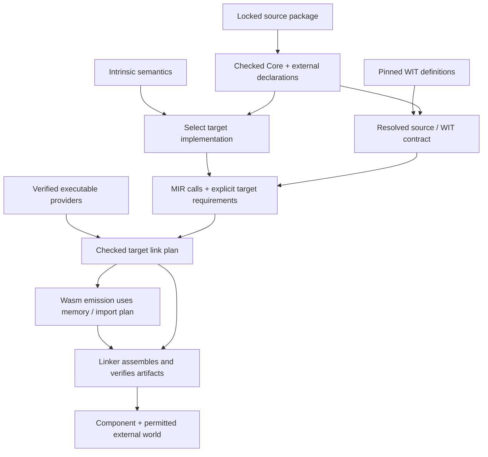
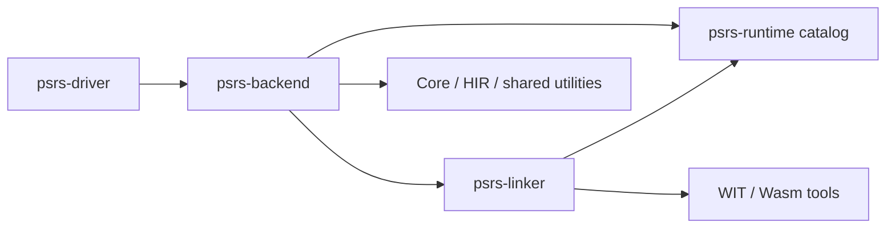

# Linking and Runtime Implementations

**Feature:** [F-02 — Build Portable Program Artifacts](../../../feature/F-02-portable-programs.md)  
**Status:** Core-Wasm formatter linking and explicit synchronous guest interface
composition are implemented; general loading extensions remain future work.

**Prerequisites:** [IR boundaries](../00-ir-boundaries.md),
[primitive FFI](primitive-ffi-and-stdlib.md),
[canonical ABI and WIT](canonical-abi-and-wit.md),
[linear memory](linear-memory-and-canonical-abi-boundary.md), and
[DEC-06](../../../decision/DEC-06-runtime-interface-via-wit.md).  
**Summary:** One checked target link plan connects language intrinsics, executable
runtime implementations, WIT interface providers, and component packaging. It
owns dependency closure, export/import agreement, memory reservations, and
instantiation order. Source typing, library algorithms, canonical adaptation,
and Wasm encoding retain their existing owners.

## Scope

This document owns target implementation selection and linking after checked
source-module assembly: the catalog, requirement closure, provider bindings,
artifact verification, link plan, and execution of that plan. It includes both
private core-Wasm runtime libraries and providers of WIT interfaces.

It does not own PureScript name resolution, type inference, stdlib algorithms,
WIT syntax, GC layouts, or control-flow structuring. It consumes their checked
results. The driver continues to assemble source modules from the locked stdlib
package. The linker never repairs invalid typing with raw ABI compatibility.

## Background

### Definitions, declarations, and implementations

| Input | Supplies | Does not establish |
| --- | --- | --- |
| PureScript source package | declarations, classes, instances, pure functions, typed foreign declarations | an executable implementation for every foreign value |
| Intrinsic registry | primitive identity, semantics, arity, language scheme | a particular raw ABI or artifact provider |
| WIT package | interfaces, worlds, function and resource types, definition dependencies | code implementing those interfaces |
| Core-Wasm library | typed raw exports and executable code, with memory/table requirements | compatibility with source types or a WIT interface |
| Guest component | component exports and imports, resource identities, executable implementation | permission to leave its dependencies as host imports |
| Host provider | implementations made available by the selected target world | arbitrary imports inferred from names or ABI shape |

A WIT-defined library can have host or guest implementation providers. Its WIT
package and its executable artifact are separate dependency records. A package
version resolves definitions; a selected provider discharges execution needs.

Core-module linking here means typed module composition inside a component.
It does not imply merging instruction streams or accepting native object-file
relocations. WIT component composition uses canonical lift/lower boundaries.
These differ from source-module linking, which unifies checked language
declarations before backend lowering.

### Intrinsic implementations

The same checked intrinsic may be realized by a direct Wasm instruction, a
compiler-generated helper, or a runtime artifact. These are implementation
choices under one language contract. `numberToString` returns a source String;
its runtime's pointer and length are not that source signature. A whole `Show`
implementation must not migrate into the compiler just because its numerical
leaf requires target code.

## Model

### Identities and checked inputs

Use stable identities within their owning domain. An intrinsic uses its HIR
identity, source values use resolved symbols, WIT interfaces/types use resolved
package identities, and executable artifacts use an identity plus a content
digest. Final Wasm indices and readable names are encoding results.

Canonical WIT names include package/interface/version identity. World aliases
are resolved through WIT before binding; strings and unversioned prefixes are
not authoritative identities. Pins choose exact definitions and artifacts.
Compatibility across versions requires an explicit adapter or rule with
evidence; the linker does not guess it from equal flattened signatures.

The source-to-WIT contract retains source TypeId, representation evidence,
canonical widths/layouts, and own/borrow rules as described in DEC-12/DEC-13.
The linker consumes that contract; it does not create another source-type mirror.

### Implementation catalog and requirements

The following are logical contracts, not a demand for placeholder crates:

```text
IntrinsicImplementation = {
  intrinsic_id, semantic_contract_version,
  implementation: Direct | GeneratedHelper | ArtifactExport,
  requirements, recovery_protocol
}

ArtifactContract = {
  artifact_id, kind: CoreModule | Component,
  digest, provenance, required_features,
  verified_exports, required_imports,
  storage_contract, initialization_contract
}

BindingRequirement = {
  origin: source_symbol/span | generated_operation/parent_origin,
  boundary: CheckedPrimitive | ResolvedWit | RawCore,
  expected_contract,
  provider: Generated | ArtifactExport | HostInterface
}

LinkPlan = {
  selected_implementations, verified_artifacts, resolved_bindings,
  memory_plan, instantiation_steps, external_world,
  requirement_origins, input_digests
}
```

Catalog metadata has one owner. Lowerers request an implementation by checked
identity and consume its ABI/recovery descriptor. Artifact inspection verifies
that descriptor against real exports; it does not independently define it.
The public library API and source scheme remain with the library and HIR.

Every executable requirement resolves to exactly one selected provider.
Explicitly compatible sharing is allowed, but duplicate or ambiguous providers
are errors. A provider's own requirements participate in the same closure.
Generated helpers and command-entry imports are roots even when absent from
source foreign declarations.

### Storage and initialization

Every shared-memory region records a memory identity, range/alignment, owner,
lifetime, and access protocol. Distinguish canonical scratch and allocator state,
runtime static data, runtime stack, and allocator-managed transient buffers.
Reservations are nonoverlapping; ranges and required memory pages are checked
for overflow and supported bounds. The allocator starts after all reserved
regions and cannot return their bytes.

Separate guest components normally own separate memories. Their canonical ABI
conversion copies/lifts values through each provider's memory and realloc/
post-return protocol. Equal pointer widths do not make pointers transferable.
Resource handles retain provider and resource-type identity; method families and
constructors/destructors cannot be split across incompatible provider instances.

Instantiation steps distinguish dependency creation, memory aliases, function
shims, shim resolution, declared initialization, and command invocation. A call
cycle may use a supported shim protocol only if initialization cannot invoke an
unresolved shim. Unsupported eager cycles, start functions, or initialization
side effects are explicit errors. No command runs until linking succeeds.

## Design

### One plan, distinct stages



P8 checks source declarations against primitive or WIT contracts and selects
implementation identities. P9 lowers recovery and ownership operations to MIR,
retaining explicit target requirements beside it. After MIR optimization,
planning closes reachable requirements and verifies artifact contracts before
P10 lays out memory or assigns imports. P10/P11 consume the same immutable plan.
Final binary inspection checks conformance to that plan; it never reconstructs
semantic bindings or chooses providers from emitted strings.

If optimization changes requirements, rebuild the plan from the checked inputs
and new reachability result. An emitter cannot independently add another helper
or host capability. Catalog feature requirements must be visible before emission.

### WIT providers and world construction

#### Runtime package owns target definitions

Move the compiler-owned WIT assets from `psrs-backend/wit/` to
`psrs-runtime/wit/`, including both the pinned WASI dependency definitions and
`psrs-app.wit`. They describe the distributed target contract and default world;
their version, hashes, source provenance, and dependency set belong with the
runtime package. Owning these definitions does not mean the package implements
WASI host services.

The runtime package exposes immutable catalog data: WIT source names/bytes,
package pins, default-world identity, artifact bytes/digests, and raw export/
storage contracts. The backend consumes this data rather than using cross-crate
`include_str!`/`include_bytes!` paths or maintaining a second embedded copy.
The same catalog supplies ABI resolution and component-world construction.

The independent `psrs-linker` owns WIT catalog loading, resolved world identities,
provider contracts, and target composition. The backend owns source-signature
checks, canonical call planning, representation recovery, and language-to-target
capability requirements. The runtime package depends on neither compiler IR crates
nor backend/linker machinery; its metadata API returns data, not `Resolve`, MIR,
or link-plan values. Target execution
code and host-consumed catalog metadata have distinct build entry points so
reading WIT assets does not require compiling the formatter into the native
compiler or embedding WIT text in the executable target module.

The resolved default world supplies interface membership. Capability policy is
checked separately against the selected target profile. Do not retain a second
handwritten `COMPONENT_INTERFACES` list as an independent source of permitted
interface identities. The final external world is still the live provider
closure, not every interface mentioned in the package's default world.

#### Select executable providers

Resolve all needed WIT definitions for type checking, but select executable
providers only for reachable interfaces and retained initialization needs.
Provider bindings are explicit build inputs: current compiler-owned WASI bindings
select host interfaces; explicit component bindings select pinned guest exports.
Merely placing WIT files in a directory never selects a provider.

For a host binding, verify that the selected target world permits that interface
and leave it in the final external world. For a guest binding, verify its export
against the resolved interface, bind the application import to that export,
and recursively resolve the guest's imports. Guest dependencies that remain host
capabilities must also be permitted and reported. A guest cannot hide an extra
filesystem/network capability from the plan.

Source-value conversion remains owned by backend ABI lowering. The linker uses
component tooling's canonical lift/lower operations for typed composition; it
does not reconstruct source layouts. WIT package inclusion, resource identity,
string encoding, ownership, realloc and export post-return are checked before
composition. Resource equivalence follows explicit instance/type aliases,
not method names. Conflicting pins or unresolved provider exports fail before
artifact emission. There is no silent host fallback when a guest binding fails.

### Artifact-backed intrinsic calls

Artifact exports use explicit raw signatures and recovery protocols. A raw
runtime accepts only representations declared by its contract; source GC
references cannot cross an independently built core library boundary without a
checked shared representation contract. The formatter needs scalars and bytes,
so it does not require shared GC types or a WIT wrapper.

The `numberToString` implementation uses pinned `ryu-js` 1.0.2 in a small Rust
target crate. The caller supplies a 32-byte buffer, and the raw export has
`(f64, i32, i32) -> i32`: value, pointer, capacity, then initialized length.
The runtime writes ASCII, allocates nothing, and retains no pointer. Its
contract includes negative zero, NaN/infinities, notation boundaries, and
ECMAScript shortest-decimal choices. The library applies the official Show rule
for appending `.0`; that rule is not part of the token primitive.

MIR allocates the buffer, calls the provider, validates/recovers UTF-8 into a GC
String, and frees the buffer on normal completion. The contract guarantees length
fits capacity; an unchecked arbitrary library cannot inherit this guarantee.
Traps abort the command; there is no promise to resume with a reusable allocator
after a runtime trap. Retained GC Strings must survive subsequent buffer reuse.

### Shared runtime storage and artifact preparation

The selected formatter reservation is static data in `[65536, 131072)`, a 64 KiB
private stack in `[131072, 196608)`, and application allocation beginning at
196608. Low addresses retain canonical scratch/allocator-state ownership.
When the formatter is absent, its reservation is absent too.

These values belong to the artifact storage contract, not scattered allocator
constants. The preparer verifies the linked Rust layout before relocating the
identified stack-pointer and heap-boundary globals. It preserves data offsets,
checks imported memory bounds, and records the resulting bytes/digest. The
consumer verifies actual globals, imports, exports, data ranges, feature needs,
and forbidden initialization against that contract. An unexplained table or
other export/import must be understood and declared, not blanket-accepted.

The pinned nonrecursive formatter's maximum stack use must be established by
artifact analysis or an explicit reviewed build assumption plus stress evidence.
Checking the initial stack pointer alone does not prove a bound. Reentrancy,
callbacks, or a different runtime provider requires revisiting the storage
contract. For the current allocator, successful memory growth preserves existing
addresses and bytes: reservations stay below the fixed heap boundary and the
runtime stack pointer does not move. Block metadata is committed only after
growth succeeds, with unsigned overflow checks before capacity calculations.
Allocator execution checks the exact page boundary, growth failure and wrapped
free-list sizes; source execution interleaves a 70,000-byte canonical WASI
allocation with formatting and retained GC Strings. This establishes growth
under the current nonreentrant calling protocol. Additional artifacts need
disjoint reservations or an explicit shared allocator; the linker must not reuse
this fixed region blindly.

This extends the strict "canonical ABI only" linear-memory clause of DEC-09/10
to permit declared private runtime execution storage. Language values remain on
the GC heap; transient buffer ownership and canonical resource rules persist.

### Reproducibility and rejected alternatives

Compiler-owned runtime artifacts are embedded with pinned dependency and source
identities, Rust toolchain/target, build profile, linker flags, preparation recipe,
and SHA-256 of final bytes. Regeneration must reproduce those bytes or explicitly
update the reviewed provenance. Normal compiler builds use the checked artifact.
The stdlib lock still owns source-package revision/fingerprint; target artifacts
and WIT definitions have distinct records included in compile lineage.

Rejected: native-only formatting, full JS-engine embedding for one primitive,
late attachment triggered by import names, duplicated per-consumer ABI tables,
universal shared-memory composition, and treating WIT definitions as executable
providers. These either fail to execute the source contract or discard a boundary
that the linker must verify.

## Algorithms

1. Load locked source, WIT, implementation catalog, and artifact provenance.
   Reject stale or conflicting identities; perform no implicit downloads.
2. Validate source primitive/WIT schemes at the Core boundary and retain binding
   origins and representation/ownership evidence through P9.
3. Lower target operations and result recovery to MIR. Emit explicit provider,
   helper, allocator, and capability requirements alongside the lowered module.
4. After optimization, close live requirements, provider dependencies, and
   required initializers. Reject absent or ambiguous implementations.
5. Validate actual artifact signatures/features, WIT exports/resource identities,
   and initialization contracts. Check allowed residual host imports.
6. Compute memory owners/reservations and a legal instantiation schedule. Publish
   a checked immutable plan only when all checks succeed.
7. Emit application Wasm using that plan. Verify emitted imports, memory, helper
   exports, and required initialization against it.
8. Execute planned composition, validate the final component, and compare its
   unresolved imports with the planned external world. Record artifact digests
   and origins; return errors without publishing a successful artifact on failure.

## Code map

### Independent linker crate

Create `psrs-linker` when implementing this contract. It has a real input/output
boundary: verified target definitions and requirements enter; a checked link plan
and composed artifact leave. Its responsibilities do not require PureScript
syntax, type inference, Core, CC, MIR, or backend-specific symbols.

The dependency direction is:



`psrs-linker` must not depend on `psrs-backend`, `psrs-core`, `psrs-hir`, or MIR
definitions. In particular, no `for_mir(&mir::Module)` API belongs in it. The
backend converts its checked requirements into linker-owned target records;
it keeps the mapping from requirement identity to source symbols/spans. The
linker returns structured errors with requirement/artifact identities, and the
backend attaches language diagnostics and compile-stage attribution. Linker-only
tests can construct target artifacts without compiling PureScript.

WIT definition loading and default-world resolution move from backend component
glue into `psrs-linker`. It returns one immutable resolved-world context consumed
by both backend ABI lowering and linker provider validation. Backend code may
use `wit-parser` operations on that context for canonical flattening; it does
not load a second copy or regenerate interface identities. Provider artifacts
must agree with the context and pinned definitions before plan publication.

The target organization is:

```text
psrs-hir/intrinsic/             semantic identities and source schemes
psrs-core/verify/               checked uses and external schemes
psrs-backend/bindings/          source contract + implementation requirements
psrs-backend/abi/               source/WIT validation, canonical conversion, ownership
psrs-backend/target_runtime/    intrinsic-to-provider selection using runtime catalog
psrs-backend/linking/           checked IR-to-linker requests and diagnostic mapping
psrs-backend/mir/               raw calls, value recovery, explicit lifetimes
psrs-backend/wasm/              planned memory/import emission and encoding
psrs-linker/definitions/        WIT loading and immutable resolved-world context
psrs-linker/plan/               provider closure, memory and initialization planning
psrs-linker/compose/            ComponentEncoder integration and final validation
psrs-linker/verify/             artifact contracts and emitted-plan agreement
psrs-runtime/                  immutable target catalog and target code
psrs-runtime/wit/              pinned definitions and default command world
psrs-runtime/artifact/         core-Wasm bytes, contracts and build provenance
psrs-stdlib/lib/                public APIs and ordinary PureScript wrappers
psrs-stdlib/conformance/        pinned official-JS observations and case engines
```

These are owners, not instructions to add empty crates or split every file.
The formatter slice is implemented in `psrs-linker` (`definitions`, `plan`,
`verify`, `compose`, `runtime`), `psrs-runtime` (catalog plus `wit/` and
`artifact/`), and the backend's `target_runtime` and `linking` modules. The
earlier backend-local `linker/` prototype and the backend `component` module
have been removed; WIT loading and composition now live in `psrs-linker`.

### API and trust boundary

The intended API is conceptually:

```text
resolve_definitions(runtime_catalog, pinned_wit_inputs)
    -> Result<ResolvedWorldContext, LinkErrors>
plan(context, TargetLinkInput)
    -> Result<CheckedLinkPlan, LinkErrors>
compose(plan, encoded_application)
    -> Result<LinkedArtifact, LinkErrors>
```

`TargetLinkInput` contains linker-owned requirement identities, target signatures,
provider selections, artifact references, storage demands, initialization roots,
and the permitted target features/host interfaces. It contains no compiler IR
nodes or language TypeIds. The backend explicitly converts its capability profile
to this target policy rather than making the linker import backend types.

The linker trusts the backend's source-type and representation checks; it does
not claim to repeat them. It checks raw contracts, WIT provider agreement, storage,
features, and composition itself. Core-binary-only callers must supply
an explicit binding/artifact contract; they cannot bypass planning by scanning
imports. Wasm emission and component assembly both require the same checked plan.
The plan exposes verified memory/import data needed by emission, while keeping
construction private to successful planning. Artifact preparation is a build
tool, not a compiler emission pass.

## Invariants and verification

- Each live foreign/primitive/helper requirement has one checked provider and
  a diagnostic origin. Raw signature equality never proves source compatibility.
- WIT definitions and executable provider closure are separately complete.
  Host imports equal the permitted residual capabilities, not every loaded WIT
  interface and not merely the source application's direct imports.
- The same plan controls raw imports, memory ownership, initialization, and
  final composition. No late encoding path changes it silently.
- Each shared pointer belongs to the planned memory/region; buffers obey
  allocation/recovery/release protocols. Component pointers and resource handles
  do not cross unrelated providers by integer reinterpretation.
- Artifact bytes and requirements match recorded digests/features. Storage and
  initializer checks are distinct from assumptions about algorithm correctness,
  stack depth, termination, and effects; trusted assumptions are recorded.
- An unneeded provider contributes neither bytes nor its host dependencies.
  Observable initializer effects are retained by explicit policy and live edges.
- Failed binding, preparation, planning, composition, or validation does not
  produce a successful artifact or an empty fallback implementation.

Validation covers malformed source bindings, raw artifact ABI/storage failures,
WIT version/provider/resource conflicts, legal and illegal initialization
dependencies, and final import closure. Runtime evidence must combine formatting,
buffer reuse, GC retention, and WASI calls to exercise the shared-memory boundary.
Acceptance obligations are tracked in
[the implementation record](../../../implementation/backend/linking-and-runtime.md).

## Worked example

For `log (show 1.0e21)`, the library Show instance calls its token primitive.
Core checks `Number -> String`. The catalog selects the formatter artifact; MIR
allocates output, calls its raw export, recovers the GC String, and releases
output. The library receives `"1e+21"` and leaves it unchanged. Console output
uses the independently checked WASI streams binding and canonical buffers.

The plan includes formatter storage and the reachable WASI host services. The
application is instantiated with call shims and owns canonical memory. The
runtime is then instantiated with that memory; its data initializes only its
reserved range. Shims are resolved before the command runs. Formatting's private
core import is closed; WASI interfaces remain in the external world. A live
String remains valid after the formatter buffer is freed and reused by stdout.

If the streams interface instead has an explicitly selected guest WIT provider,
that provider is composed through its interface, memory, and resource instance.
Its own allowed host dependencies join the external world. This is not achieved
by passing the application's output buffer pointer into the guest memory.

## Boundaries and interfaces

The driver supplies source package provenance and checked declarations. HIR/Core
supply primitive identities/types. ABI lowering supplies checked source/WIT
contracts and recovery operations. MIR optimization preserves their identities
and updates live requirements. The linker supplies a checked target plan; Wasm
encoding supplies conforming bytes. Component assembly consumes both and emits
the validated final artifact with the planned external world.

Compile diagnosis should record selected provider identities, WIT/artifact
digests, plan inputs, checks, and failures as explicit lineage alongside MIR and
binary artifacts. Runtime observations remain separate evidence. A valid link
plan proves binding/layout checks, not official-library semantic conformance.

## Supported component entry and future work

The initial guest entry point is `psrs link application.wasm --manifest
providers.json -o linked.wasm [--report report.json]`. It consumes an already
validated application component, pinned executable guest components and explicit
whole-interface bindings. The version-1 manifest and report are specified in
[Explicit Component Linking](../../../workflow/component-linking.md).
`psrs build` owns source compilation and accepts `--manifest` explicitly after
completing the checked core runtime plan. It computes the produced application's
pin rather than requiring the user to predict its bytes. An optional supplied
root pin is still checked. `--report` joins the source diagnosis artifact to
component composition by exact digest. Standalone `psrs link` requires all pins;
neither command discovers providers.

`psrs-linker::guest::plan_components` uses the pinned `wasm-compose` 0.245.1
in-memory graph API. Every participating component is parsed with the same
validator so cross-component resource identities share one type universe.
Closure starts at the application, follows explicit guest edges, and retains
only permitted unbound interface instances as host imports. Unused candidates
are omitted. Duplicate bindings, digest drift, incompatible interfaces, missing
exports and instantiation cycles fail closed. An explicitly selected guest
never falls back to the host. Canonical adaptation preserves each component's
memory, realloc and post-return operations through typed instance connections.

The core `CheckedLinkPlan` remains bound to one immutable resolved WIT context,
raw import signatures and memory reservations. Composition independently checks
the actual application's imports, minimum memory and active initialization
before attaching core libraries. Component composition uses a distinct sealed
`CheckedComponentPlan`: its memories remain component-owned, so it does not
fabricate an application-wide linear memory plan. The component plan holds the
validated graph encoding, exact root digest, selected binding edges, artifact
pins, validator feature policy and residual host imports. Emission accepts only
the root bytes checked by that plan. Both plans are linker-owned target records;
neither contains compiler IR or reinterprets source types.

Guest graph closure requires exact equality with the encoded outer imports.
WIT type dependencies are not independent executable capabilities. The core-to-component path derives the same projection by encoding the planned
WIT function signatures in a nonexecuted import-only module. The authoritative
component encoder determines resource-owner imports, without expanding unused
interface methods. Final composition independently requires exact import-set
equality with this projection. Every retained resource owner must also satisfy
world membership and target policy.

Only synchronous whole-interface instance imports with matching canonical
interface names are supported by the initial entry point. Non-interface
imports, implicit version adaptation, partial method providers, cyclic
instantiation, dynamic discovery and asynchronous composition require explicit
extensions. A definition-only WIT package is not an executable provider.

The runtime stack bound is measured by a static call-graph analysis of the
pinned nonrecursive artifact, and the artifact-provenance representation is
settled as a catalog record; repeat builds are checked against the committed
bytes. Relocatable object files, dynamic loading, async/WASI 0.3 composition,
recursive or reentrant runtime libraries, and cross-module GC sharing require
explicit extensions.

Existing WIT/WASI binding code precedes this plan model. The formatter slice now
carries one checked plan from requirement closure through artifact verification,
Wasm emission, and component assembly, with a target-only linker test suite and
an end-to-end formatter execution test. The stack bound is measured over a restricted
frame protocol: one constant prologue, an immutable saved frame and checked restoration before returning.
Unrecognized stack-pointer access, indirect/imported calls, recursion, exception
unwinding and suspension are rejected. The declared stack-pointer global must
be mutable and initialize at the reserved stack top. These checks establish the
formatter bound; they do not establish arbitrary runtime-library memory safety.
Guest execution evidence is recorded separately from the formatter slice.

## References

- [DEC-18 — Unified Target Linking](../../../decision/DEC-18-unified-target-linking.md).
- [DEC-12 — Resolved WIT Bindings](../../../decision/DEC-12-resolved-wit-bindings.md),
  [DEC-13 — WIT to Source Mapping](../../../decision/DEC-13-wit-to-source-type-mapping.md),
  [DEC-14 — Resource Ownership](../../../decision/DEC-14-resource-handle-ownership.md).
- [Component Model explainer](https://github.com/WebAssembly/component-model/blob/main/design/mvp/Explainer.md)
  and [WIT specification](https://github.com/WebAssembly/component-model/blob/main/design/mvp/WIT.md)
  for interface definitions, canonical boundaries, and typed composition.
- [ryu-js](https://github.com/boa-dev/ryu-js) for the selected formatter implementation.
